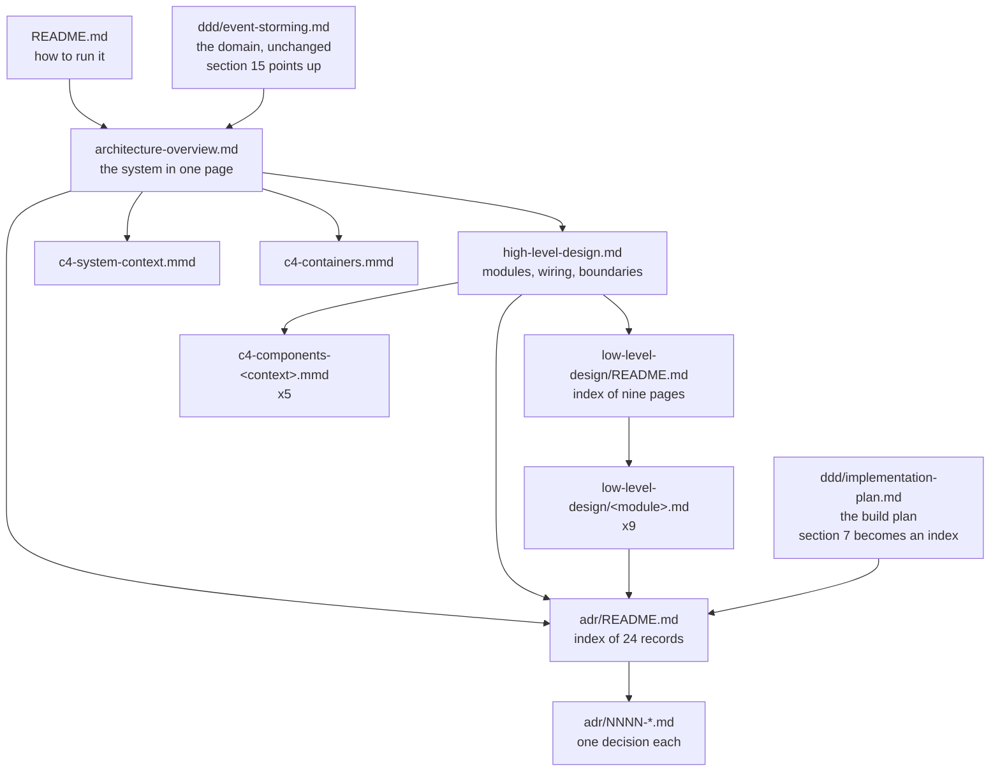

# Architecture Documentation Design

**Spec**: `.specs/features/architecture-documentation/spec.md`
**Status**: Approved

---

## Architecture Overview

Four levels of document, each owning one altitude and pointing at the next rather than repeating
it. The arrows are the "points at" relation the consistency pass in ARCH-04 enforces, and they are
also the reading order for someone arriving at the repository.

The build order follows the levels, with one deviation the user chose: the nine low level design
pages and the five component diagrams are produced in **five slices, one per bounded context**,
because both artifacts for a context are written from the same reading of the same source. Reading
`work-orders` once and writing its page and its diagram together costs materially less than reading
it twice, and the two artifacts contradict each other far less often when written in one sitting.

---

## Code Reuse Analysis

Nothing in `src/` is reused: this feature writes documents. What is reused is prose already written
and facts already recorded, which is what keeps the set from being invented.

### Existing sources to draw from

| Source | Location | How to Use |
| --- | --- | --- |
| The 15 decision blocks already in ADR shape | `docs/ddd/implementation-plan.md` section 7 (line 1119 onward) | Move into `docs/adr/`, one file each. Section 7 becomes an index. Section 10 says move rather than copy, so the prose has exactly one home. |
| The H-answers holding the reasoning for the remaining decisions | `docs/ddd/event-storming.md` section 14 | Cite as the Context of the ADRs that section 7 has no prose block for. |
| The nine architectural decisions taken during the build | `.specs/STATE.md` `## Decisions`, AD-001 to AD-009 | Ten ADRs name their `AD-NNN` in a `Source` line. AD-008 and AD-009 become ADRs 0023 and 0024, which the plan's list does not have. |
| The ADR subject list and the ownership table | `docs/ddd/implementation-plan.md` section 10 | The numbering and the "does not repeat" column are the contract this design implements. |
| The five bounded contexts and four business actors | `docs/ddd/event-storming.md` sections 3 and 4 | The overview restates them; the component diagrams are drawn one per context from section 4. |
| The existing mermaid style | `docs/ddd/event-storming.mmd` | The new `.mmd` files follow its conventions, so the whole set renders the same way. |
| Prettier, already a devDependency, already clean over `docs/` | `.prettierrc` | `npx prettier --check docs/` is the mechanical half of every task gate. No new script, no new dependency. |

### Integration points

| System | Integration Method |
| --- | --- |
| `README.md` | Its `Architecture` section gains links to the four entry points. It currently links only `docs/ddd/`, deliberately, because the rest did not exist when it was written. |
| `.specs/STATE.md` | Stays canonical for the skill's working memory. Ten ADRs point at it; it is not emptied into `docs/adr/`. |
| The two DDD documents | Edited only where section 10 instructs: section 7 becomes an index, section 15 points at the overview. |

---

## Components

Each "component" here is a document or a document group, with the same fields a code component
would carry. Location is relative to the repository root.

### The ADR set

- **Purpose**: Give every architectural decision exactly one home, findable by number, with its alternatives and consequences.
- **Location**: `docs/adr/`
- **Interfaces**:
  - `README.md` - number, title and status of all 24, no decision text of its own
  - `NNNN-<kebab-case-title>.md` - `## Context`, `## Decision`, `## Alternatives`, `## Consequences`, plus a `**Status**` line and, where one exists, a `**Source**` line naming the `AD-NNN`
- **Dependencies**: The plan's section 7 and section 10 table; the event storming's section 14; `.specs/STATE.md`'s Decisions log
- **Reuses**: The 15 existing decision blocks verbatim in substance, restructured into the four sections

**Numbering and provenance**, fixed at design time so no task has to decide it:

| ADR | Subject (from section 10) | Prose source | `Source` line |
| --- | --- | --- | --- |
| 0001 | Modular monolith in layers, with CQRS | plan narrative, section 3 | none |
| 0002 | PostgreSQL as the relational database | plan section 13's own short version | none |
| 0003 | Redis for access cache, revoked sessions, rate limiting | plan narrative | none |
| 0004 | JWT access tokens with refresh rotation and reuse detection | plan narrative | none |
| 0005 | Argon2id for password hashing | plan narrative | none |
| 0006 | Internal sequential key plus external UUID | section 7 block | AD-001 |
| 0007 | Money in the shared kernel, integer BRL cents | section 7 block | AD-002 |
| 0008 | Cross context communication through the buses | section 7 block | AD-003 |
| 0009 | Customer as its own aggregate over a user identity | section 7 block | AD-004 |
| 0010 | No aggregate for Mechanic, Service advisor, Administrator | section 7 block | AD-004 |
| 0011 | Groups removed from the authorization model | section 7 block | AD-005 |
| 0012 | Super administrator created outside the API | section 7 block | AD-006 |
| 0013 | One InventoryItem aggregate for parts and supplies | section 7 block | none |
| 0014 | Stock consumed at withdrawal, no reservation phase | section 7 block | none |
| 0015 | Stock movements append only, with transitions | section 7 block | none |
| 0016 | Cancellation writes movements off | section 7 block | none |
| 0017 | Budget as an entity inside the WorkOrder aggregate | section 7 block | none |
| 0018 | Numbered budget rounds | section 7 block | none |
| 0019 | A withdrawal charged at the price its round froze | section 7 block | none |
| 0020 | Budget total and charged total kept separate | section 7 block | none |
| 0021 | The trail written by the repository in the same transaction | section 7 block, corrected | AD-007 |
| 0022 | A logout ends every active session | event storming section 10, rule 8 | none |
| 0023 | Repositories honour an ambient transaction | `.specs/STATE.md` | AD-008 |
| 0024 | Optimistic version guard on the work order repository | `.specs/STATE.md` | AD-009 |

Section 7 holds 15 blocks against 22 subjects, so seven records draw their Context from the plan's
narrative or the event storming instead. Any record whose reasoning cannot be traced to an existing
document is not written; the gap is raised in the task's closure notes, per the spec's edge case.

### The overview and the high level design

- **Purpose**: Explain the system at two altitudes: what it is, then how it hangs together.
- **Location**: `docs/architecture/architecture-overview.md`, `docs/architecture/high-level-design.md`
- **Interfaces**:
  - Overview: what the system is, the four business actors, the five bounded contexts, the three runtime pieces, the shaping constraints
  - High level design: the nine code units and what each owns, communication through `CommandBus`/`QueryBus`, the CQRS wiring, the guard chain, the cross-module transaction boundaries, the identifier and money conventions
- **Dependencies**: The ADR set, which both point at for every decision
- **Reuses**: Event storming sections 3 and 4 for actors and contexts; section 15, which becomes a pointer

**The guard chain, verified rather than assumed.** `src/app.module.ts:89-92` registers four
`APP_GUARD` providers, and Nest runs them in declaration order: `ThrottlerGuard`, then
`JwtAuthGuard`, then `PendingPasswordGuard`, then `PermissionsGuard`. The high level design states
that order.

### The C4 diagrams

- **Purpose**: The same structure as a picture, at three levels.
- **Location**: `docs/architecture/*.mmd`
- **Interfaces**:
  - `c4-system-context.mmd` - `C4Context`, four business actors, one system, no external system
  - `c4-containers.mmd` - `C4Container`, the NestJS application, PostgreSQL, Redis
  - `c4-components-<context>.mmd` x5 - `C4Component`, one per bounded context
- **Dependencies**: The module structure the low level design pages describe
- **Reuses**: `docs/ddd/event-storming.mmd`'s conventions

**Context to module mapping**, from event storming section 4, fixed here so the five slices in
phase 3 are unambiguous:

| Bounded context | Modules | Diagram |
| --- | --- | --- |
| Identity & Access | `users`, `authentication`, `authorization` | `c4-components-identity-and-access.mmd` |
| Customer Management | `customers`, `vehicles` | `c4-components-customer-management.mmd` |
| Workshop Catalog | `services` | `c4-components-workshop-catalog.mmd` |
| Inventory | `inventory` | `c4-components-inventory.mmd` |
| Workshop Operations | `work-orders` | `c4-components-workshop-operations.mmd` |

A context spanning more than one module shows each module as its own boundary inside it, so
Identity & Access reads as three and Customer Management as two.

### The low level design pages

- **Purpose**: One page per code unit, holding what a person changing that unit needs.
- **Location**: `docs/architecture/low-level-design/`
- **Interfaces**: `README.md` plus nine pages, each covering aggregates and invariants, value objects, commands and handlers, queries and ports, repository and mapper, ORM entities and their columns, endpoints, and errors with their HTTP mapping
- **Dependencies**: The source of the module it describes; the ADR set for anything that is a decision
- **Reuses**: Nothing textual. Each page is written from the source it describes.

**The nine pages and their weight**, so the slices in phase 3 are packed honestly rather than
evenly:

| Page | ORM entities | Controllers | Notes |
| --- | --- | --- | --- |
| `users.md` | 1 | 1 | |
| `authentication.md` | 2 | 1 | Holds the `Session` aggregate and `RefreshToken` |
| `authorization.md` | 4 | 3 | The guard chain's own module |
| `customers.md` | 1 | 1 | |
| `vehicles.md` | 1 | 1 | |
| `services.md` | 1 | 1 | |
| `inventory.md` | 2 | 1 | |
| `work-orders.md` | 5 | 1 | The largest by far: 4 domain entities, 16 write handlers |
| `shared.md` | 0 | 0 | No aggregate of its own. Holds `Money`, `AggregateRoot`, `EntityId`, the `Clock`/`IdGenerator`/`TransactionRunner` ports, the TypeORM transaction runner, the global exception filter and the error-kind to HTTP mapping |

Columns are listed in full, per the user's decision, and every entity block names the migration
file its columns come from. Nine migrations exist, `1787702400000` through `1787702400008`.

### The consistency pass and the Swagger review

- **Purpose**: Remove the duplication the set could otherwise carry, and make the published API contract match the implemented one.
- **Location**: All of `docs/`, plus `README.md`, plus the ten controllers under `src/modules/**/presentation/controllers/`
- **Interfaces**: No new file. Edits only.
- **Dependencies**: Every other component, which is why this is last
- **Reuses**: Section 10's ownership table as the arbiter of which document keeps a duplicated statement

The Swagger review is the only part of this feature that can touch `src/`, and only to correct an
annotation that misstates a route. Its gate therefore runs the full test suite; every other task
touches `docs/` and `.specs/` only.

---

## Data Models

None. This feature adds no table, no column, no entity and no migration.

---

## Error Handling Strategy

| Error Scenario | Handling | User Impact |
| --- | --- | --- |
| An ADR subject in section 10 has no traceable reasoning in any existing document | The record is not written from imagination. The gap is raised in the task's closure notes and carried to the Verifier. | One numbered gap in the set, visible rather than a plausible-sounding invention. |
| A document states something the code contradicts | The document is corrected, and the correction is named in the closure notes. | The set matches the code; the divergence is on the record. |
| Two documents state the same fact | Section 10's ownership table decides which one keeps it; the other points at it. | One place to change when the fact changes. |
| A `.mmd` file does not render | Caught by opening it on GitHub or in a mermaid preview during the task, since no parser runs in CI. | A broken diagram is a visible blank, not a silent wrong answer. |
| A Swagger annotation misstates a route | The annotation is corrected to match the implemented behaviour, never the reverse. | The published contract matches what the API does. |

---

## Risks & Concerns

| Concern | Location | Impact | Mitigation |
| --- | --- | --- | --- |
| Listing every ORM column in prose duplicates the schema with nothing to detect drift. The user chose full fidelity to section 10 over a pointer. | `docs/architecture/low-level-design/*.md` | A migration nobody mirrors turns the page into a confident wrong answer, and no gate catches it. | Every entity block names the migration file its columns come from, so a reader verifies with one file open. The low level design `README.md` records the commit the columns were read at, so a stale page is datable rather than merely wrong. |
| Prettier is configured but enforced nowhere: 149 files fail `npm run format:check` today, across `src` (109), `test` (26), `.claude` (11) and `README.md`. | Repository-wide, pre-existing | Anyone running `npm run format` produces a 149-file diff touching code this feature never looked at. | This feature never runs `npm run format`. Its gate uses `npx prettier --check docs/`, which passes today and covers exactly what the feature writes. The repository-wide state is flagged here for a future maintenance pass, not fixed inside a documentation feature. |
| `README.md` fails Prettier, from feature 9's T10. | `README.md` | A small inconsistency in the file this feature is about to edit. | ARCH-04 already edits the `Architecture` section; it brings the file to Prettier-clean in the same task, so the fix travels with a change that had to touch the file anyway. |
| Section 7 holds 15 decision blocks against 22 ADR subjects. | `docs/ddd/implementation-plan.md:1119` | Seven records could end up invented to fill the numbering. | Their Context is drawn from event storming section 14 and the plan's narrative and cited. An untraceable record is not written; the gap is raised. Already an acceptance criterion and an edge case in the spec. |
| The trail decision in section 7 still describes a post-commit subscriber, which AD-007 replaced before any trail code shipped. | `docs/ddd/implementation-plan.md`, section 7's third block | Copying it forward would put a decision in `docs/adr/` that the codebase has never implemented. | ADR 0021 records what was decided and built, and names the subscriber as the alternative that was rejected, with the reason AD-007 gives. See Tech Decisions below for why this is not a supersession pair. |
| No discrimination sensor is possible on prose. | The whole feature | The Verifier's usual empirical guarantee does not apply. | Recorded in the spec's Assumptions. Every acceptance criterion is instead a structural fact confirmable with `ls`, `grep` or a single file open, which is what the Verifier checks. |
| The low level design describes code that other features keep changing. | `docs/architecture/low-level-design/` | Pages age. | They are written after the phases that could change the code, and this feature changes no source except Swagger annotations. Ageing past this feature is a maintenance concern, not one this design can close. |

---

## Tech Decisions

| Decision | Choice | Rationale |
| --- | --- | --- |
| Whether ADR 0021 is one record or a supersession pair | One record, stating the transaction decision, with the subscriber named as the rejected alternative | AD-007 is dated 2026-08-30 and the trail code shipped in feature 5, after it. The subscriber version was planned and revised before anything was built, so it is an alternative that was considered, not a decision that shipped and was later reversed. A `Superseded by` pair would claim a history that did not happen. |
| The mechanical half of each task's gate | `npx prettier --check docs/` alongside `npm run lint && npm run build` | `docs/` passes Prettier today and Prettier is already a devDependency, so this adds no script and no dependency, which is what the user's "prose with human review" decision rules out. `npm run format:check` cannot be used: it fails on 149 pre-existing files. |
| Which gate the Swagger review runs | The full build gate, tests included | ARCH-05 is the only story that can modify `src/`. Every other task is confined to `docs/` and `.specs/`. |
| One component diagram per bounded context rather than per module | Five diagrams | Carried from the spec's Assumptions, where section 10's own contradiction is resolved in favour of its prose. |
| Where the Decisions log lives after this feature | `.specs/STATE.md` keeps its `AD-NNN` entries; ten ADRs name theirs in a `Source` line | The log is the skill's working memory, read on every resume. Moving it into `docs/adr/` would break that flow for a gain the cross-reference already provides. |

> **Proposed as `AD-010`, for approval with this design.** Once `docs/adr/` exists, section 10's
> standing rule becomes operative for the first time: a decision taken from here on needs both an
> `AD-NNN` entry in `.specs/STATE.md` and a numbered ADR file, with each naming the other. That
> changes what "record a decision" means for every future feature, which is the bar `memory.md`
> sets for a project-level entry. It is not appended until this design is approved.

---

## Build Order

Four phases, matching the spec's priorities, with phase 3 sliced by context.

| Phase | Produces | Files | Requirement |
| --- | --- | --- | --- |
| 1 | The 24 ADRs, the index, and section 7 becoming an index | 25 new, 1 edited | ARCH-01 |
| 2 | The overview, the high level design, C4 levels 1 and 2, and section 15 becoming a pointer | 4 new, 1 edited | ARCH-02 |
| 3 | Five context slices, each writing its modules' pages and its component diagram together, plus `shared.md` and the index | 15 new | ARCH-03 |
| 4 | The consistency pass, the README links, the Swagger review | 0 new, README and up to 10 controllers edited | ARCH-04, ARCH-05 |

Totals: 44 new files, 3 edited documents, and the controllers ARCH-05 touches. Phase 3 is the
largest and is the one whose tasks are packed by the page weights in the table above rather than by
file count, since `work-orders.md` alone carries five ORM entities and sixteen write handlers.
