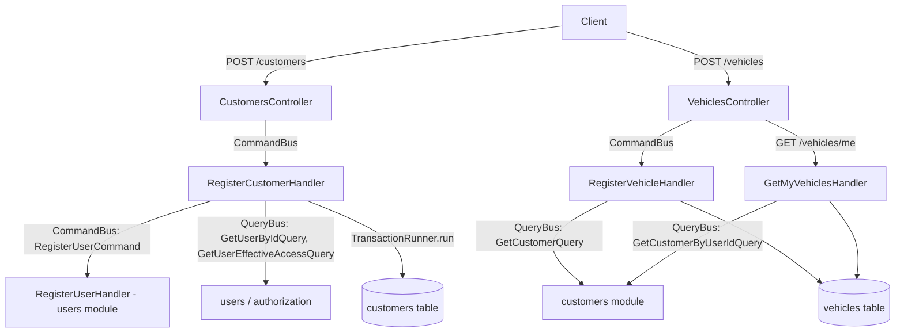

# Customer And Vehicle Registry Design

**Spec**: `.specs/features/customer-and-vehicle-registry/spec.md`
**Status**: Approved

---

## Architecture Overview

The module boundary and every cross-module reuse point below are not chosen among alternatives -
they are stated directly by `docs/ddd/implementation-plan.md` phases 4 and 5, which name the exact
modules, the exact dependency direction, and the exact query to reuse ("Must reuse: `GetCustomerQuery`
instead of injecting the customer repository" for Vehicle; "Must reuse: `RegisterUserCommand` rather
than a second user creation path" for Customer). There is no genuine architectural fork here worth
presenting as 2-3 options - manufacturing one would misrepresent a decision the DDD phase already
made. The one thing this Design phase adds is *how* those reuse points implement, at the code level,
against this repository's existing patterns (confirmed by reading `AssignRoleToUserHandler` /
`TypeOrmAssignmentRepository`, `RegisterUserHandler`, and `UsersController` directly, not assumed).

Two new modules, following the existing four-layer folder shape (`domain`, `application`,
`infrastructure`, `presentation`):

- **`customers`** - the `Customer` aggregate. Depends on `users` (via `RegisterUserCommand`,
  `GetUserByIdQuery`, `GetUserEffectiveAccessQuery`) and nothing else.
- **`vehicles`** - the `Vehicle` aggregate. Depends on `customers` (via `GetCustomerQuery`,
  `GetCustomerByUserIdQuery`) and nothing else.

Both cross every module boundary through `CommandBus`/`QueryBus` only (AD-003), exactly like the
existing split between `users`, `authorization` and `authentication` - a bounded context ("Customer
Management") spanning two `src/modules` directories is already the established shape, not a new one.



---

## Code Reuse Analysis

### Existing Components to Leverage

| Component | Location | How to Use |
| --- | --- | --- |
| `RegisterUserCommand` (extended by `identity-foundation` T18 with `issuedByStaff`) | `src/modules/users/application/commands/register-user/` | `RegisterCustomerHandler` dispatches it with `issuedByStaff: true` for the account-creation branch - the exact mechanism that already generates and returns a temporary password. No second user-creation path. |
| `GetUserByIdQuery`, `GetUserEffectiveAccessQuery` | `src/modules/users/...`, `src/modules/authorization/...` | Confirm an existing-user target exists and holds `CUSTOMER`, the same two queries `AssignRoleToUserHandler` already calls for its own cross-module checks. |
| `TransactionRunner` / `TRANSACTION_RUNNER` (`AsyncLocalStorage`-based) | `src/shared/infrastructure/database/typeorm-transaction-runner.ts` | Wraps `RegisterCustomerHandler`'s body so the `RegisterUserCommand` dispatch and the `customers` insert commit or roll back together - identical to how `RegisterUserHandler` already wraps its own user-save + role-assign. |
| Repository-boundary external-to-internal id resolution via `currentEntityManager()` | `src/modules/authorization/infrastructure/persistence/typeorm-assignment.repository.ts` (`resolveUserInternalId`) | `TypeOrmCustomerRepository` copies this exact pattern (`SELECT id FROM users WHERE external_id = $1`, read through the active transaction's manager) to resolve `customers.user_id`; `TypeOrmVehicleRepository` copies it again to resolve `vehicles.customer_id`. This is an infrastructure-layer FK lookup, not a business-logic cross-module call, so it does not go through `QueryBus` - the same distinction `TypeOrmAssignmentRepository` already draws. |
| `EntityId`, `AggregateRoot` | `src/shared/domain/` | `CustomerId`, `VehicleId` extend `EntityId` exactly like `UserId`/`RoleId`. `Customer`/`Vehicle` extend `AggregateRoot` exactly like `User`/`Role`. |
| Aggregate shape (private ctor, static `register`/`restore`, props interface, getters) | `src/modules/users/domain/entities/user.ts` | Direct template for `Customer` and `Vehicle`. |
| `me`-before-`:externalId` route split, `@RequirePermissions`, `ParseUUIDPipe` | `src/modules/users/presentation/controllers/users.controller.ts` | Direct template for `CustomersController`/`VehiclesController`: self-service routes declared first, unguarded by `@RequirePermissions`, scoped to `principal.userId`; staff routes guarded by `customers:read`/`customers:manage`/`vehicles:read`/`vehicles:manage`. |
| `ListUsersQuery(role?, document?)` shape | `src/modules/users/application/queries/list-users/` | Template for `ListCustomersQuery(name?, document?)` - one filtered-list query serves both "search by document" (CVR-02 AC1) and "list by name" (CVR-02 AC2), rather than two separate queries. |
| `ErrorKind` + `GlobalExceptionFilter` mapping | `src/shared/domain/errors/error-kind.ts` | Every new `DomainError` subclass picks one of the five existing kinds - no new kind needed. |
| RBAC catalog | `1787702400001-seed-rbac-catalog.ts` | `customers:read`, `customers:manage`, `vehicles:read`, `vehicles:manage` already exist and are already granted to `SERVICE_ADVISOR` (all four), `ADMIN`/`SUPER_ADMIN` (all four), `MECHANIC` (read only). **No RBAC seed change in this feature.** |

### Integration Points

| System | Integration Method |
| --- | --- |
| `users` module | `CommandBus.execute(RegisterUserCommand)`, `QueryBus.execute(GetUserByIdQuery)`, `QueryBus.execute(GetUserEffectiveAccessQuery)`. |
| `customers` module (from `vehicles`) | `QueryBus.execute(GetCustomerQuery)`, `QueryBus.execute(GetCustomerByUserIdQuery)`. |
| PostgreSQL | Two new hand-written migrations, `bigserial`/`external_id uuid` on both tables (AD-001), `CHECK` constraints and partial unique indexes filtered by `deleted_at IS NULL`, matching the identity schema. |

---

## Components

### `Customer` (aggregate root)

- **Purpose**: The workshop's own record of a person it serves - exactly one per user identity, carrying the address and phone the identity module has no business holding.
- **Location**: `src/modules/customers/domain/entities/customer.ts`
- **Interfaces**:
  - `static register(input: RegisterCustomerInput): Customer` - records `CustomerRegistered`.
  - `static restore(props: CustomerProps): Customer` - for the mapper.
  - `updateProfile(input: { address?: Address; phoneNumber?: PhoneNumber }, now: Date): void`
  - `deactivate(now: Date): void`
  - Getters: `id`, `userId` (external id of the backing `User`), `address: Address | null`, `phoneNumber: PhoneNumber | null`, `status`, `createdAt`, `updatedAt`, `deletedAt`.
- **Dependencies**: `Address`, `PhoneNumber`, `CustomerId`.
- **Reuses**: `AggregateRoot`, the `User` aggregate's private-ctor/static-factory shape.

### `Vehicle` (aggregate root)

- **Purpose**: One vehicle, identified by plate, belonging to exactly one active customer.
- **Location**: `src/modules/vehicles/domain/entities/vehicle.ts`
- **Interfaces**:
  - `static register(input: RegisterVehicleInput): Vehicle` - records `VehicleRegistered`.
  - `static restore(props: VehicleProps): Vehicle`
  - `updateDetails(input: { brand?: string; model?: string; year?: VehicleYear }, now: Date): void`
  - `transferTo(customerId: CustomerId, now: Date): void`
  - `remove(now: Date): void`
  - Getters: `id`, `customerId`, `plate: LicensePlate`, `brand`, `model`, `year: VehicleYear`, `deletedAt`.
- **Dependencies**: `LicensePlate`, `VehicleYear`, `VehicleId`, `CustomerId` (from `customers`' own value objects module - a value object crossing a module boundary is data, not behaviour, and `UserId` already crosses into `authorization`'s `AssignRoleToUserCommand` payload the same way).
- **Reuses**: `AggregateRoot`.

### `RegisterCustomerHandler`

- **Purpose**: The one place both registration branches of CVR-01 meet.
- **Location**: `src/modules/customers/application/commands/register-customer/`
- **Interfaces**: `execute(command: RegisterCustomerCommand): Promise<RegisteredCustomerDto>`
- **Dependencies**: `CUSTOMER_REPOSITORY`, `CommandBus`, `QueryBus`, `TRANSACTION_RUNNER`, `CLOCK`, `ID_GENERATOR`.
- **Reuses**: `RegisterUserCommand`, `GetUserByIdQuery`, `GetUserEffectiveAccessQuery`, `TransactionRunner`.
- **Logic**:
  1. Validate exactly one of `{ userId }` or `{ email, name, document }` is present (CVR-01 AC6) - throws `AmbiguousCustomerRegistrationError` (Validation, 400) otherwise.
  2. Validate `address`/`phoneNumber` if supplied (CVR-01 AC7-9) - the value objects throw `InvalidAddressError`/`InvalidPhoneNumberError` (Validation, 400).
  3. `transactionRunner.run(async () => { ... })`:
     - **Existing-user branch**: `GetUserByIdQuery` (404 via `UserNotFoundError` reused from `users` if missing is surfaced as-is, since `AssignRoleToUserHandler` already treats a missing user this way for its own cross-module check), then `GetUserEffectiveAccessQuery` and check `.roles.includes('CUSTOMER')` (`UserMissingCustomerRoleError`, RuleViolation, 422).
     - **Account-creation branch**: `commandBus.execute(new RegisterUserCommand(email, name, undefined, document, true))`, capturing `{ id, temporaryPassword }`.
     - Either way: `customers.save(Customer.register(...))` - the repository resolves the external user id to the internal `user_id` at its own boundary (see Code Reuse Analysis) and the DB's own partial unique index on `user_id` is the concurrency backstop for CVR-01 AC3 / the Edge Cases row on concurrent registration.
  4. Return `{ id, temporaryPassword? }` - `temporaryPassword` present only on the account-creation branch, mirroring `RegisteredUserDto`.

### `RegisterVehicleHandler`

- **Purpose**: Register a vehicle for an active customer.
- **Location**: `src/modules/vehicles/application/commands/register-vehicle/`
- **Interfaces**: `execute(command: RegisterVehicleCommand): Promise<RegisteredVehicleDto>`
- **Dependencies**: `VEHICLE_REPOSITORY`, `QueryBus`, `CLOCK`, `ID_GENERATOR`.
- **Reuses**: `GetCustomerQuery`.
- **Logic**: `GetCustomerQuery(command.customerId)` - `CustomerNotFoundError` (404) if null, `OwningCustomerInactiveError` (RuleViolation, 422) if its status is inactive; `LicensePlate.create(command.plate)` throws `InvalidLicensePlateError` (400) on a malformed plate; `VehicleYear.create(command.year)` throws `InvalidVehicleYearError` (400) outside 1950..currentYear+1; `vehicles.save(...)` with a partial unique index on `plate` where `deleted_at IS NULL` as the concurrency backstop (Edge Cases).

### `GetMyVehiclesHandler`

- **Purpose**: Resolve "my vehicles" from the authenticated principal with no customer-id round trip exposed to the client.
- **Location**: `src/modules/vehicles/application/queries/get-my-vehicles/`
- **Interfaces**: `execute(query: GetMyVehiclesQuery): Promise<VehicleSummaryDto[]>`
- **Reuses**: `GetCustomerByUserIdQuery`.
- **Logic**: `GetCustomerByUserIdQuery(principal.userId)` - if null, return `[]` (the logged assumption, not an error); otherwise list active vehicles for that customer's internal id.

---

## Data Models

### `customers`

```sql
id                  bigserial primary key
external_id         uuid not null unique
user_id             bigint not null unique references users(id)
address_street      varchar(160) null
address_number      varchar(20) null
address_complement  varchar(60) null
address_district    varchar(80) null
address_city        varchar(80) null
address_state       char(2) null
address_zip_code    varchar(8) null
phone               varchar(11) null
status              varchar(20) not null check (status in ('ACTIVE', 'INACTIVE'))
created_at          timestamptz not null
updated_at          timestamptz not null
deleted_at          timestamptz null
```

Index: `unique (user_id)` (backs CVR-01 AC3 and the Edge Cases concurrency row). `ILIKE` search on
name reads through `users` via `GetUserByIdQuery`/a join at the query-adapter level - see the
`ListCustomersQuery` note below.

### `vehicles`

```sql
id           bigserial primary key
external_id  uuid not null unique
customer_id  bigint not null references customers(id)
plate        varchar(7) not null
brand        varchar(60) not null
model        varchar(60) not null
year         smallint not null
created_at   timestamptz not null
updated_at   timestamptz not null
deleted_at   timestamptz null
```

Indexes: partial unique `(plate) where deleted_at is null` (CVR-03 AC6, Edge Cases); index on
`customer_id` (CVR-04 AC1, CVR-04 AC3's `/vehicles/me`).

**Relationships**: `customers.user_id` -> `users.id` (internal, resolved at the repository
boundary per AD-001). `vehicles.customer_id` -> `customers.id` (internal, same pattern).

**Note on `ListCustomersQuery`'s name filter**: `Customer` carries no `name` column - the name
lives on `users`. `TypeOrmCustomerQueryAdapter` joins `customers` to `users` on `user_id = users.id`
for the name/document filters and the list projection, the same shape
`TypeOrmUserQueryAdapter` already reads through for its own `document`/`role` filters (a query
adapter reading another module's table directly, at the infrastructure layer, is the established
exception to AD-003 - see the `resolveUserInternalId` precedent above; the alternative, a QueryBus
round trip per row to fetch each candidate's name, does not scale to a list endpoint).

---

## Error Handling Strategy

| Error Scenario | Handling | User Impact |
| --- | --- | --- |
| Register over an existing user without `CUSTOMER` | `UserMissingCustomerRoleError`, `ErrorKind.RuleViolation` | HTTP 422 |
| Register over a user that already has a customer | DB unique violation on `customers.user_id` mapped to `CustomerAlreadyExistsForUserError`, `ErrorKind.Conflict` | HTTP 409 |
| Register with both/neither `userId` and account data | `AmbiguousCustomerRegistrationError`, `ErrorKind.Validation` | HTTP 400 |
| Malformed address or phone | `InvalidAddressError` / `InvalidPhoneNumberError`, `ErrorKind.Validation` | HTTP 400 |
| Register a vehicle for a deactivated customer | `OwningCustomerInactiveError`, `ErrorKind.RuleViolation` | HTTP 422 |
| Register a vehicle for a customer that does not exist | `CustomerNotFoundError`, `ErrorKind.NotFound` | HTTP 404 |
| Malformed plate, either format | `InvalidLicensePlateError`, `ErrorKind.Validation` | HTTP 400 |
| Duplicate active plate | DB unique violation mapped to `LicensePlateAlreadyInUseError`, `ErrorKind.Conflict` | HTTP 409 |
| Implausible model year | `InvalidVehicleYearError`, `ErrorKind.Validation` | HTTP 400 |
| Missing `customers:manage`/`vehicles:manage`/`customers:read`/`vehicles:read` and not the owning person | Existing `PermissionsGuard` | HTTP 403 |
| Unknown customer/vehicle external id | `CustomerNotFoundError`/`VehicleNotFoundError`, `ErrorKind.NotFound` | HTTP 404 |

---

## Risks & Concerns

| Concern | Location (file:line) | Impact | Mitigation |
| --- | --- | --- | --- |
| Cross-module transaction: `RegisterUserCommand` dispatch + `customers` insert must commit or roll back together, same shape as the risk `identity-foundation`'s own T9/T18 already closed | `RegisterCustomerHandler` (new) | A failed customer insert after a successful user creation would leave an orphan account with a `CUSTOMER` role and no customer record | Wrap the whole handler body in `TransactionRunner.run()`, verified with the same kind of real-Postgres rollback integration test `identity-foundation`'s Verifier used as a discrimination-sensor mutation target |
| `ListCustomersQuery`'s name filter needs `customers` to read `users.name` for every row | `TypeOrmCustomerQueryAdapter` (new) | A naive per-row `QueryBus` call would be N+1; already mitigated by design (see Data Models note) rather than left as a follow-up | Query adapter joins the two tables directly, the same exception to AD-003 the identity schema's own query adapters already use |
| First optional value object on an aggregate in this codebase (`Address`, `PhoneNumber` are both nullable on `Customer`) | `Customer` (new) | None found beyond needing an explicit "all-or-nothing" rule, already logged as a spec assumption - not a risk, a first instance of an already-obvious pattern | `Address.create`/`PhoneNumber.create` are called only when the input is present; the aggregate field is simply `Address \| null` |

> No security, tech-debt or test-coverage-gap concerns found beyond the above.

---

## Tech Decisions (only non-obvious ones)

| Decision | Choice | Rationale |
| --- | --- | --- |
| Where the "exactly one of userId / account data" check lives | Inside `RegisterCustomerHandler`, not a `class-validator` decorator on the DTO | `@ValidateIf` conditional-group validation reads awkwardly for "exactly one of two field groups" and every other cross-field business rule in this codebase already lives in the handler, not the DTO (e.g. `RegisterUserHandler`'s own existence checks) |
| `Address`/`PhoneNumber` optionality | Nullable field on `Customer`, all-or-nothing validation inside the VO's own `create` | Logged in spec.md's Assumptions table; kept here for traceability |
| Vehicle year bound | 1950..currentYear+1, computed from `Clock` at validation time, not hardcoded to today's year | Matches the codebase's existing `Clock` port pattern (already used by every aggregate for `now`) rather than reading `new Date()` directly inside a value object, which would make the VO untestable without a fake clock |
| `ListCustomersQuery` reuse for both "search by document" and "list by name" | One query, two optional filters | Matches `ListUsersQuery(role?, document?)` exactly; a document filter naturally returns 0 or 1 row since documents are unique |

---

## AD Conformance

No `AD-NNN` supersession needed - every choice above conforms to AD-001 through AD-007 as written.
No new `AD-NNN` is proposed by this design either: nothing here sets a *new* project-wide
convention beyond what AD-001/AD-003/AD-004 already establish - it is the first feature to exercise
them, not the first to decide them.
