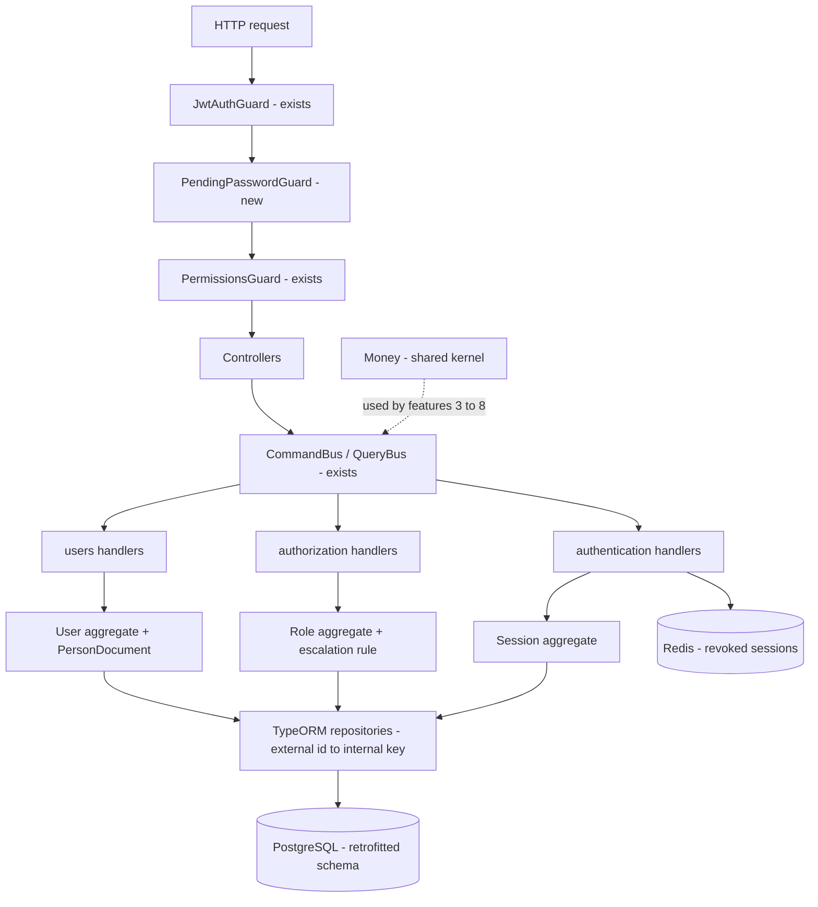

# Identity Foundation Design

**Spec**: `.specs/features/identity-foundation/spec.md`
**Status**: Draft

---

## Architecture Overview

Nothing new is invented here. Three existing modules are extended in place and one feature is
removed from one of them. The shared kernel gains one value object and the schema changes shape.



The guard order matters. `PendingPasswordGuard` runs after `JwtAuthGuard`, because it needs the
principal, and before `PermissionsGuard`, because an account that must change its password is
refused regardless of what it is permitted to do.

---

## Code Reuse Analysis

### Existing components to leverage

| Component | Location | How to use |
| --- | --- | --- |
| `User` aggregate with `changePassword` | `src/modules/users/domain/entities/user.ts` | Extend with the document and the pending flag. `changePassword` already exists and is unused. |
| `Email`, `Password`, `PasswordHash` | `src/modules/users/domain/value-objects/` | Reference for the `PersonDocument` shape: private constructor, static `create`, `equals`. |
| `RegisterUserCommand` and its handler | `src/modules/users/application/commands/register-user/` | The only path that creates an account. Extend it, never add a second one. |
| `AssignRoleToUserCommand` and its handler | `src/modules/authorization/application/commands/assign-role-to-user/` | The only path that grants a profile. The escalation rule goes inside it. |
| `LogoutAllSessionsCommand` | `src/modules/authentication/application/commands/logout-all-sessions/` | Becomes the logout, and the password change dispatches it. |
| `RevokeSessionHandler` | `src/modules/authentication/application/commands/revoke-session/revoke-session.handler.ts` | The pattern for an authorization check that depends on loaded state, copied by the escalation rule. |
| `JwtAuthGuard`, `@Public()`, `Principal` | `src/modules/authentication/presentation/` | The new guard sits next to them and reuses `Principal`. |
| `JwtAccessTokenService` | `src/modules/authentication/infrastructure/security/jwt-access-token.service.ts` | Gains the pending flag claim. |
| `EntityId` | `src/shared/domain/entity-id.ts` | Unchanged. The external identifier is a uuid, so every id value object keeps working. |
| `DomainError` and `ErrorKind` | `src/shared/domain/errors/` | Every new error extends it, and `GlobalExceptionFilter` maps it with no per-module work. |
| Raw SQL migration style | `src/shared/infrastructure/database/migrations/` | The rewritten schema follows it, including `CHECK` constraints and partial unique indexes. |

### Integration points

| System | Integration method |
| --- | --- |
| Existing e2e suite | The regression net for the retrofit. Only the registration payloads change, by gaining a document. |
| `test/support/db.ts` | Hand-written entity list. Loses the four group entities. |
| `test/support/global-setup.ts` | Hand-written migration list. Unchanged in shape. |
| `scripts/seed-admin.ts` | Gains a document and creates a `SUPER_ADMIN` instead of an `ADMIN`. |

---

## Components

### Money

- **Purpose**: One implementation of monetary arithmetic in integer BRL cents.
- **Location**: `src/shared/domain/value-objects/money.ts`
- **Interfaces**:
  - `static fromCents(cents: number): Money`
  - `static fromDatabase(raw: string): Money` - PostgreSQL returns `bigint` as a string
  - `add(other: Money): Money`
  - `multiply(quantity: number): Money`
  - `subtract(other: Money): Money`
  - `isGreaterThan(other: Money): boolean`
  - `equals(other?: Money): boolean`
  - `get cents(): number`
- **Dependencies**: none
- **Reuses**: the value object shape of `Email`

### PersonDocument

- **Purpose**: A CPF or CNPJ, validated by check digits and stored as digits only.
- **Location**: `src/modules/users/domain/value-objects/person-document.ts`
- **Interfaces**:
  - `static create(raw: string): PersonDocument`
  - `get value(): string` - digits only
  - `get kind(): 'CPF' | 'CNPJ'`
  - `equals(other?: PersonDocument): boolean`
- **Dependencies**: `InvalidPersonDocumentError`
- **Reuses**: `Email` for the normalise-then-validate shape

### PendingPasswordGuard

- **Purpose**: Refuse every authenticated route while the account must replace its password.
- **Location**: `src/modules/authentication/presentation/guards/pending-password.guard.ts`
- **Interfaces**:
  - `canActivate(context: ExecutionContext): boolean`
- **Dependencies**: `Reflector`, the pending flag claim on the principal
- **Reuses**: `JwtAuthGuard` for the reflector and principal pattern, `@Public()` for the decorator pattern. Its companion decorator `@AllowsPendingPassword()` marks the password change and the logout.

### ChangePasswordHandler

- **Purpose**: Replace a password, clear the pending flag and end every session.
- **Location**: `src/modules/users/application/commands/change-password/`
- **Interfaces**:
  - `execute(command: ChangePasswordCommand): Promise<void>`
- **Dependencies**: `UserRepository`, `PasswordHasher`, `Clock`, `CommandBus`
- **Reuses**: `User.changePassword`, which already exists; `Password` for the strength rules; `LogoutAllSessionsCommand` for the revocation

### Role escalation rule

- **Purpose**: Refuse an assignment of a profile at or above the actor's level.
- **Location**: `src/modules/authorization/application/commands/assign-role-to-user/assign-role-to-user.handler.ts` (modify)
- **Interfaces**: unchanged signature
- **Dependencies**: the actor's effective access
- **Reuses**: `RevokeSessionHandler`'s pattern of checking a permission inside the handler once the target is known

### Identifier translation in repositories

- **Purpose**: Keep the internal key out of the domain.
- **Location**: every `src/modules/*/infrastructure/persistence/*.repository.ts` and `*.mapper.ts`
- **Interfaces**: unchanged. The domain keeps passing value objects carrying uuids.
- **Dependencies**: none new
- **Reuses**: the existing mapper shape

---

## Data Models

Every addressable table gains the same two columns. `users` gains three fields of its own.

```typescript
// shape shared by users, roles, permissions, sessions, refresh_tokens
interface AddressableRow {
  id: bigint          // internal, never leaves the process
  externalId: string  // uuid, the only identifier in routes and payloads
}

interface UserRow extends AddressableRow {
  email: string
  passwordHash: string
  name: string
  document: string            // digits only, 11 or 14
  mustChangePassword: boolean
  status: 'ACTIVE' | 'INACTIVE'
  createdAt: Date
  updatedAt: Date
  deletedAt: Date | null
}
```

**Relationships**: `user_roles` and `role_permissions` keep composite primary keys of the two
internal keys. `groups`, `user_groups`, `group_roles` and `group_permissions` are not created.

**Indexes**: partial unique on `users.email` and on `users.document`, both filtered by
`deleted_at IS NULL`, matching what the schema already does for the email.

---

## Error Handling Strategy

| Error scenario | Handling | User impact |
| --- | --- | --- |
| Invalid CPF or CNPJ | `InvalidPersonDocumentError`, `ErrorKind.Validation` | 400 with `USER_INVALID_DOCUMENT` |
| Document already in use | `DocumentAlreadyInUseError`, `ErrorKind.Conflict` | 409 with `USER_DOCUMENT_ALREADY_IN_USE` |
| Request while the password is pending | `PasswordChangeRequiredError`, `ErrorKind.Forbidden` | 403 with `AUTH_PASSWORD_CHANGE_REQUIRED` |
| Wrong current password on change | reuses `InvalidCredentialsError` | 401 with `AUTH_INVALID_CREDENTIALS` |
| Weak new password | reuses `WeakPasswordError` | 400 with `USER_WEAK_PASSWORD` |
| Attempt to assign `SUPER_ADMIN` | `RoleNotAssignableError`, `ErrorKind.Forbidden` | 403 with `AUTHZ_ROLE_NOT_ASSIGNABLE` |
| Attempt to assign `ADMIN` without `SUPER_ADMIN` | `RoleEscalationForbiddenError`, `ErrorKind.Forbidden` | 403 with `AUTHZ_ROLE_ESCALATION_FORBIDDEN` |
| Editing another user without `users:manage` | existing `PermissionsGuard` | 403 |

---

## Risks & Concerns

| Concern | Location (file:line) | Impact | Mitigation |
| --- | --- | --- | --- |
| The ADMIN grant is a `CROSS JOIN` executed once, so permissions added later are not granted to any role automatically | `src/shared/infrastructure/database/migrations/1787702400001-seed-rbac-catalog.ts:40` | A new permission silently reaches nobody, and the failure appears as a 403 much later | The rewritten seed grants each role an explicit list rather than a wildcard, and an integration test asserts the resolved set per role |
| `RegisterUserHandler` saves the user and then dispatches the role assignment as two separate awaits with no shared transaction | `src/modules/users/application/commands/register-user/register-user.handler.ts:45` | A failure between the two leaves an account with no role, which can authenticate but resolves an empty permission set | T9 wraps the two writes in one transaction, and an integration test asserts that a failing assignment leaves no user behind |
| `pullDomainEvents` drains the collection, so only one consumer can ever read the events | `src/shared/domain/aggregate-root.ts:10` | Feature 7 needs the repository and the publisher to read the same events | Not this feature's problem to solve, but the getter that fixes it is cheap and is added here so feature 7 inherits it. Recorded as AD-007 |
| `scripts/seed-admin.ts` builds its rows with raw SQL and a client-generated uuid | `scripts/seed-admin.ts:16` | It bypasses the domain, so it will silently violate the new document rule | T6 rewrites it to supply a validated document and to create a `SUPER_ADMIN` |
| The effective access query has three union branches, two of which read group tables | `src/modules/authorization/infrastructure/persistence/typeorm-effective-access.reader.ts:8` | Every authorized request pays for joins that will always return nothing | T7 removes both branches with the feature |
| `test/support/db.ts` lists ORM entities by hand | `test/support/db.ts:22` | A forgotten edit makes integration tests fail with a confusing metadata error rather than a clear one | T7 updates it in the same task that deletes the entities |

---

## Tech Decisions

| Decision | Choice | Rationale |
| --- | --- | --- |
| How the retrofit reaches the database | Rewrite the initial migration in place | No commits, no deployed database. An ALTER migration over six tables would be written once and never run against real data. |
| Where the pending flag lives at request time | A claim in the access token | Avoids a database read on every request, and revoking the sessions on change keeps the claim from outliving its truth. |
| Where the escalation rule lives | Inside `AssignRoleToUserHandler` | The rule depends on which role is being assigned, which the guard cannot know before the handler resolves it. |
| Whether `Money` is a shared kernel type | Yes | Three later features need identical arithmetic. Recorded as AD-002. |
| Whether group removal is its own feature | No, it rides with the retrofit | The initial migration is being rewritten anyway, so the database cost collapses to not creating four tables. Recorded as AD-005. |

> Project-level decisions from this design are recorded in `.specs/STATE.md` as AD-001 to AD-007.
