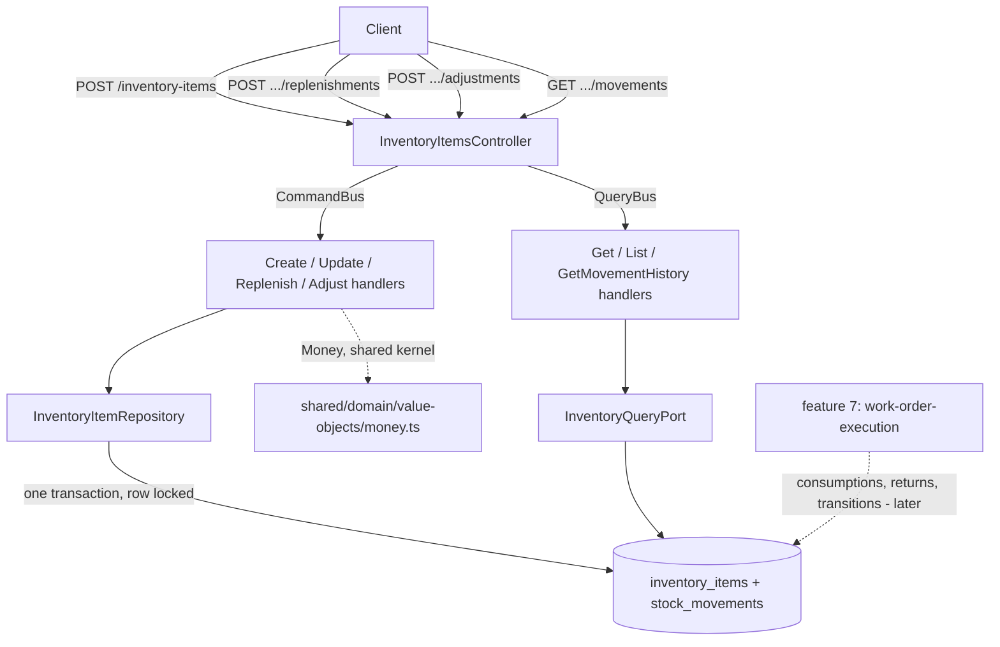

# Inventory And Stock Movements Design

**Spec**: `.specs/features/inventory-and-stock-movements/spec.md`
**Status**: Approved

---

## Architecture Overview

One module, one aggregate root owning an append-only child collection, one write path, no cross-module
calls. Phase 7 lists this feature's only dependency as "Money from the shared kernel", and section 12
of `event-storming.md` shows the Inventory context being *asked* by Workshop Operations later
(features 5 and 7), never asking anyone itself. As with the three features before it, the module
boundary and layer shape are dictated by the plan rather than chosen among alternatives.

Three things here are genuinely new to this codebase. Each was confirmed by reading the existing code,
not assumed:

1. **The first pessimistic row lock.** `grep` for `FOR UPDATE`, `setLock` and `pessimistic` across
   `src/` and `test/` returns nothing: no code in this project locks a row today. Phase 7's Risks
   section names the hazard directly - "two concurrent movements on the same item can both read the
   same count" - and prescribes the fix: the write runs inside a transaction with a row lock, with the
   `CHECK` constraint as the backstop.
2. **AD-007 becomes real code.** Until now it was a decision on paper: audit rows are written inside
   the same transaction as the aggregate whose facts they describe, never by a post-commit subscriber.
   Here the movement row and the item's new count are written together by
   `TypeOrmInventoryItemRepository.save`. `TypeOrmSessionRepository.save` is the only existing
   two-table aggregate write in the codebase and is the shape phase 7 explicitly says to copy.
3. **The first aggregate that deliberately does not load its own children.** Phase 7's Risks section:
   "an aggregate that owns an unbounded append only collection cannot load it all on every write. The
   repository loads the item with its pending movements only, and the full history is a read model."
   In this phase there are no consumptions, so *pending* is always empty: `findById` loads an item
   with no movements attached, and `save` writes only the movements appended during this request.



The dotted arrow from feature 7 is not built here. It is drawn because this feature creates the
schema those later movements will use (`CONSUMPTION`/`RETURN` kinds, the `PENDING`/`SETTLED`/
`WRITTEN_OFF` statuses, `undoes_movement_id`, and the `stock_movement_transitions` table) while
writing none of it - the boundary phase 7 sets and spec.md's Out of Scope records.

---

## Code Reuse Analysis

### Existing Components to Leverage

| Component | Location | How to Use |
| --- | --- | --- |
| Two-table aggregate write inside one transaction | `src/modules/authentication/infrastructure/persistence/typeorm-session.repository.ts:78` (`this.dataSource.transaction(async (manager) => ...)`) | The shape phase 7 names. `TypeOrmInventoryItemRepository.save` opens the same kind of transaction, adds the row lock, and writes the item row plus its new movement rows inside it. |
| Aggregate with a child-entity collection | `src/modules/authentication/domain/entities/session.ts` (`tokens: RefreshToken[]` in props, child entity in its own file) | Direct template for `InventoryItem` holding `StockMovement[]`. |
| Mapper returning a multi-row snapshot | `session.mapper.ts` (`SessionOrmSnapshot { sessionRow, tokenRows }`) | `InventoryItemMapper.toOrm` returns `{ itemRow, movementRows }` for the new movements only. |
| `Money` and its explicit `bigint` conversion | `src/shared/domain/value-objects/money.ts`, and `service.mapper.ts:17` as the worked example | `unit_price_cents` on both tables. `service-catalog` established the pattern and the test that proves it (assert the driver value is a `string` **and** the mapped value a `number`); repeat it here rather than re-deriving. |
| Two-layer uniqueness: application pre-check plus a database constraint | `CreateServiceHandler` + `TypeOrmServiceRepository`'s unique-violation mapping | `CreateInventoryItemHandler` pre-checks `existsActiveBySku` for the friendly 409; the repository maps the `ux_inventory_items_active_sku` violation for the concurrent case. |
| `EntityId`, `AggregateRoot`, `DomainEvent`, `ErrorKind` | `src/shared/domain/` | `InventoryItemId`/`StockMovementId` extend `EntityId`. `ErrorKind.RuleViolation` (422) is what phase 7 says to reuse for insufficient stock. |
| `@RequirePermissions`, `ParseUUIDPipe`, controller shape | `src/modules/services/presentation/controllers/services.controller.ts` | Direct template. `CurrentUser`/`Principal` supply the acting user every movement must record. |
| RBAC catalog | `1787702400001-seed-rbac-catalog.ts` | `inventory:read` (SUPER_ADMIN, ADMIN, SERVICE_ADVISOR, MECHANIC), `inventory:manage` and `audit:read` (SUPER_ADMIN, ADMIN) already exist and are already granted. **No RBAC seed change in this feature** - verified against the migration, not assumed. This is what makes phase 7's "403 for a mechanic trying to replenish" true. |
| Unique test-fixture factories | `test/support/factories/document.factory.ts`, `plate.factory.ts`, `service.factory.ts` | A new `uniqueSku()`, because the test database is never truncated and a literal SKU collides across runs - the bug feature 2 hit and feature 3 avoided. |

### Integration Points

| System | Integration Method |
| --- | --- |
| Shared kernel | Direct import of `Money`. Shared kernel, not another module's domain, so AD-003 does not apply. |
| `users` | `stock_movements.actor_user_id` is a foreign key to `users(id)`, resolved from the acting principal's external id at the repository boundary (AD-001). No `QueryBus` call: this is an infrastructure-layer id resolution, the same exception `TypeOrmCustomerRepository.resolveUserInternalId` already documents. |
| PostgreSQL | Three new tables in one hand-written migration, registered in `test/support/global-setup.ts`'s hardcoded array (not a glob). |
| Future features 5 and 7 | They read and write this module through the `CommandBus`/`QueryBus`. Nothing to build for them here. |

---

## Components

### `Sku` (value object)

- **Purpose**: A stock-keeping code, normalised so uniqueness needs no expression index.
- **Location**: `src/modules/inventory/domain/value-objects/sku.ts`
- **Interfaces**: `static create(raw: string): Sku`; `readonly value: string`; `equals(other?)`.
- **Behaviour**: trims, collapses internal whitespace, upper-cases, rejects empty or over 40 characters (`InvalidSkuError`, 400).

### `StockQuantity` (value object)

- **Purpose**: The item's quantity on hand - a non-negative whole number.
- **Location**: `src/modules/inventory/domain/value-objects/stock-quantity.ts`
- **Interfaces**: `static of(raw: number): StockQuantity`; `readonly units: number`; `plus(units: number)`; `minus(units: number)`.
- **Behaviour**: rejects a non-integer or negative value. `minus` that would go below zero throws `InsufficientStockError` (`RuleViolation`, 422) - the invariant lives in the value object, so no command can route around it. Movement quantity (`> 0`, a different rule) is validated in `StockMovement.record` rather than in a second value object, because phase 7 names only `StockQuantity`.

### `StockMovement` (child entity, append-only)

- **Purpose**: One line of the ledger. Once recorded it is never edited.
- **Location**: `src/modules/inventory/domain/entities/stock-movement.ts`
- **Interfaces**: `static record(input: RecordMovementInput): StockMovement`; `static restore(props)`; read-only getters only - no setters, no mutating methods at all.
- **Behaviour**: rejects a quantity that is not a positive integer (`InvalidMovementQuantityError`, 400). An `INBOUND` or `ADJUSTMENT` carries `status: null` and `workOrderId: null`, because only a consumption carries a status (section 9's invariant).

### `InventoryItem` (aggregate root)

- **Purpose**: One part or supply, its truthful count, and the movements appended during this request.
- **Location**: `src/modules/inventory/domain/entities/inventory-item.ts`
- **Interfaces**:
  - `static create(input): InventoryItem` - records `InventoryItemCreated`, quantity starts at zero.
  - `static restore(props): InventoryItem` - restored with **no** movements attached.
  - `updateDetails(input: { name?; description?; unitPrice? }, now): void` - records `InventoryItemUpdated`. Cannot touch the quantity.
  - `replenish(input: { quantity; unitPrice; actorUserId; note?; movementId; now }): void` - raises the count, appends an `INBOUND` movement, records `StockReplenished`.
  - `adjustDown(input: { quantity; actorUserId; note; movementId; now }): void` - lowers the count via `StockQuantity.minus` (which refuses to go negative), appends an `ADJUSTMENT` movement, records `StockAdjusted`. A blank note throws `AdjustmentNoteRequiredError` (400).
  - `get newMovements(): readonly StockMovement[]` - **non-draining**, see Tech Decisions.
- **Dependencies**: `Sku`, `StockQuantity`, `Money`, `StockMovement`, the kind/status enums.

### `TypeOrmInventoryItemRepository`

- **Purpose**: The only writer of stock quantities (rule 21), and the place AD-007 is honoured.
- **Location**: `src/modules/inventory/infrastructure/persistence/typeorm-inventory-item.repository.ts`
- **Interfaces**: `findById(id)`, `existsActiveBySku(sku)`, `save(item)`.
- **Logic**: `save` opens one transaction (copying `TypeOrmSessionRepository.save`), takes a row lock on the item (`SELECT ... FOR UPDATE`), writes the item row and every row in `item.newMovements`, and resolves `actorUserId` from external to internal at its own boundary. A unique violation on `ux_inventory_items_active_sku` maps to `SkuAlreadyInUseError` (409).
- **Note**: `findById` does **not** load movements. The history is a read model, per phase 7's Risks.

### `TypeOrmInventoryQueryAdapter`

- **Purpose**: The read side: the catalog and the unbounded history the aggregate must not hold.
- **Location**: `src/modules/inventory/infrastructure/persistence/typeorm-inventory-query.adapter.ts`
- **Interfaces**: `getById(externalId)`, `listActive(kind?)`, `listMovements(itemExternalId)`.
- **Logic**: `listMovements` returns every movement of one item ordered by `occurred_at`, joining `users` for the actor's external id. Prices convert through `Money.fromDatabase` on both paths, as `service-catalog` established.

### `ReplenishStockHandler` / `AdjustStockHandler`

- **Location**: `src/modules/inventory/application/commands/replenish-stock/`, `.../adjust-stock/`
- **Logic**: load by id or `InventoryItemNotFoundError` (404); call the aggregate method, which enforces the quantity and note rules; `save`; publish. Neither handler computes the new count itself - the aggregate owns that arithmetic so a future caller cannot bypass it.

### `InventoryItemsController`

- **Routes**: `POST /api/v1/inventory-items`, `PATCH /api/v1/inventory-items/:externalId`, `POST /api/v1/inventory-items/:externalId/replenishments`, `POST /api/v1/inventory-items/:externalId/adjustments` behind `inventory:manage`; `GET /api/v1/inventory-items` and `GET /api/v1/inventory-items/:externalId` behind `inventory:read`; `GET /api/v1/inventory-items/:externalId/movements` behind `audit:read`.
- **Note**: phase 7 warned that `GET /inventory-items/shortages` had to be declared before the `:externalId` route so it would not be parsed as an id. With shortages deferred (spec.md's Out of Scope) that hazard does not arise here, and returns with the route in feature 7.

---

## Data Models

### `inventory_items`

```sql
id                bigserial primary key
external_id       uuid not null unique
sku               varchar(40) not null
name              varchar(120) not null
description       varchar(255) null
kind              varchar(10) not null check (kind in ('PART', 'SUPPLY'))
unit_price_cents  bigint not null check (unit_price_cents >= 0)
quantity_on_hand  integer not null check (quantity_on_hand >= 0)
status            varchar(20) not null check (status in ('ACTIVE', 'INACTIVE'))
created_at        timestamptz not null
updated_at        timestamptz not null
```

Index: `create unique index ux_inventory_items_active_sku on inventory_items (sku) where status = 'ACTIVE'`. Plain, not an expression index, because `Sku` normalises to upper case on the way in.

### `stock_movements`

```sql
id                  bigserial primary key
external_id         uuid not null unique
inventory_item_id   bigint not null references inventory_items(id)
kind                varchar(20) not null check (kind in ('INBOUND', 'CONSUMPTION', 'RETURN', 'ADJUSTMENT'))
undoes_movement_id  bigint null references stock_movements(id)
quantity            integer not null check (quantity > 0)
unit_price_cents    bigint not null check (unit_price_cents >= 0)
work_order_id       bigint null              -- no FK until phase 8 creates work_orders
status              varchar(20) null check (status in ('PENDING', 'SETTLED', 'WRITTEN_OFF'))
occurred_at         timestamptz not null
actor_user_id       bigint not null references users(id)
note                varchar(255) null
```

Indexes: `(inventory_item_id, occurred_at)` for the history read, `(work_order_id, status)` for the
shortages read model feature 7 will add.

### `stock_movement_transitions`

```sql
id                   bigserial primary key
external_id          uuid not null unique
stock_movement_id    bigint not null references stock_movements(id)
from_status          varchar(20) null
to_status            varchar(20) not null
from_work_order_id   bigint null
to_work_order_id     bigint null
actor_user_id        bigint null references users(id)
occurred_at          timestamptz not null
note                 varchar(255) null
```

Index: `(stock_movement_id)`. **Created here, written by nothing until phase 11** - only a consumption
ever changes status, and consumptions arrive with feature 7.

**Relationships**: `stock_movements.inventory_item_id` and `stock_movement_transitions.stock_movement_id`
are the aggregate's own internal keys. `actor_user_id` points at `users(id)` (spec.md's Assumptions).
`work_order_id` deliberately carries no constraint until phase 8.

---

## Error Handling Strategy

| Error Scenario | Handling | User Impact |
| --- | --- | --- |
| Negative unit price | `InvalidMoneyAmountError` (shared kernel), `ErrorKind.Validation` | HTTP 400 |
| Empty or over-long SKU | `InvalidSkuError`, `ErrorKind.Validation` | HTTP 400 |
| Kind outside `PART`/`SUPPLY` | Request DTO validation, `VALIDATION_ERROR` | HTTP 400 |
| SKU already held by an active item | `SkuAlreadyInUseError`, `ErrorKind.Conflict` - thrown by the handler's pre-check, and again by the repository on the concurrent race | HTTP 409 |
| Movement quantity zero or negative | `InvalidMovementQuantityError`, `ErrorKind.Validation` | HTTP 400 |
| Adjustment with no note | `AdjustmentNoteRequiredError`, `ErrorKind.Validation` | HTTP 400 |
| Adjustment that would go below zero | `InsufficientStockError`, `ErrorKind.RuleViolation` - thrown by `StockQuantity.minus`, so no command can route around it | HTTP 422 |
| Unknown item external id | `InventoryItemNotFoundError`, `ErrorKind.NotFound` | HTTP 404 |
| Missing `inventory:manage` / `inventory:read` / `audit:read` | Existing `PermissionsGuard` | HTTP 403 |

---

## Risks & Concerns

| Concern | Location (file:line) | Impact | Mitigation |
| --- | --- | --- | --- |
| **The `CHECK` constraint does not catch a lost update.** Two concurrent replenishments of +5 on a count of 10 can both read 10 and both write 15, losing five units - and 15 satisfies `quantity_on_hand >= 0` perfectly, so the database never complains | `TypeOrmInventoryItemRepository.save` (new) | Silent stock drift, the exact failure the ledger exists to make impossible | `SELECT ... FOR UPDATE` on the item row inside the write transaction. The `CHECK` backstops the *invariant*, never the *arithmetic* - only the lock protects the arithmetic, and the concurrency test must prove it with two real connections rather than argue it |
| First pessimistic lock in the codebase - nothing else here locks a row, so there is no local precedent to copy and no existing test that would notice if the lock were dropped | `TypeOrmInventoryItemRepository.save` (new) | A dropped or mis-scoped lock reintroduces the drift above, invisibly | An integration test that runs two overlapping transactions against real PostgreSQL and asserts the final count equals the sum; it is also the obvious discrimination-sensor target for this feature |
| Draining the new-movement list would lose the ledger row if a save failed and the caller retried, writing the count with no movement behind it | `InventoryItem.newMovements` (new) | A count and a ledger that disagree - the one outcome this feature exists to prevent | A **non-draining** getter, not a `pull...()` drain. See Tech Decisions; this mirrors why H39 gave `AggregateRoot` a non-draining `domainEvents` reader next to the draining `pullDomainEvents` |
| An unbounded child collection loaded on every write would degrade as the ledger grows | `InventoryItemRepository.findById` (new) | Slow writes that get slower forever | `findById` attaches no movements at all; the history is served by the query adapter. Phase 7 prescribes this |
| A fixed literal SKU in a test collides with leftover rows, because the test database is never truncated | new test files | Green in isolation, red in a full run - the bug feature 2 hit | A `uniqueSku()` factory from the first test that needs one, and `test:integration` run twice consecutively at every gate |
| L-002 and L-003 (confirmed lessons) apply directly here: five Edge Cases and several error-producing call sites | `tasks.md` (next phase) | Edge cases with no owning task ship unimplemented; sibling-path tests hide missing route-level proof | Every Edge Case in spec.md gets a named owning task, and every refusal path gets its own asserting test at the layer the coverage matrix promises |

---

## Tech Decisions (only non-obvious ones)

| Decision | Choice | Rationale |
| --- | --- | --- |
| How the repository learns which movements are new | A non-draining `newMovements` getter on the aggregate, read inside the write transaction | A draining `pullNewMovements()` would mirror `pullDomainEvents`, but the two are not alike: losing a domain event on a failed save costs a notification, losing a movement costs the ledger row that explains a count that did change. The aggregate instance is per-request and never re-saved, so nothing needs clearing |
| `StockMovementTransition` entity class | Table created now, **class deferred to feature 7** | A dormant column costs nothing and spares phase 11 a schema rewrite. A dormant *class* is dead code with no caller and no test - the same reasoning that moved the shortages query out of scope |
| Movement quantity validation | Inside `StockMovement.record`, not a second value object | Phase 7's "needs new implementation" list names `StockQuantity` and `Sku` and no third value object. The item count (`>= 0`) and a movement quantity (`> 0`) are different rules on different things |
| Where the never-negative invariant lives | `StockQuantity.minus`, not the handler | Rule 19 says the count never goes negative "at any point, through any command". Putting the check in a handler means the next command that forgets to call it breaks the invariant; putting it in the value object makes that impossible |
| `unit_price_cents` on `stock_movements` is `not null` | Every movement records the price it moved at | Phase 7's schema shows the column without a null marker, and a movement whose price is unknown could not be priced by feature 6's budget. A replenishment carries the price it arrived at; an adjustment carries the item's current price |

---

## AD Conformance

Conforms to AD-001 (bigserial internal keys with `external_id uuid`, external ids in routes, internal
resolution at the repository boundary), AD-002 (`Money`, integer cents, `bigint` columns, explicit
mapper conversion on both tables), AD-003 (no cross-module coupling exists in this feature) and
**AD-007**, which this feature turns from a recorded decision into running code: the movement row is
written inside the same transaction as the aggregate whose count it explains, by the repository, never
by a post-commit subscriber. AD-004, AD-005 and AD-006 do not apply. No supersession, and no new
`AD-NNN` proposed - AD-007 already covers the pattern this feature is the first to implement.
