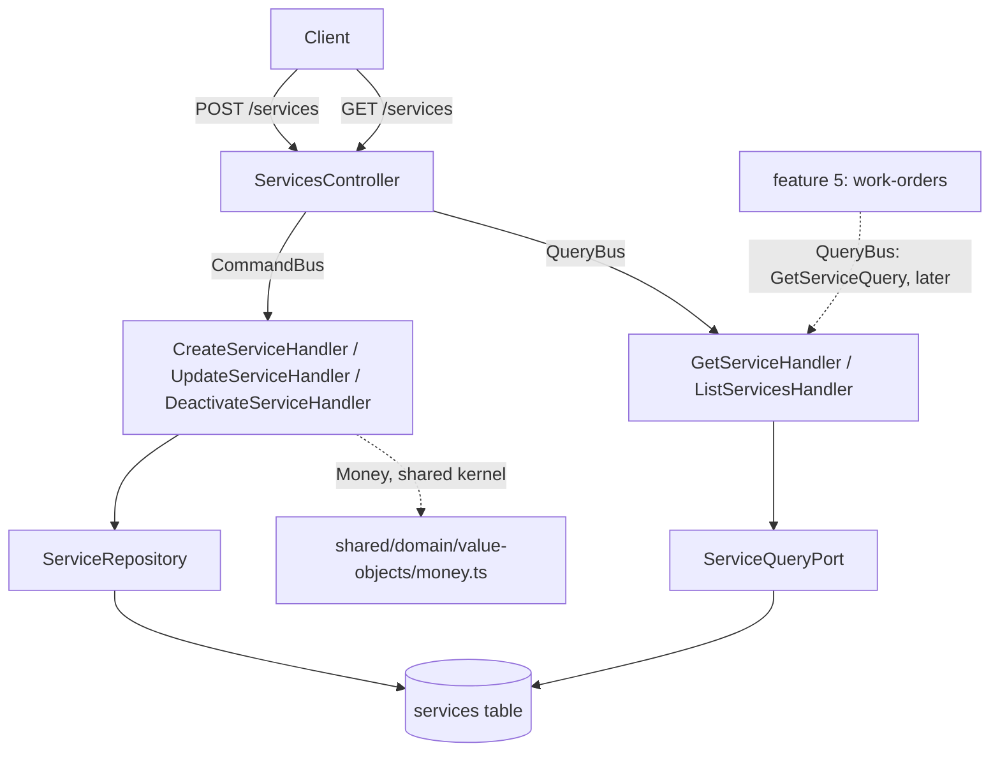

# Service Catalog Design

**Spec**: `.specs/features/service-catalog/spec.md`
**Status**: Approved

---

## Architecture Overview

One module, one aggregate, one table, no cross-module writes and no cross-module reads. This is the
simplest feature of the three built so far: `docs/ddd/implementation-plan.md` phase 6 lists its only
dependency as "Money from the shared kernel", and section 12 of `event-storming.md` shows the
`Workshop Catalog` context being *read from* by Workshop Operations later (feature 5), never
reading from anyone itself. There is no `TransactionRunner`, no `CommandBus` dispatch across a
module boundary, and no `QueryBus` call out of this module - the shapes that carried the real risk
in the two features before this one simply do not appear here.

As with `customer-and-vehicle-registry`, the module boundary and layer shape are not a choice among
alternatives: phase 6 names the module, the aggregate, its commands, queries, repositories and
schema, and `identity-foundation` plus `customer-and-vehicle-registry` already built the four-layer
shape twice. Presenting invented alternatives would misrepresent a decision the DDD phase made.
What this design adds is the code-level detail for the two things that are genuinely new to this
codebase, both verified by reading the existing code rather than assumed:

1. **The first `Money`-backed column.** AD-002 says the backend works in integer BRL cents with
   `bigint` columns and that "every mapper converts explicitly". Until now no table stored one -
   `identity-foundation`'s own round-trip test had to create a throwaway table to prove it. Every
   existing `bigint` non-primary-key column in this codebase maps to a **`string`** property
   (`SessionOrmEntity.userInternalId`, `CustomerOrmEntity.userInternalId`,
   `VehicleOrmEntity.customerInternalId`), because that is what the driver returns.
   `ServiceOrmEntity.priceCents` follows that, and `ServiceMapper` calls
   `Money.fromDatabase(row.priceCents)` on the way in - the exact hazard phase 6's Risks line names.
2. **The first expression index.** Name uniqueness is case-insensitive per spec.md's Assumptions,
   so the partial unique index is on `lower(name)` rather than on `name`. Every existing partial
   index in the schema filters on a column (`WHERE deleted_at IS NULL`); this one filters on
   `WHERE status = 'ACTIVE'` and keys on an expression. Both halves are plain PostgreSQL, but it is
   the first of its kind here, so the repository's uniqueness pre-check has to use `lower()` too or
   the two layers disagree.



The dotted arrow from feature 5 is not built here. It is drawn because `GetServiceQuery`'s shape is
this feature's obligation to the next one: it must return `status` alongside name, price and
duration, so that feature 5 can enforce rule 18 ("a deactivated service cannot be added to a work
order") with a precise error instead of a misleading not-found. `customer-and-vehicle-registry`
learned this the expensive way and had to change a query adapter after the fact; here it is a
stated acceptance criterion (SVC-02 AC3) from the start.

---

## Code Reuse Analysis

### Existing Components to Leverage

| Component | Location | How to Use |
| --- | --- | --- |
| `Money` | `src/shared/domain/value-objects/money.ts` | `Money.fromCents` on the write path, `Money.fromDatabase` in the mapper. Its own `InvalidMoneyAmountError` (`ErrorKind.Validation`, 400) already covers SVC-01 AC2 - this feature defines no price error of its own. |
| `EntityId`, `AggregateRoot`, `DomainEvent` | `src/shared/domain/` | `ServiceId extends EntityId` exactly like `CustomerId`/`VehicleId`; `Service extends AggregateRoot`. |
| Aggregate shape (private ctor, static `create`/`restore`, props interface, getters, idempotent deactivate) | `src/modules/customers/domain/entities/customer.ts`, `src/modules/vehicles/domain/entities/vehicle.ts` | Direct template. `Vehicle.remove`'s idempotency guard is the model for `Service.deactivate` (SVC-04 AC3). |
| Two-layer uniqueness: application pre-check plus a database constraint as the concurrency backstop | `RegisterCustomerHandler.existsByUserId` + `TypeOrmCustomerRepository`'s unique-violation mapping; `TypeOrmVehicleRepository`'s plate mapping | `CreateServiceHandler` calls `existsActiveByName` for the friendly 409; `TypeOrmServiceRepository.save` maps the `ux_services_active_name` violation to the same error for the race. |
| Query-adapter split: `getById` unfiltered, list filtered | `TypeOrmCustomerQueryAdapter` (`getById` deliberately unfiltered after the T20 fix; `listActive` filtered) | Same split here by design rather than by correction: `getById` returns a service whatever its status, `listActive` returns `ACTIVE` only. |
| `@RequirePermissions`, `ParseUUIDPipe`, controller route shape | `src/modules/vehicles/presentation/controllers/vehicles.controller.ts` | Direct template. No `me` route exists in this feature, so no route-ordering concern. |
| `ErrorKind` + `GlobalExceptionFilter` mapping | `src/shared/domain/errors/error-kind.ts` | `Validation` 400, `Conflict` 409, `NotFound` 404, and `PermissionsGuard`'s own 403. No new kind. |
| RBAC catalog | `1787702400001-seed-rbac-catalog.ts` | `services:read` (SUPER_ADMIN, ADMIN, SERVICE_ADVISOR, MECHANIC) and `services:manage` (SUPER_ADMIN, ADMIN) already exist and are already granted. **No RBAC seed change in this feature** - verified against the migration, not assumed. |
| Test-fixture uniqueness discipline | `test/support/factories/document.factory.ts`, `plate.factory.ts` | A new `uniqueServiceName()` factory, because the test database is never truncated (`STATE.md` Conventions) and a fixed literal name would collide across runs - the exact bug `customer-and-vehicle-registry` T15 hit. |

### Integration Points

| System | Integration Method |
| --- | --- |
| Shared kernel | Direct import of `Money`. It is shared-kernel, not another module's domain, so AD-003 does not apply. |
| PostgreSQL | One new hand-written migration, registered in `test/support/global-setup.ts`'s hardcoded `migrations` array (that array is not a glob - the correction recorded in `customer-and-vehicle-registry`'s own Preconditions). |
| Future feature 5 | Exposes `GetServiceQuery` on the `QueryBus`. Nothing to build for it here beyond the DTO carrying `status`. |

---

## Components

### `ServiceName` (value object)

- **Purpose**: A catalog name that is trimmed, bounded, and compared case-insensitively.
- **Location**: `src/modules/services/domain/value-objects/service-name.ts`
- **Interfaces**: `static create(raw: string): ServiceName`; `readonly value: string`; `equals(other?)`.
- **Behaviour**: trims, collapses runs of internal whitespace to one space, rejects empty or over 120 characters (`InvalidServiceNameError`, 400). Stores the name as the administrator capitalised it - case-insensitivity lives in the index and the lookup query, not in a second normalised field on the aggregate.

### `ServiceDuration` (value object)

- **Purpose**: The estimated duration in whole minutes.
- **Location**: `src/modules/services/domain/value-objects/service-duration.ts`
- **Interfaces**: `static fromMinutes(raw: number): ServiceDuration`; `readonly minutes: number`.
- **Behaviour**: rejects anything that is not a positive integer (`InvalidServiceDurationError`, 400). No upper bound, per spec.md's Assumptions.

### `Service` (aggregate root)

- **Purpose**: One catalog entry: what it is called, what it costs, how long it takes, whether it is still offered.
- **Location**: `src/modules/services/domain/entities/service.ts`
- **Interfaces**:
  - `static create(input: CreateServiceInput): Service` - records `ServiceCreated`.
  - `static restore(props: ServiceProps): Service`
  - `updateDetails(input: { name?: ServiceName; description?: string | null; price?: Money; duration?: ServiceDuration }, now: Date): void` - records `ServiceUpdated`.
  - `deactivate(now: Date): void` - records `ServiceDeactivated`; idempotent (SVC-04 AC3).
  - Getters: `id`, `name`, `description`, `price: Money`, `duration: ServiceDuration`, `status`, `createdAt`, `updatedAt`.
- **Dependencies**: `ServiceId`, `ServiceName`, `ServiceDuration`, `Money`, `ServiceStatus`.
- **Note**: no `deletedAt`. Deactivation is a status flip - phase 6's schema has no such column, unlike every other table built so far.

### `CreateServiceHandler`

- **Purpose**: The only place the uniqueness rule and the three value-object validations meet.
- **Location**: `src/modules/services/application/commands/create-service/`
- **Interfaces**: `execute(command: CreateServiceCommand): Promise<CreatedServiceDto>`
- **Dependencies**: `SERVICE_REPOSITORY`, `ID_GENERATOR`, `CLOCK`, `EventBus`.
- **Logic**: build `ServiceName`, `Money.fromCents`, `ServiceDuration.fromMinutes` (each throws its own 400); `services.existsActiveByName(name)` - `ServiceNameAlreadyInUseError` (409) if taken; `Service.create(...)`; `save`; publish. The repository's own unique-violation mapping covers the concurrent case (Edge Cases).

### `UpdateServiceHandler` / `DeactivateServiceHandler`

- **Location**: `src/modules/services/application/commands/update-service/`, `.../deactivate-service/`
- **Logic**: load by `ServiceId` or `ServiceNotFoundError` (404). Update applies only the supplied fields; when the name changes, re-run `existsActiveByName` and exclude the service's own row from the match, so renaming a service to its own current name is not a false conflict. Deactivate flips the status and is idempotent. Neither refuses to act on an already-deactivated service (spec.md Assumptions).

### `GetServiceHandler` / `ListServicesHandler`

- **Location**: `src/modules/services/application/queries/get-service/`, `.../list-services/`
- **Logic**: `GetServiceQuery` returns the service by external id **regardless of status**, or `null` (the controller turns `null` into 404). Guards a malformed id through `ServiceId.create` in a `try/catch` returning `null`, the same shape `GetCustomerHandler` uses. `ListServicesQuery` returns `ACTIVE` services only, ordered by name.

### `ServicesController`

- **Purpose**: The five routes phase 6 names.
- **Location**: `src/modules/services/presentation/controllers/services.controller.ts`
- **Routes**: `POST /api/v1/services` and `PATCH`/`DELETE /api/v1/services/:externalId` behind `services:manage`; `GET /api/v1/services` and `GET /api/v1/services/:externalId` behind `services:read`. `DELETE` returns 204 and deactivates - it does not delete a row.

---

## Data Models

### `services`

```sql
id                          bigserial primary key
external_id                 uuid not null unique
name                        varchar(120) not null
description                 varchar(255) null
price_cents                 bigint not null check (price_cents >= 0)
estimated_duration_minutes  integer not null check (estimated_duration_minutes > 0)
status                      varchar(20) not null check (status in ('ACTIVE', 'INACTIVE'))
created_at                  timestamptz not null
updated_at                  timestamptz not null
```

Index: `create unique index ux_services_active_name on services (lower(name)) where status = 'ACTIVE'`.

**Relationships**: none. `services` references no other table, and no table references it yet -
feature 5's `work_order_services` will, and will carry its own price snapshot rather than a
foreign-key-driven read (rule 17: a later price change must not move a generated budget).

**`Money` mapping, explicitly** (AD-002, and phase 6's stated risk):

```typescript
// ServiceOrmEntity
@Column({ name: 'price_cents', type: 'bigint' })
priceCents!: string        // what the driver actually returns for bigint

// ServiceMapper.toDomain
price: Money.fromDatabase(row.priceCents)
// ServiceMapper.toOrm
row.priceCents = String(service.price.cents)
```

---

## Error Handling Strategy

| Error Scenario | Handling | User Impact |
| --- | --- | --- |
| Negative price | `InvalidMoneyAmountError` (shared kernel), `ErrorKind.Validation` | HTTP 400 |
| Zero or negative duration | `InvalidServiceDurationError`, `ErrorKind.Validation` | HTTP 400 |
| Empty or over-long name | `InvalidServiceNameError`, `ErrorKind.Validation` | HTTP 400 |
| Name already used by another active service | `ServiceNameAlreadyInUseError`, `ErrorKind.Conflict` - thrown by the handler's pre-check, and again by the repository when a concurrent insert loses the race | HTTP 409 |
| Unknown service external id | `ServiceNotFoundError`, `ErrorKind.NotFound` | HTTP 404 |
| Missing `services:manage` / `services:read` | Existing `PermissionsGuard` | HTTP 403 |

---

## Risks & Concerns

| Concern | Location (file:line) | Impact | Mitigation |
| --- | --- | --- | --- |
| First `Money`-backed column: an implicit `bigint`-to-number conversion returns a string, and a price silently becomes `"15099"` instead of `15099` - phase 6 names this risk explicitly | `ServiceMapper` (new) | A budget in feature 6 built by concatenating strings instead of adding numbers | `Money.fromDatabase` in the mapper, plus an integration test asserting both the reloaded value and that the raw driver value really is a string (the assertion `identity-foundation`'s `money.roundtrip.spec.ts:37` already makes against a throwaway table, now against the real column) |
| The `lower(name)` index and the application pre-check can disagree if one is case-sensitive and the other is not | `TypeOrmServiceRepository.existsActiveByName` (new) + the migration | A duplicate name slipping past the friendly check and surfacing as a raw 500 from the constraint, or the reverse - a false 409 | Both sides use `lower()`; an integration test inserts `"Troca de Oleo"` then asserts `existsActiveByName("troca de oleo")` is true, and a second test asserts the constraint itself rejects the insert |
| Renaming a service to its own current name would trip a naive uniqueness pre-check | `UpdateServiceHandler` (new) | A false 409 on a no-op rename | The pre-check excludes the service's own row; covered by its own unit test |
| Fixed literal service names in tests colliding across runs against the never-truncated test database | new test files | Green in isolation, red in the full suite - exactly the bug `customer-and-vehicle-registry` T15 hit | A `uniqueServiceName()` factory from the first test that needs a name, and every integration/e2e test uses it |

> No security or tech-debt concerns found. This feature adds no cross-module coupling and no new
> guard, and touches no existing module's code.

---

## Tech Decisions (only non-obvious ones)

| Decision | Choice | Rationale |
| --- | --- | --- |
| Where case-insensitivity lives | In the index and the lookup query (`lower(...)`), not as a second normalised column on the aggregate | Keeps the stored name exactly as the administrator typed it for display, with one comparison rule enforced in the one place that can enforce it atomically. A `name_normalised` column would be a second source of truth to keep in sync. |
| `DELETE /services/:externalId` deactivates rather than deletes | Status flip, 204 | Phase 6 lists `DELETE` among the routes and `Deactivate Service` among the commands, with no hard-delete command anywhere. Matches `DELETE /customers/:externalId`, which also soft-deletes. |
| No `deleted_at` on `services` | `status` only | Phase 6's schema for this table omits it deliberately, and the uniqueness filter it specifies is `WHERE status = 'ACTIVE'`. Carried through rather than "corrected" for symmetry with the other tables. |
| `description` clearing | `null` clears it; omitting the field leaves it untouched | The only way to distinguish "not supplied" from "set to empty" in a PATCH. Consistent with the partial-update shape of `UpdateCustomerCommand`/`UpdateVehicleCommand`. |

---

## AD Conformance

Conforms to AD-001 (bigserial internal id plus unique `external_id`, routes accept only the
external one), AD-002 (`Money` from the shared kernel, integer cents, `bigint` column, explicit
mapper conversion - this feature is where that decision first becomes real code) and AD-003
(no cross-module coupling exists here at all). AD-004 through AD-007 do not apply to this feature.
No supersession, and no new `AD-NNN` proposed: nothing here sets a project-wide convention that
AD-001 and AD-002 do not already establish.
