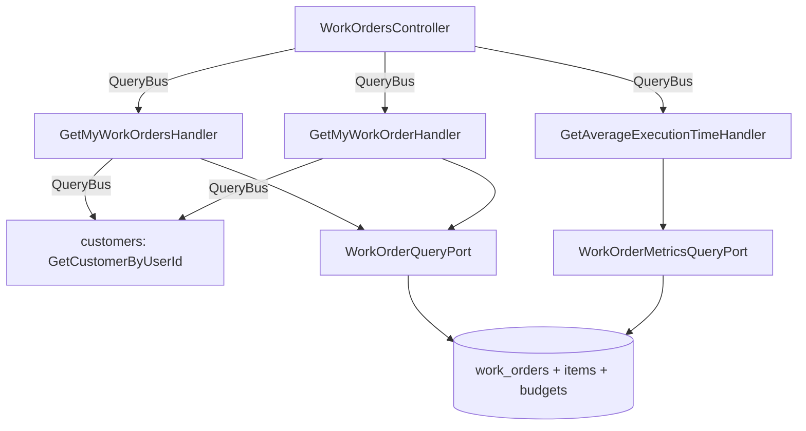

# Tracking And Metrics Design

**Spec**: `.specs/features/tracking-and-metrics/spec.md`
**Status**: Approved

---

## Architecture Overview

Nothing here writes. Three read models join the `work-orders` module, each following a path this codebase already has a precedent for, so the design is mostly a matter of naming which precedent applies where.

The two customer reads resolve the acting customer the way `GetMyVehiclesHandler` already does: over the `QueryBus` into the `customers` module (AD-003), answering an empty list when the user backs no customer. The single-work-order read compares the resolved customer against the work order's own and answers `null` when they differ, which the controller turns into the same 404 an unknown number produces - so a stranger cannot tell an existing number from a missing one (rule 44).

The metric is the one genuinely new shape: a second query port beside `WorkOrderQueryPort`, whose adapter runs one `AVG(EXTRACT(EPOCH FROM (completed_at - execution_started_at)))` over the rows Postgres already holds. No handler ever sees a work order.



---

## Code Reuse Analysis

### Existing Components to Leverage

| Component | Location | How to Use |
| --- | --- | --- |
| `GetMyVehiclesHandler` | `src/modules/vehicles/application/queries/get-my-vehicles/get-my-vehicles.handler.ts` | The exact template for both customer reads: resolve the customer over the `QueryBus`, answer empty when there is none. |
| `GetCustomerByUserIdQuery` | `src/modules/customers/application/queries/get-customer-by-user-id/` | Resolves `principal.userId` to the customer record, already used by three modules. |
| `WorkOrderQueryPort` | `src/modules/work-orders/application/ports/work-order-query.port.ts` | Gains `listByCustomerId`. `getByNumber` is reused unchanged for the single read. |
| `TypeOrmWorkOrderQueryAdapter` | `.../infrastructure/persistence/typeorm-work-order-query.adapter.ts` | `SELECT_WORK_ORDERS` already joins customers, vehicles and users and already carries every closing field - the new list read is one more `WHERE` over it. |
| `WorkOrderResponseDto` and `toResponseDto` | `.../presentation/controllers/work-orders.controller.ts` | Both customer reads answer the same shape as the staff reads, mapped by the same private method. |
| `me`-before-`:id` route ordering | `users.controller.ts:108`, `vehicles.controller.ts:69` | Both already declare `me` first; the same ordering applies here (plan phase 13's own named risk). |
| `AppPermission.WorkOrdersReadOwn` / `MetricsRead` | `src/modules/authorization/application/contracts/app-permissions.ts:25,28` | Both seeded since feature 1, written by nothing until now. |
| `execution_started_at`, `completed_at`, `status` | `work_orders`, verified against the running database | The metric's three inputs. No migration. |

### Integration Points

| System | Integration Method |
| --- | --- |
| `customers` module | `QueryBus`, `GetCustomerByUserIdQuery`, read only (AD-003). |
| PostgreSQL | One new read-only adapter running an aggregate; no schema change, no migration, no new ORM entity. |
| `vitest.config.ts` | Per-glob coverage thresholds, confirmed supported by the installed Vitest 3.2.7's own type definition. |

---

## Components

### `GetMyWorkOrdersHandler`

- **Purpose**: Answers the acting customer's own work orders, and nothing else.
- **Location**: `src/modules/work-orders/application/queries/get-my-work-orders/`
- **Interfaces**: `execute(query: GetMyWorkOrdersQuery): Promise<WorkOrderSummaryDto[]>` - `GetMyWorkOrdersQuery(userId)`
- **Logic**: resolve the customer; no customer means an empty list; otherwise `workOrderQuery.listByCustomerId(customer.id)`.
- **Reuses**: `GetMyVehiclesHandler` verbatim as a template.

### `GetMyWorkOrderHandler`

- **Purpose**: Answers one of the acting customer's own work orders, or nothing at all.
- **Location**: `src/modules/work-orders/application/queries/get-my-work-order/`
- **Interfaces**: `execute(query: GetMyWorkOrderQuery): Promise<WorkOrderSummaryDto | null>` - `GetMyWorkOrderQuery(userId, number)`
- **Logic**: resolve the customer; read the work order by number; answer `null` when there is no customer, no work order, **or** the work order's `customerId` differs. One `null` for all three, so the controller's single 404 cannot leak which case happened.
- **Reuses**: `GetWorkOrderHandler`'s existing read, `BudgetDecisionAuthorizer`'s reasoning about answering not-found rather than forbidden.

### `WorkOrderMetricsQueryPort` and its adapter

- **Purpose**: The average execution time, computed by the database.
- **Location**: `src/modules/work-orders/application/ports/work-order-metrics-query.port.ts`, `.../infrastructure/persistence/typeorm-work-order-metrics-query.adapter.ts`
- **Interfaces**: `averageExecutionTime(filter: AverageExecutionTimeFilter): Promise<AverageExecutionTimeDto>` where the filter carries an optional `serviceId`, `completedFrom` and `completedTo`, and the DTO carries `averageSeconds`, `workOrderCount` and `approximated`.
- **SQL shape**:
  ```sql
  SELECT COALESCE(AVG(EXTRACT(EPOCH FROM (wo.completed_at - wo.execution_started_at))), 0) AS average_seconds,
         COUNT(*) AS work_order_count
    FROM work_orders wo
    -- only when a service filter is given:
    JOIN work_order_services wos ON wos.work_order_id = wo.id
    JOIN services s ON s.id = wos.service_id AND s.external_id = $serviceId
   WHERE wo.status IN ('COMPLETED', 'DELIVERED')
     AND wo.execution_started_at IS NOT NULL
     AND wo.completed_at IS NOT NULL
     AND ($from::timestamptz IS NULL OR wo.completed_at >= $from)
     AND ($to::timestamptz IS NULL OR wo.completed_at <= $to)
  ```
  `COALESCE(..., 0)` is what turns "no rows" into the zero TAM-02 AC4 asks for, in SQL rather than in a branch the handler would have to remember.
- **Reuses**: `TypeOrmWorkOrderQueryAdapter`'s raw-SQL style and its reasoning about why raw SQL rather than TypeORM relations (AD-003).

### Presentation

Three routes on the existing `WorkOrdersController`, all declared **before** the `:number` routes:

| Route | Permission | Answers |
| --- | --- | --- |
| `GET /work-orders/me` | `work-orders:read-own` | `WorkOrderResponseDto[]`, empty for a user with no customer record |
| `GET /work-orders/me/:number` | `work-orders:read-own` | `WorkOrderResponseDto`, or 404 for a number that is missing or not theirs |
| `GET /work-orders/metrics/average-execution-time` | `metrics:read` | `AverageExecutionTimeResponseDto`, with `serviceId`, `completedFrom` and `completedTo` as optional query parameters |

### Coverage thresholds

`vitest.config.ts`'s `coverage.thresholds` gains one glob entry per critical path plan section 8 names, each at 80 on statements, branches, functions and lines. Confirmed against the installed Vitest's own type: `thresholds?: Thresholds | ({ [glob: string]: Pick<Thresholds, ...> } & Thresholds)`.

Measured before writing this design, every named path already clears 80 on statements and lines. `customers/domain/value-objects` sits at 76.31 branches and 75 functions, so this feature adds the unit tests that close it - `address.ts` lines 48 and 62-72, `phone-number.ts` lines 22-23.

### README

One file at the repository root, covering prerequisites, environment, `docker compose up`, migrations, the super administrator seed, each test suite's command, and the Swagger URL. It links to `docs/ddd/` only; the architecture set does not exist until feature 10.

---

## Error Handling Strategy

| Error scenario | Handling | User impact |
| --- | --- | --- |
| No token | The global `JwtAuthGuard` | 401 |
| Actor lacks `work-orders:read-own` | `PermissionsGuard` | 403 |
| Actor lacks `metrics:read` | `PermissionsGuard` | 403 |
| Acting user backs no customer, list read | Handler answers `[]` | 200 with an empty list |
| Acting user backs no customer, single read | Handler answers `null` | 404 |
| Work order belongs to another customer | Handler answers `null` | 404, identical to a missing number |
| Malformed work order number on `/me/:number` | `WorkOrderNumber.create` throws `InvalidWorkOrderNumberError` | 400, matching every other number-bearing route |
| Metric with no rows to average | `COALESCE(..., 0)` in SQL | 200 with `averageSeconds: 0`, `workOrderCount: 0` |

---

## Risks & Concerns

| Concern | Location | Impact | Mitigation |
| --- | --- | --- | --- |
| Route order. `GET /work-orders/:number` already exists, and a `me` route declared after it would be shadowed - `/work-orders/me` would be read as the number `me` and answer 400 from `WorkOrderNumber.create`, not 200. | `work-orders.controller.ts:109` | The customer's route silently never works, with an error that points at the wrong thing. | Both `me` routes are declared before every `:number` route, the ordering `UsersController` and `VehiclesController` already use. An e2e test hits `/work-orders/me` on a work order-bearing customer and asserts 200 with a list, which fails loudly if the ordering ever regresses. |
| The service filter's approximation is a real arithmetic claim, not a caveat. A work order carrying three services contributes its whole elapsed time to each of the three, so the three averages do not decompose the total. | the metrics adapter | An administrator reads three service averages and adds them up, getting a number that means nothing. | The response carries `approximated: true` whenever the service filter is applied, and the field is asserted in its own e2e test rather than left to the Swagger description. |
| `EXTRACT(EPOCH FROM ...)` returns a double. Rounding it in TypeScript after the fact would put the rounding rule in a different place from the average. | the metrics adapter | Two callers disagree about the same number. | The adapter rounds once, at the boundary where the DTO is built, and an integration test asserts a whole number comes back from a fixture with a known fractional average. |
| The coverage floor changes what a failing build means for every future feature, not just this one. | `vitest.config.ts` | A later feature is blocked by a floor it did not introduce. | The floor is set at 80 rather than at today's number, which leaves genuine headroom on every path. The gap this feature closes (`customers/domain/value-objects`) is closed by adding tests, never by lowering the floor or excluding the file. |
| `work_orders.completed_at` is null for a `DELIVERED` work order that somehow skipped completion. | the metrics adapter | A null propagates into `AVG` and silently narrows the sample. | The `WHERE` names both timestamps as `NOT NULL` explicitly rather than relying on the status filter to imply them. |

---

## Tech Decisions

| Decision | Choice | Rationale |
| --- | --- | --- |
| Where the ownership comparison lives | In `GetMyWorkOrderHandler`, answering `null` | A single `null` for "no customer", "no work order" and "not yours" is what makes the three indistinguishable at the route. Comparing in the controller would put a security rule in the layer least tested for one. |
| A second query port rather than extending `WorkOrderQueryPort` | `WorkOrderMetricsQueryPort` | The existing port answers work orders; this one answers a number. One port with both would make every consumer of the first depend on the aggregation too. Plan phase 13 asks for it by name. |
| Where the average is computed | In SQL, with `COALESCE` for the empty case | Plan phase 13 says so, and it keeps the zero-rows rule in the same place as the average rather than in a handler branch that has to remember it. |
| The unit crossing the wire | Integer seconds | AD-002's reasoning applied to time: an integer in a named unit, formatting left to the client. |
| Whether the customer reads get their own DTO | No, they reuse `WorkOrderResponseDto` | Section 13 asks for the work order's progress, which that DTO already carries whole. A second shape would be one more thing to keep in step for no requirement. |
| Coverage thresholds keyed per path rather than globally | Per-glob entries | A single global floor over `src/**` would be dragged down by controllers and DTOs that unit tests deliberately do not cover, making the number meaningless exactly where it matters. |

> No project-level decision here. Every choice is local to `work-orders` or to the test configuration, and none supersedes AD-001 through AD-009. AD-002 (integer units) and AD-003 (bus-only cross-module reads) are both conformed to.
