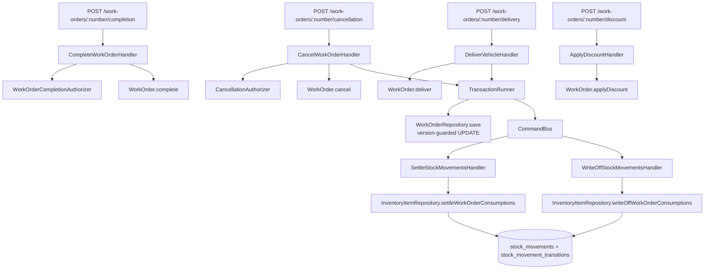

# Work Order Closing Design

**Spec**: `.specs/features/work-order-closing/spec.md`
**Status**: Approved

---

## Architecture Overview

Four commands close a work order, and two of them reach into inventory to end the life of the movements the work order caused. The cross-module half is the shape feature 7 already built: the work-orders handler opens one `transactionRunner.run`, saves its own aggregate, and dispatches a command into `inventory` inside that same transaction (AD-003 for the boundary, AD-008 for the transaction).

Alongside the feature, one defect already in `main` is fixed: every work-order write becomes safe against a lost update, enforced in the repository rather than in each handler. See Risks & Concerns.



`complete` and `applyDiscount` touch only the work order, so they need no transaction beyond the repository's own. `deliver` and `cancel` span both modules and take the full AD-008 path.

---

## Approach exploration: where a movement's status change is written

This is the one genuine architectural fork inside the feature's own scope. Everything else follows a pattern already in the codebase.

`InventoryItem.restore()` deliberately attaches no movements. Feature 4 established that and feature 7 reaffirmed it while correcting T12: the aggregate never loads prior movements, which is exactly why `findPendingConsumptions` exists as a repository read. Settling and writing off have to change the status of movement rows the aggregate structurally cannot see.

**A. A repository method per operation, no aggregate involvement. Chosen.**
`settleWorkOrderConsumptions(...)` and `writeOffWorkOrderConsumptions(...)` do the status update and the transition rows in SQL, inside the ambient transaction. The handler calls the repository directly.
Trade-off: two writes in this module no longer pass through `InventoryItem`. Justified because the only invariant that aggregate guards is `quantity_on_hand` (rules 19 to 21), and neither operation touches it. A status flip on an append-only ledger is bookkeeping over facts already committed, and it spans every item a work order touched rather than one aggregate instance.

**B. Load the movements into the aggregate and mutate them there.**
Trade-off: reverses the no-movements rule two features depend on, loads and locks every affected item for a write no invariant depends on, and makes `restore` mean two different things depending on the caller.

**C. Promote `StockMovement` to its own aggregate root.**
Trade-off: section 9 of the event storming names `InventoryItem` as the aggregate and `StockMovement` as an entity inside it. Changing that is a modelling decision far larger than this feature, for no gain here.

---

## Code Reuse Analysis

### Existing components to leverage

| Component | Location | How to use |
| --- | --- | --- |
| `TransactionRunner` + `currentEntityManager()` | `src/shared/application/ports/transaction-runner.port.ts`, `src/shared/infrastructure/database/typeorm-transaction-runner.ts` | The cross-module transaction for delivery and cancellation, unchanged from feature 7 (AD-008). |
| `WithdrawPartsHandler` | `src/modules/work-orders/application/commands/withdraw-parts/withdraw-parts.handler.ts` | Structural template for a handler that saves its own aggregate and dispatches into inventory inside one transaction. |
| `ConsumeStockBatchHandler` / `RestoreStockBatchHandler` | `src/modules/inventory/application/commands/` | Structural template for the two new inventory-side handlers, including the "reached only from inside the caller's transaction" comment. |
| `BudgetDecisionAuthorizer` | `src/modules/work-orders/application/services/budget-decision.authorizer.ts` | Template for both new authorizers: an either/or access rule that `PermissionsGuard.every()` cannot express, checked in the handler after the load, reading access over the `QueryBus`. |
| `findPendingConsumptions`' SQL | `src/modules/inventory/infrastructure/persistence/typeorm-inventory-item.repository.ts:83` | The write-off's per-consumption net loss is the identical `quantity - COALESCE(SUM(returns pointing at it), 0)` expression, already integration-tested. |
| `WorkOrderTrailEvent` | `src/modules/work-orders/domain/events/work-order-trail.event.ts` | Base class for the four new trail events, each declaring its own `eventType` string. |
| `assertStateAllows` | `src/modules/work-orders/domain/entities/work-order.ts:497` | Every new transition's state guard. |
| `approveBudget` | `src/modules/work-orders/domain/entities/work-order.ts:337` | Template for a transition method: guard, mutate, stamp `updatedAt`, record the trail event. |
| `ErrorKind.Conflict` | `src/shared/domain/errors/error-kind.ts`, mapped at `src/shared/presentation/filters/global-exception.filter.ts:12` | Already maps to HTTP 409, so the new concurrency error needs no presentation-layer work. |
| `stock_movement_transitions` | `src/shared/infrastructure/database/migrations/1787702400005-create-inventory-schema.ts:71` | Already created, written by nothing. Its own comment says it waits for the phase that changes a consumption's status. This is that phase. |
| `listByStatus` | `src/modules/work-orders/infrastructure/persistence/typeorm-work-order-query.adapter.ts:131` | Already filters only on the optional status argument, so cancelled and delivered work orders appear with no change. |

### Integration points

| System | Integration method |
| --- | --- |
| `inventory` | Two new commands over the `CommandBus`, dispatched inside the caller's transaction (AD-003, AD-008). |
| `authorization` | `GetUserEffectiveAccessQuery` over the `QueryBus`, from both authorizers, exactly as `BudgetDecisionAuthorizer` does. |
| `work_orders` table | Eleven new closing columns, one non-null default, and the `version` column the concurrency fix needs. |

---

## Components

### `WorkOrder` (extended)

- **Purpose**: Owns the four closing transitions and the charged-total arithmetic, since it holds every input the total needs.
- **Location**: `src/modules/work-orders/domain/entities/work-order.ts`
- **Interfaces**:
  - `complete(input: CloseActionInput): void` - guards `IN_EXECUTION`, refuses when the recorded discount exceeds the pre-discount total, computes and freezes `chargedTotal`, stamps `completedAt`, records `WorkOrderCompleted`.
  - `deliver(input: CloseActionInput): void` - guards `COMPLETED`, stamps `deliveredAt` and `deliveredByUserId`, records `VehicleDelivered`.
  - `cancel(input: CancelInput): void` - guards against `COMPLETED`, `DELIVERED` and `CANCELED`, stamps the reason, canceller and moment, records `WorkOrderCanceled`.
  - `applyDiscount(input: ApplyDiscountInput): void` - guards `IN_EXECUTION` or `COMPLETED`, refuses an amount above the pre-discount total, replaces any previous discount, recomputes `chargedTotal` when already `COMPLETED`, records `DiscountApplied`.
  - `get hasOutstandingWithdrawals(): boolean` - true when any part item's `withdrawnQuantity` is above zero. What the cancellation authorizer reads.
  - `get version(): number` - the row version this instance was loaded from, carried through `restore` and read by the repository on save.
  - `private chargedTotalBeforeDiscount(): Money` - approved-round services plus each part item's withdrawn quantity at its budgeted unit price. Shared by `complete` and `applyDiscount`.
- **Dependencies**: `Money`, `WorkOrderStatus`, the four new trail events, three new errors.
- **Reuses**: `assertStateAllows`, the `approveBudget` transition shape, `Budget.status` for the approved-round filter.

### `WorkOrderCompletionAuthorizer`

- **Purpose**: Answers "the assigned mechanic or a holder of `work-orders:manage`", which no single permission expresses.
- **Location**: `src/modules/work-orders/application/services/work-order-completion.authorizer.ts`
- **Interfaces**: `assertMayComplete(workOrder: WorkOrder, actorUserId: string): Promise<void>`
- **Dependencies**: `QueryBus`.
- **Reuses**: `BudgetDecisionAuthorizer` wholesale, differing in the permission it reads and in throwing a forbidden error rather than a not-found one (spec.md's Assumptions: every actor in reach already holds `work-orders:read`, so there is nothing to hide).

### `CancellationAuthorizer`

- **Purpose**: Requires `work-orders:cancel-in-execution` whenever the work order carries an outstanding withdrawn part, in any state.
- **Location**: `src/modules/work-orders/application/services/cancellation.authorizer.ts`
- **Interfaces**: `assertMayCancel(workOrder: WorkOrder, actorUserId: string): Promise<void>`
- **Dependencies**: `QueryBus`.
- **Reuses**: `BudgetDecisionAuthorizer`'s shape. Reads `workOrder.hasOutstandingWithdrawals` rather than the state, per spec.md's Assumptions on H36 against H38. Throws `CancelInExecutionForbiddenError`, code `WORK_ORDER_CANCEL_IN_EXECUTION_FORBIDDEN`, kind `Forbidden`.

### `SettleStockMovementsHandler` / `WriteOffStockMovementsHandler`

- **Purpose**: The inventory side of a delivery and of a cancellation.
- **Location**: `src/modules/inventory/application/commands/settle-stock-movements/`, `.../write-off-stock-movements/`
- **Interfaces**: each `execute(command: { workOrderId: string; actorUserId: string }): Promise<void>`
- **Dependencies**: `InventoryItemRepository`, `Clock`, `IdGenerator`.
- **Reuses**: `ConsumeStockBatchHandler`'s shape, including its comment that the handler is reached only from inside the caller's transaction.

### `InventoryItemRepository` (extended)

- **Purpose**: Writes the status change and its audit row without loading an aggregate that cannot see the movements.
- **Location**: `src/modules/inventory/domain/repositories/inventory-item.repository.ts`, implemented in `.../infrastructure/persistence/typeorm-inventory-item.repository.ts`
- **Interfaces**:
  - `settleWorkOrderConsumptions(input: MovementClosureInput): Promise<number>` - moves every `PENDING` consumption of that work order to `SETTLED`, appends one transition row each, returns how many it moved.
  - `writeOffWorkOrderConsumptions(input: MovementClosureInput): Promise<number>` - the same for `WRITTEN_OFF`, skipping any consumption whose returns cancel it out entirely, and recording the net lost quantity on the transition row.
- **Dependencies**: the ambient `EntityManager` through the existing `inTransaction` helper (AD-008).
- **Reuses**: the net-quantity SQL fragment extracted from `findPendingConsumptions`, `resolveInternalId`, `inTransaction`.

### `TypeOrmWorkOrderRepository.save` (changed) - the concurrency fix

- **Purpose**: Makes a lost update impossible for every work-order command, present and future, without any handler taking part.
- **Location**: `src/modules/work-orders/infrastructure/persistence/typeorm-work-order.repository.ts`
- **Interfaces**: unchanged signature. Internally, the row update becomes `UPDATE work_orders SET ..., version = version + 1 WHERE id = :id AND version = :loadedVersion`, and zero affected rows throws `ConcurrentModificationError` (kind `Conflict`, HTTP 409). A first insert writes `version = 0`.
- **Dependencies**: the `version` column, and `WorkOrder.version` carried through the mapper.
- **Reuses**: the existing `inTransaction` wrapper, so the check runs inside whatever transaction is ambient. When the save is part of a cross-module transaction, the rollback takes the inventory write with it, which is the correct outcome.
- **Why here and not in the handlers**: enforcement in one place cannot be forgotten by a handler written later. Every one of the twelve existing mutating handlers is protected without being edited, and so is every handler this project has not written yet.

### Presentation

| Route | Permission on the route | Handler-side check |
| --- | --- | --- |
| `POST /work-orders/{number}/completion` | `work-orders:read` | `WorkOrderCompletionAuthorizer` |
| `POST /work-orders/{number}/delivery` | `work-orders:manage` | none |
| `POST /work-orders/{number}/cancellation` | `work-orders:cancel` | `CancellationAuthorizer` |
| `POST /work-orders/{number}/discount` | `work-orders:discount` | none |

`WorkOrderResponseDto` gains `chargedTotalCents`, `discountCents`, `discountNote`, `completedAt`, `deliveredAt`, `canceledAt` and `cancellationReason`. `version` stays internal and is not exposed.

---

## Data Models

### Migration `1787702400008-add-work-order-closing-columns`

```sql
ALTER TABLE work_orders
  ADD COLUMN charged_total_cents bigint NULL,
  ADD COLUMN discount_cents bigint NOT NULL DEFAULT 0,
  ADD COLUMN discount_note varchar(255) NULL,
  ADD COLUMN discount_applied_by_user_id bigint NULL REFERENCES users (id) ON DELETE RESTRICT,
  ADD COLUMN discount_applied_at timestamptz NULL,
  ADD COLUMN completed_at timestamptz NULL,
  ADD COLUMN delivered_at timestamptz NULL,
  ADD COLUMN delivered_by_user_id bigint NULL REFERENCES users (id) ON DELETE RESTRICT,
  ADD COLUMN canceled_at timestamptz NULL,
  ADD COLUMN canceled_by_user_id bigint NULL REFERENCES users (id) ON DELETE RESTRICT,
  ADD COLUMN cancellation_reason varchar(255) NULL,
  ADD COLUMN version integer NOT NULL DEFAULT 0;

ALTER TABLE stock_movement_transitions
  ADD COLUMN quantity integer NULL;
```

`version` defaults to 0, so every existing row starts valid and the first save of an old work order bumps it to 1.

`stock_movement_transitions.quantity` carries the net figure a write-off recorded, which is smaller than the movement's own quantity when part of it came back. It is nullable because a settlement records no quantity of its own: it settles whatever the movement says.

`test/support/global-setup.ts`'s migration array takes the new entry, per the convention every migration-bearing feature has followed.

---

## Error Handling Strategy

| Error scenario | Handling | User impact |
| --- | --- | --- |
| Completing outside `IN_EXECUTION` | `WorkOrderStateError`, `RuleViolation` | 422 |
| Completing with a discount above the total | `DiscountExceedsChargedTotalError`, `RuleViolation` | 422 naming the discount |
| Completing as neither assignee nor manager | `CompletionForbiddenError`, `Forbidden` | 403 |
| Delivering outside `COMPLETED` | `WorkOrderStateError` | 422 |
| Cancelling with outstanding parts without the elevated permission | `CancelInExecutionForbiddenError`, code `WORK_ORDER_CANCEL_IN_EXECUTION_FORBIDDEN`, `Forbidden` | 403, message naming the withdrawn parts |
| Cancelling from `COMPLETED`, `DELIVERED` or `CANCELED` | `WorkOrderStateError` | 422 |
| Discount above the pre-discount total | `DiscountExceedsChargedTotalError` | 422 |
| Missing cancellation reason or discount reason | DTO validation | 400 |
| Two commands writing the same work order concurrently | `ConcurrentModificationError`, `Conflict` | 409, and the caller repeats the request |

---

## Risks & Concerns

| Concern | Location | Impact | Mitigation |
| --- | --- | --- | --- |
| **A lost update on the work order aggregate, present in `main` today.** Every handler loads outside its transaction, with no version column and no row lock, so two concurrent commands both read the same state and the second `save` overwrites the first. Proven against the running app: two concurrent withdrawals of 3 on one work order both answered 200, 6 units left the shelf, and the work order recorded 3 withdrawn. | `withdraw-parts.handler.ts:36` and every sibling handler; `typeorm-work-order.repository.ts` has no lock or version | Feature 7's two ledgers disagree. This feature makes it a money bug: the charged total reads `withdrawnQuantity`, so the customer is billed for 3 units while 6 left the shelf, and a cancellation writes off a loss computed from a different number than the one the work order shows. A second withdrawal that should be refused for exceeding the plan is also wrongly accepted. | The version-guarded `save` above. Enforced in the repository so no handler can opt out or forget, and so a handler written later inherits it. A dedicated concurrency test reproduces the two-withdrawal scenario and asserts one 200 and one 409, with the ledgers agreeing. |
| A cancellation racing a withdrawal on the same work order could leave a consumption `PENDING` on a `CANCELED` work order. | `cancel-work-order.handler.ts` (new) against `withdraw-parts.handler.ts` | An orphan pending movement that neither settles nor writes off, so the loss is understated. | The same version guard: whichever commits second is refused with 409, so a withdrawal cannot land against a work order whose state it did not read. |
| The write-off's net-loss arithmetic would be the third caller of the same "quantity minus returns pointing at it" expression. | `typeorm-inventory-item.repository.ts:83` | Three copies drift apart. Feature 7's round 3 verification already found one formula written twice with only one copy tested. | Extract it to one named SQL fragment used by `findPendingConsumptions` and the write-off, with a test that a partly returned consumption yields the same number through both paths. |
| The 409 is a status no route in this API returns today. | every work-order write route | A client that does not handle it treats a recoverable conflict as a hard failure. | The status is documented on every work-order write route's Swagger decorator, and the e2e concurrency test asserts it. Nothing retries automatically: the caller decides, which is the honest contract for a write it may no longer want to repeat. |
| The version guard changes the failure mode of twelve handlers this feature does not otherwise touch. | `src/modules/work-orders/application/commands/` | A regression here breaks features 5, 6 and 7. | The whole existing suite runs unchanged: nothing in it drives two concurrent writes to one work order, so every existing test exercises the single-writer path and must stay green. That is the regression test for the change. |
| L-003 (recurrence 4) applies directly: four new routes, each with its own error paths. | `LESSONS.md` | The verification loop on feature 7 spent two rounds on exactly this. | Every route gets its own e2e case per error path, named in the task breakdown rather than left to the executor. |
| L-009 and L-014 apply: the charged total is a sum over a collection, and the write-off aggregates across movements. | `LESSONS.md` | Both were surviving mutants on feature 7. | The task breakdown budgets a multi-item fixture for the charged total and a multi-movement fixture for the write-off up front. |

---

## Tech Decisions

| Decision | Choice | Rationale |
| --- | --- | --- |
| Where a movement's status change is written | The inventory repository, not the `InventoryItem` aggregate | Approach A above. The operation crosses no invariant that aggregate guards, and `restore` deliberately cannot see the rows it changes. |
| One closing command or two | Two: settle and write off | They record opposite facts and are reached from different transitions. Symmetric with feature 7's consume and restore pair. |
| Where the charged total is computed | In the aggregate, from its own items | It holds every input: approved rounds, withdrawn quantities, budgeted prices and the discount. A handler computing it would need to re-derive all four. |
| How concurrent writes are made safe | An optimistic `version` column checked in `save`, answering 409 | Confirmed with the user, at the widest scope: fix the class, not the instances. A pessimistic row lock would have meant restructuring fifteen handlers and would still depend on every future handler calling a special load method. One guard in the repository cannot be forgotten. |
| How the net loss is recorded | A `quantity` column on `stock_movement_transitions` | The write-off's figure is smaller than the movement's own quantity when part of it came back. Putting a number in `note` would make the only record of a financial loss a parsed string. |
| Whether the discount is stored as a separate entity | No, four columns on `work_orders` | Phase 12 defines them, and spec.md's confirmed decision is that a second discount replaces the first, so there is no collection to model. The trail keeps the history. |
| How the completion refusal distinguishes itself | 403 rather than `BudgetDecisionAuthorizer`'s 404 | Every actor reaching this route holds `work-orders:read`, so the work order's existence is not a secret from them. |

> **Project-level decision:** the version guard is a convention every future work-order write inherits, and the reason handlers must not carry their own concurrency handling. It is recorded as `AD-009` in `.specs/STATE.md` when this design is approved.
