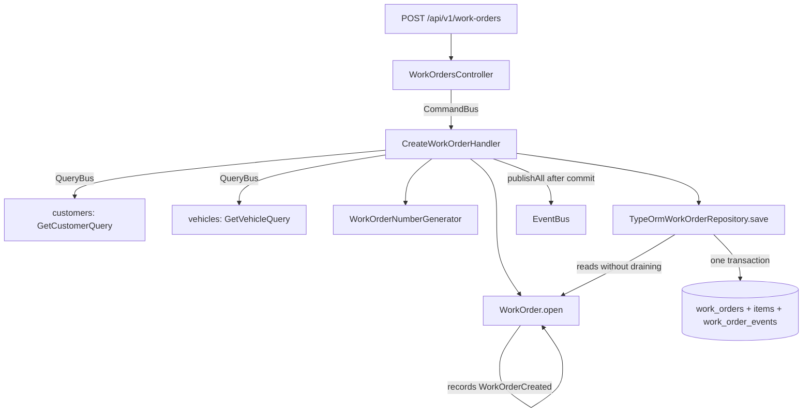

# Work Order Creation Design

**Spec**: `.specs/features/work-order-creation/spec.md`
**Status**: Approved

---

## Architecture Overview

A fifth four-layer module, `work-orders`, holding the `WorkOrder` aggregate with two child item collections, plus an append-only trail the repository writes from the aggregate's own recorded events. Three things here are new to this codebase:

1. **The second application of AD-007, and the first that needs the shared kernel to change.** `inventory` wrote its ledger from a child collection the aggregate carried (`newMovements`). The work order trail is written from the **domain events** instead, so `AggregateRoot` gains a `domainEvents` getter that reads without draining, beside the existing `pullDomainEvents` that keeps draining for the publisher. H39 and phase 8's Risks both prescribe exactly this, and nothing that already calls `pullDomainEvents` changes.
2. **A write that can legitimately fail and be retried.** The work order number is drawn at random, so a collision with `ux_work_orders_number` is expected rather than exceptional. `CreateWorkOrderHandler` draws again, up to five times. The repository has to tell that violation apart from the vehicle one, which is a genuine 409 and must never be retried.
3. **Routes keyed by a human readable number** rather than an external uuid. Every other controller in this codebase reads `:externalId` through `ParseUUIDPipe`; here `WorkOrderNumber` validates the path segment and the uuid stays in the response body.

Cross-module reads follow the incumbent pattern, confirmed with the product owner while designing: each handler injects the `QueryBus` and calls the other module's query class directly, exactly as `RegisterVehicleHandler` does. The alternatives considered were a module-local resolver service and one anti-corruption port per foreign module; both were declined in favour of a single shape across the codebase. The cost that buys is recorded under Risks & Concerns, with the mitigation this design applies.



---

## Code Reuse Analysis

### Existing components to leverage

| Component | Location | How to use |
| --- | --- | --- |
| Two-table aggregate write inside one transaction | `src/modules/inventory/infrastructure/persistence/typeorm-inventory-item.repository.ts:56` and `src/modules/authentication/infrastructure/persistence/typeorm-session.repository.ts:68` | Direct template for `TypeOrmWorkOrderRepository.save`, which writes four tables inside one transaction instead of two. |
| Aggregate with a child-entity collection | `src/modules/authentication/domain/entities/session.ts` (`tokens: RefreshToken[]`) | Template for `WorkOrder` holding `serviceItems` and `partItems`, each a child entity in its own file. |
| Cross-module read from a command handler | `src/modules/vehicles/application/commands/register-vehicle/register-vehicle.handler.ts:31` | The shape every handler here repeats: inject `QueryBus`, call the other module's query, apply the rule, throw a module-local error. |
| Unique-violation mapping by constraint name | `src/modules/inventory/infrastructure/persistence/typeorm-inventory-item.repository.ts:112` (`isViolation(error, code, constraint)`) | Copied so the number collision and the vehicle collision map to different outcomes. |
| Internal-id resolution at the repository boundary | `TypeOrmInventoryItemRepository.resolveUserInternalId`, `TypeOrmCustomerRepository.resolveUserInternalId` | Same raw-SQL lookup for `customer_id`, `vehicle_id`, `service_id`, `inventory_item_id`, `created_by_user_id` and `assigned_mechanic_user_id` (AD-001). |
| Query adapter with a raw-SQL cross-table join | `src/modules/inventory/infrastructure/persistence/typeorm-inventory-query.adapter.ts` | Template for `TypeOrmWorkOrderQueryAdapter`, including the join to `users` for the actor's external id on the trail. |
| `EntityId`, `AggregateRoot`, `DomainEvent`, `ErrorKind`, `Money` | `src/shared/domain/` | `WorkOrderId` and `WorkOrderItemId` extend `EntityId`. `Money` prices both item kinds (AD-002). `AggregateRoot` gains the `domainEvents` getter. |
| `PermissionsGuard`, `RequirePermissions`, `CurrentUser`, `Principal` | `src/modules/authorization/presentation/`, `src/modules/authentication/presentation/` | `work-orders:manage`, `work-orders:read` and `audit:read` are already seeded and already granted to the right roles. No RBAC change. |

### Integration points

| System | Integration method |
| --- | --- |
| `customers` | `GetCustomerQuery` through the `QueryBus`. `CustomerSummaryDto.status` decides the 422, `name` is snapshotted. `getById` is deliberately unfiltered there, so a deactivated customer is distinguishable from a missing one. |
| `vehicles` | `GetVehicleQuery` through the `QueryBus`. `VehicleSummaryDto.customerId` decides the ownership rule; `plate`, `brand`, `model` and `year` are snapshotted. That adapter filters `deleted_at IS NULL`, so a removed vehicle answers 404. |
| `services` | `GetServiceQuery` through the `QueryBus`. `status` decides the 422 on a deactivated service; `name` and `priceCents` are snapshotted onto the item. |
| `inventory` | `GetInventoryItemQuery` through the `QueryBus`. `sku`, `name` and `unitPriceCents` are snapshotted onto the part item. The stock is not touched: withdrawal is phase 11. |
| `users` and `authorization` | `GetUserByIdQuery` answers whether the target user exists at all, then `GetUserEffectiveAccessQuery` answers whether they hold `MECHANIC`. Two reads, because the effective-access read alone cannot tell an unknown user from one with no roles. |
| `inventory` schema | This migration adds the foreign key from `stock_movements.work_order_id` to `work_orders(id)` that `inventory-and-stock-movements` deliberately left off, phase 7 having no `work_orders` table to point at. Existing movement rows all carry `NULL` there, so the constraint applies cleanly. |

---

## Components

### `WorkOrderNumber` (value object)

- **Purpose**: The number the counter says out loud, validated and normalised.
- **Location**: `src/modules/work-orders/domain/value-objects/work-order-number.ts`
- **Interfaces**: `static create(raw: string): WorkOrderNumber`; `readonly value: string`; `equals(other?)`.
- **Behaviour**: trims, upper-cases, and requires `[A-Z0-9]{6}-[0-9]{4}`. Anything else throws `InvalidWorkOrderNumberError` (400). It validates but never generates: drawing a number is an application concern with a retry loop around it.

### `PlannedQuantity` (value object)

- **Purpose**: A positive whole number of units planned for a part item.
- **Location**: `src/modules/work-orders/domain/value-objects/planned-quantity.ts`
- **Behaviour**: rejects zero, negative and fractional values with `InvalidPlannedQuantityError` (400). Module-local rather than a shared `StockQuantity`: inventory's version carries a different rule (non-negative) and an invariant with its own error, and dragging it across the boundary to share "a positive integer" would import that invariant with it.

### `WorkOrderServiceItem` / `WorkOrderPartItem` (child entities)

- **Purpose**: One requested service, and one planned part, snapshotted at the moment they were added.
- **Location**: `src/modules/work-orders/domain/entities/`
- **Interfaces**: `static add(input)`, `static restore(props)`, read-only getters.
- **Behaviour**: a service item carries the service identifier, its name and its unit price, and no quantity. A part item carries the inventory item identifier, its SKU, its name, its unit price, a `PlannedQuantity`, and a `withdrawnQuantity` that starts at zero and stays untouched until phase 11.

### `WorkOrder` (aggregate root)

- **Purpose**: One visit, its snapshot, its items, and the events that describe what was done to it.
- **Location**: `src/modules/work-orders/domain/entities/work-order.ts`
- **Interfaces**:
  - `static open(input): WorkOrder` - status `RECEIVED`, records `WorkOrderCreated`.
  - `static restore(props): WorkOrder` - rebuilt with its items and **no** trail.
  - `addService(input): void` - allowed in `RECEIVED`, `IN_DIAGNOSIS` and `IN_EXECUTION`, records `ServiceAddedToWorkOrder`.
  - `planPart(input): void` - allowed in `IN_DIAGNOSIS` and `IN_EXECUTION` only, records `PartPlannedForWorkOrder`.
  - `removeItem(input): void` - allowed in the same three states, searches both collections, records `ItemRemovedFromWorkOrder`.
  - `assignMechanic(input): void` - allowed while the status is not `DELIVERED` or `CANCELED`, replaces any current assignee, records `MechanicAssigned`.
  - `get serviceItems()` / `get partItems()` - defensive copies.
- **Behaviour**: every method takes the acting user and stamps it on the event it records, because the trail row needs it. A command aimed at a state that does not allow it throws `WorkOrderStateError` (422) naming the current status.
- **Dependencies**: `WorkOrderNumber`, `WorkOrderStatus`, `PlannedQuantity`, `Money`, the two item entities, the five event classes.

### The five domain events

- **Location**: `src/modules/work-orders/domain/events/`
- **Shape**: each extends a module-local `WorkOrderTrailEvent extends DomainEvent`, which declares `workOrderId`, `actorUserId`, `fromStatus`, `toStatus`, `note` and a `readonly eventType: string` that each subclass sets to its own exported constant.
- **Why a constant**: phase 8's Risks name the hazard. Reading `constructor.name` means renaming a class silently changes what lands in `event_type`, and the trail is append-only, so the rows already written are never corrected.

### `TypeOrmWorkOrderRepository`

- **Purpose**: The only writer of work orders, and where AD-007 is honoured for the second time.
- **Location**: `src/modules/work-orders/infrastructure/persistence/typeorm-work-order.repository.ts`
- **Interfaces**: `findByNumber(number)`, `save(workOrder)`.
- **Logic**: `save` opens one transaction, resolves every external identifier to its internal key, writes the work order row, replaces its item rows, and appends one `work_order_events` row per event read from `workOrder.domainEvents` without draining them. A violation of `ux_work_orders_number` maps to `WorkOrderNumberTakenError` so the handler can draw again; a violation of `ux_work_orders_active_vehicle` maps to `VehicleAlreadyHasActiveWorkOrderError` (409) and is never retried.
- **Note**: `findByNumber` loads the items and never the trail. The trail is a read model, the same call the `inventory` repository makes about its own ledger.

### `TypeOrmWorkOrderQueryAdapter`

- **Purpose**: The read side: the board, one work order in full, and the trail.
- **Location**: `src/modules/work-orders/infrastructure/persistence/typeorm-work-order-query.adapter.ts`
- **Interfaces**: `listByStatus(status?)`, `getByNumber(number)`, `listTrail(number)`.
- **Logic**: `getByNumber` returns the work order with both item lists. `listTrail` orders by `occurred_at` and joins `users` for the actor's external id, never the internal one (AD-001). Prices convert through `Money.fromDatabase` on every path, as `service-catalog` established.

### `WorkOrderNumberGenerator` (port) and `RandomWorkOrderNumberGenerator`

- **Purpose**: Draw a candidate number.
- **Location**: `src/modules/work-orders/application/ports/work-order-number-generator.port.ts`, `.../infrastructure/random-work-order-number.generator.ts`
- **Interfaces**: `next(year: number): string`.
- **Behaviour**: six characters from `A-Z0-9` drawn with `node:crypto`, a hyphen, then the year. A port rather than a free function so a test can make a collision happen on demand.

### `CreateWorkOrderHandler`

- **Location**: `src/modules/work-orders/application/commands/create-work-order/`
- **Logic**: read the customer (404 if missing, 422 if deactivated), read the vehicle (404 if missing, 422 if it belongs to someone else), then loop up to five times: draw a number, `WorkOrder.open`, `save`. A `WorkOrderNumberTakenError` sends it round again; anything else propagates. After the fifth attempt the error propagates rather than a work order landing without a number.

### `AddRequestedServiceHandler` / `PlanPartHandler` / `RemoveWorkOrderItemHandler` / `AssignMechanicHandler`

- **Location**: `src/modules/work-orders/application/commands/`
- **Logic**: load by number or `WorkOrderNotFoundError` (404); resolve the referenced record through the `QueryBus` and apply its rule; call the aggregate method, which owns the state guard; `save`; publish. No handler computes a state transition or writes a trail row itself.

### `WorkOrdersController`

- **Routes**: `POST /api/v1/work-orders`, `POST /api/v1/work-orders/:number/services`, `POST /api/v1/work-orders/:number/parts`, `DELETE /api/v1/work-orders/:number/items/:itemExternalId` and `PUT /api/v1/work-orders/:number/mechanic` behind `work-orders:manage`; `GET /api/v1/work-orders` and `GET /api/v1/work-orders/:number` behind `work-orders:read`; `GET /api/v1/work-orders/:number/trail` behind `audit:read`.
- **Note**: `:number` is validated by `WorkOrderNumber.create` rather than by `ParseUUIDPipe`, which is what every other controller here uses. A malformed number therefore answers 400 from the value object, and a well-formed one that matches nothing answers 404.

---

## Data Models

### `work_orders`

```sql
id                        bigserial primary key
external_id               uuid not null unique
number                    varchar(11) not null unique
customer_id               bigint not null references customers(id)
vehicle_id                bigint not null references vehicles(id)
assigned_mechanic_user_id bigint null references users(id)
created_by_user_id        bigint not null references users(id)
status                    varchar(20) not null check (status in ('RECEIVED', 'IN_DIAGNOSIS', 'AWAITING_APPROVAL', 'IN_EXECUTION', 'COMPLETED', 'DELIVERED', 'CANCELED'))
customer_name             varchar(120) not null
vehicle_plate             varchar(7) not null
vehicle_brand             varchar(60) not null
vehicle_model             varchar(60) not null
vehicle_year              smallint not null
created_at                timestamptz not null
updated_at                timestamptz not null
```

Index: `create unique index ux_work_orders_active_vehicle on work_orders (vehicle_id) where status not in ('DELIVERED', 'CANCELED')`. The `CHECK` lists all seven states even though only `RECEIVED` is reachable here, because later phases move through the rest and a `CHECK` that forbids a state the schema is meant to hold would have to be rewritten.

### `work_order_services`

```sql
id               bigserial primary key
external_id      uuid not null unique
work_order_id    bigint not null references work_orders(id) on delete restrict
service_id       bigint not null references services(id) on delete restrict
service_name     varchar(120) not null
unit_price_cents bigint not null check (unit_price_cents >= 0)
created_at       timestamptz not null
```

Index: `(work_order_id)`.

### `work_order_parts`

```sql
id                 bigserial primary key
external_id        uuid not null unique
work_order_id      bigint not null references work_orders(id) on delete restrict
inventory_item_id  bigint not null references inventory_items(id) on delete restrict
sku                varchar(40) not null
item_name          varchar(120) not null
planned_quantity   integer not null check (planned_quantity > 0)
withdrawn_quantity integer not null default 0 check (withdrawn_quantity >= 0)
unit_price_cents   bigint not null check (unit_price_cents >= 0)
created_at         timestamptz not null
```

Index: `(work_order_id)`. **`withdrawn_quantity` is created here and written by nothing until phase 11**, which states it adds no column of its own.

### `work_order_events`

```sql
id            bigserial primary key
external_id   uuid not null unique
work_order_id bigint not null references work_orders(id) on delete restrict
event_type    varchar(40) not null
from_status   varchar(20) null
to_status     varchar(20) null
actor_user_id bigint null references users(id)
occurred_at   timestamptz not null
note          varchar(255) null
```

Index: `(work_order_id, occurred_at)` for the chronological read.

### The foreign key this migration closes

```sql
alter table stock_movements
  add constraint fk_stock_movements_work_order
  foreign key (work_order_id) references work_orders(id)
```

**Relationships**: every reference above is an internal key resolved at the repository boundary (AD-001). `work_order_events.actor_user_id` is nullable because phase 8's schema says so, though every event this feature records carries an actor.

---

## Error Handling Strategy

| Error scenario | Handling | User impact |
| --- | --- | --- |
| Malformed work order number in the path | `InvalidWorkOrderNumberError`, `ErrorKind.Validation` | HTTP 400 |
| No work order for a well-formed number | `WorkOrderNotFoundError`, `ErrorKind.NotFound` | HTTP 404 |
| Customer, vehicle, service, inventory item or target user missing | `ReferencedCustomerNotFoundError`, `ReferencedVehicleNotFoundError`, `ReferencedServiceNotFoundError`, `ReferencedInventoryItemNotFoundError`, `AssignedMechanicNotFoundError`, all `ErrorKind.NotFound` and all module-local | HTTP 404 |
| Customer deactivated | `CustomerInactiveError`, `ErrorKind.RuleViolation` | HTTP 422 |
| Vehicle owned by another customer | `VehicleNotOwnedByCustomerError`, `ErrorKind.RuleViolation` | HTTP 422 |
| Vehicle already has a non-terminal work order | `VehicleAlreadyHasActiveWorkOrderError`, `ErrorKind.Conflict` - raised by the handler's pre-check and again by the repository on the concurrent race | HTTP 409 |
| Service deactivated | `ServiceInactiveError`, `ErrorKind.RuleViolation` | HTTP 422 |
| Command aimed at a state that does not allow it | `WorkOrderStateError`, `ErrorKind.RuleViolation`, naming the current status | HTTP 422 |
| Planned quantity zero, negative or fractional | `InvalidPlannedQuantityError`, `ErrorKind.Validation` | HTTP 400 |
| Item belongs to another work order | `WorkOrderItemNotFoundError`, `ErrorKind.NotFound` | HTTP 404 |
| Target user does not hold `MECHANIC` | `AssignedUserNotMechanicError`, `ErrorKind.RuleViolation` | HTTP 422 |
| Number collision on the unique index | `WorkOrderNumberTakenError`, caught by the handler and retried, never surfaced | none, up to five attempts |
| Missing `work-orders:manage` / `work-orders:read` / `audit:read` | Existing `PermissionsGuard` | HTTP 403 |

---

## Risks & Concerns

| Concern | Location (file:line) | Impact | Mitigation |
| --- | --- | --- | --- |
| **The incumbent handler-test style stubs the `QueryBus` positionally.** `register-vehicle.handler.spec.ts:44` uses `mockResolvedValueOnce`, which is unambiguous with one cross-module read. `CreateWorkOrderHandler` makes two and `AssignMechanicHandler` makes two, so a positional chain would encode the order the handler happens to call them in | `src/modules/vehicles/application/commands/register-vehicle/register-vehicle.handler.spec.ts:44` | A reordering of two reads inside the handler either breaks the test for the wrong reason or feeds the wrong DTO into the wrong check and passes wrongly | Every handler test here that reads more than once stubs `queryBus.execute` with an implementation branching on the query instance (`instanceof GetCustomerQuery`), never on call order. Recorded as a Tech Decision so later phases keep it |
| **`EffectiveAccessReader.read` cannot tell an unknown user from a user with no roles.** Its SQL returns no rows in both cases, and the DTO is `{ roles: [], permissions: [] }` either way | `src/modules/authorization/infrastructure/persistence/typeorm-effective-access.reader.ts:34` | Assigning a mechanic by a uuid that belongs to nobody would answer 422 "not a mechanic" instead of 404 | `AssignMechanicHandler` asks `GetUserByIdQuery` first, which answers `null` for a missing or malformed id, and only then reads the roles |
| **The partial unique index has to list exactly the two terminal states.** Naming one state wrongly, or listing statuses positively and forgetting one, silently permits two active work orders for a vehicle | the new migration | The rule the whole feature rests on stops being enforced, and only at the database level, where no unit test looks | The index is written as `where status not in ('DELIVERED', 'CANCELED')`, the complement rather than an enumeration, so a state added later is covered by default. An integration test proves a second insert is refused for each of the five non-terminal states and accepted after the first moves to each terminal one |
| **A number collision is expected, not exceptional, and shares its code path with a genuine 409.** Both surface as `23505` from the same `save` | the new repository | Retrying a vehicle conflict would loop five times and then answer the wrong error; not retrying a number collision would fail a request that should have succeeded | `save` maps by constraint name, not by SQL state, using the `isViolation(error, code, constraint)` helper `inventory` already has. An integration test forces each violation and asserts the two different error classes |
| **The trail's `event_type` would rot silently if read from the class name** | the new event classes | A rename changes what lands in an append-only column, and the rows already written are never corrected | Each event class exports its own `eventType` constant and a unit test asserts the literal string per class, so a rename fails a test instead of changing data |
| **`AggregateRoot` is shared by every module.** Adding a getter touches `users`, `authentication`, `authorization`, `customers`, `vehicles`, `services` and `inventory` | `src/shared/domain/aggregate-root.ts:3` | A change to the draining semantics would break every publisher in the codebase | The change is additive: `pullDomainEvents` keeps its exact behaviour and a new `domainEvents` getter returns a copy. The full existing suite is the regression proof, and it runs at the phase gate |

---

## Tech Decisions (only non-obvious ones)

| Decision | Choice | Rationale |
| --- | --- | --- |
| Where the number retry loop lives | In `CreateWorkOrderHandler`, around `open` plus `save` | A retry needs a fresh number on the aggregate, and the number is set at `open`. Putting the loop in the repository would mean the repository mutating an aggregate it was handed, and putting it in the generator would mean the generator knowing what is already persisted |
| Whether the trail is a domain entity | No. The repository maps recorded domain events straight to rows | Unlike `StockMovement`, which commands create as a first-class fact with its own quantity and price, a trail entry carries nothing its event does not already carry. `inventory` reached the same conclusion about loading: history is a read model |
| How `save` persists item removals | It replaces the work order's item set: rows whose external id is no longer on the aggregate are deleted inside the transaction, the rest are written | A `removedItemIds` list beside the items would be a second thing to keep in step with the first. Item counts here are small enough that replacing the set costs one extra statement |
| `PlannedQuantity` local rather than a shared `StockQuantity` | Module-local value object | The rules differ: planned is strictly positive, stock on hand is non-negative and carries the never-negative invariant with `InsufficientStockError`. Sharing the type would move that invariant into a module that has no use for it |
| How a handler test stubs two cross-module reads | Branch on the query instance, never on call order | See the first row of Risks & Concerns. This is what keeps the incumbent `QueryBus`-in-handler pattern from producing order-dependent tests |
| Which states accept `addService` and `removeItem` | `RECEIVED`, `IN_DIAGNOSIS` and `IN_EXECUTION`, per section 11 | Only `RECEIVED` is reachable in this feature, but writing the guard to the state machine now means feature 6 opens `IN_DIAGNOSIS` without revisiting the aggregate. The round-freezing nuance in `IN_EXECUTION` arrives with the rounds, in phase 9 |

---

## AD conformance

- **AD-001**: every table carries `id bigserial` plus `external_id uuid`; every foreign key is an internal id resolved at the repository boundary; every response and every trail entry exposes external identifiers only.
- **AD-002**: both item tables price in integer BRL cents on `bigint` columns, mapped through `Money.fromDatabase` on the way back.
- **AD-003**: no import of another module's repository or entity. Five cross-module reads, all through the `QueryBus`, with module-local error classes for every "not found" so no foreign error class crosses the boundary.
- **AD-004**: the assigned mechanic is a user reference, not an aggregate. The customer is referenced by id and snapshotted.
- **AD-007**: the trail is written inside the aggregate's own transaction, never by a post-commit subscriber. This feature is what adds the non-draining read that decision named.

No new `AD-NNN` is proposed, and none is superseded.
