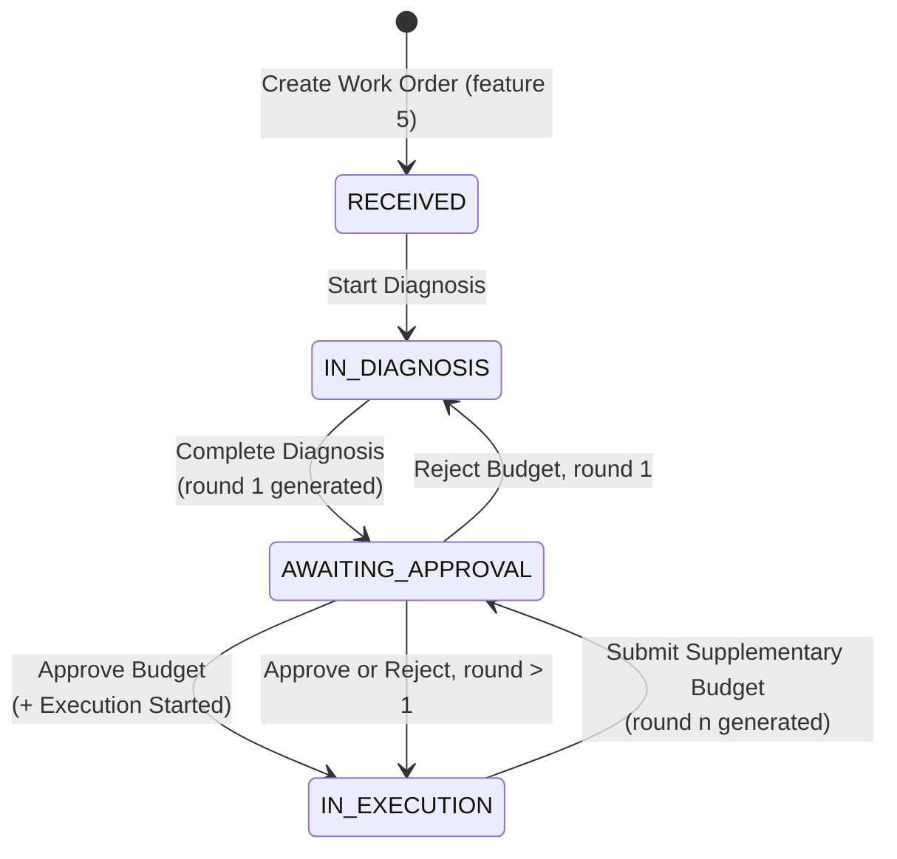
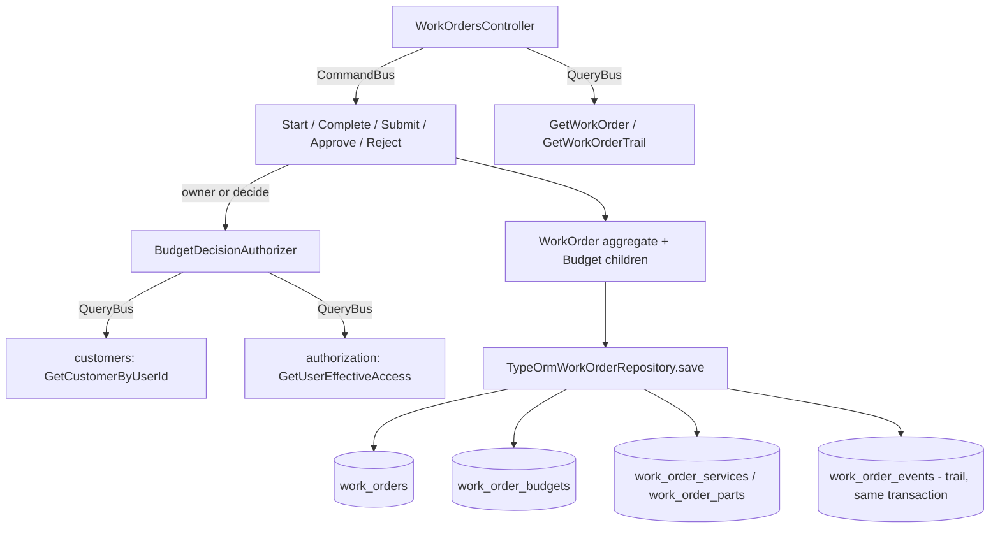

# Work Order Diagnosis And Budget Design

**Spec**: `.specs/features/work-order-diagnosis-and-budget/spec.md`
**Status**: Approved

---

## Architecture Overview

The `WorkOrder` aggregate gains a child collection of `Budget` rounds and five transition methods. Every round is generated by the aggregate from the items it already holds, with no I/O: an item's `unitPrice` was snapshotted from the catalog when the item was added, and generating a round copies that snapshot onto the item as its budgeted price and stamps the item with the round it now belongs to. Nothing outside the aggregate can supply a total, which is rule 29 satisfied by construction rather than by validation.

The repository writes the work order row, then the budget rows, then the item rows, in that order inside one transaction, because an item's `budget_id` is a foreign key to a budget row whose internal key does not exist until it is inserted. The trail keeps working the way `work-order-creation` built it: `save` reads the aggregate's recorded events through the non-draining `domainEvents` getter and appends one row per trail event in the same transaction (AD-007).

The approval and rejection routes carry no permission decorator. `PermissionsGuard` requires every listed permission, so it cannot express "the owning customer **or** a holder of `work-orders:decide`". A single application-layer authorizer, shared by both handlers, resolves the acting user's customer through the `customers` module and their permissions through the `authorization` module, and answers `WorkOrderNotFoundError` when neither path admits the actor.





---

## Code Reuse Analysis

### Existing Components to Leverage

| Component | Location | How to Use |
| --- | --- | --- |
| `WorkOrder` aggregate | `src/modules/work-orders/domain/entities/work-order.ts` | Extend: five transition methods, the budget collection, five new props. `assertStateAllows` already exists and every new guard uses it. |
| `WorkOrderServiceItem`, `WorkOrderPartItem` | `.../domain/entities/` | Extend: `budgetRound` and `budgetedUnitPrice`, plus `attachToBudget(round)` and an `isDraft` getter. |
| `WorkOrderTrailEvent` | `.../domain/events/work-order-trail.event.ts` | Extend by subclassing, once per new event, each exporting its own `*_EVENT_TYPE` literal so a rename cannot change an append-only row's meaning. |
| `TypeOrmWorkOrderRepository.save` | `.../infrastructure/persistence/typeorm-work-order.repository.ts:85` | Extend: budget rows written between the work order row and the item rows, inside the existing transaction. `appendTrail`, `resolveInternalId` and `isViolation` are reused unchanged. |
| `WorkOrderMapper` | `.../infrastructure/persistence/work-order.mapper.ts` | Extend both directions with the budget rows and the two new item columns. |
| `Money` | `src/shared/domain/value-objects/money.ts` | The budget total and every budgeted price (AD-002, integer BRL cents). `Money.zero()` seeds the sum. |
| `AggregateRoot.domainEvents` | `src/shared/domain/aggregate-root.ts` | The non-draining read `save` already uses for the trail. No change needed. |
| `GetCustomerByUserIdQuery` | `src/modules/customers/application/queries/get-customer-by-user-id/` | Resolves the acting user to their customer, which is the risk phase 10 names. Reached over the `QueryBus` (AD-003). |
| `GetUserEffectiveAccessQuery` | `src/modules/authorization/application/queries/get-user-effective-access/` | Reads the actor's permissions in the authorizer. Same call `AssignMechanicHandler` already makes (`assign-mechanic.handler.ts:47`). |
| `WorkOrderStateError` | `.../domain/errors/work-order-state.error.ts` | Every illegal transition, `ErrorKind.RuleViolation` to 422. Plan phase 10 says to reuse it. |
| `WorkOrderNotFoundError` | `.../domain/errors/work-order-not-found.error.ts` | Both the unknown number and the actor who may not decide, so the API never confirms a number exists. |
| Migration + integration-test pattern | `1787702400006-create-work-orders-schema.ts` and `test/integration/*.migration.spec.ts` | Same shape for the new migration and its schema assertions. |

### Integration Points

| System | Integration Method |
| --- | --- |
| `customers` module | `QueryBus`, `GetCustomerByUserIdQuery`, returning `CustomerSummaryDto \| null`. Read only, from the authorizer. |
| `authorization` module | `QueryBus`, `GetUserEffectiveAccessQuery`, returning `EffectiveAccessDto`. Read only, from the authorizer. |
| PostgreSQL | One new table plus columns on three existing tables. Registered in `test/support/db.ts` (entity list) and `test/support/global-setup.ts` (hardcoded migration array). |
| `work_order_events` | Eight new `eventType` values land in the existing append-only table. No schema change. |

---

## Components

### `Budget` (child entity)

- **Purpose**: One numbered round: what it totalled, when it was quoted, and how it was decided.
- **Location**: `src/modules/work-orders/domain/entities/budget.ts`
- **Interfaces**:
  - `static generate(input: { id: BudgetId; round: number; total: Money; generatedAt: Date }): Budget`
  - `static restore(props: BudgetProps): Budget`
  - `regenerate(input: { total: Money; generatedAt: Date }): void` - resets a rejected round to `PENDING` with a new total and clears its decision. Refuses unless the round is `REJECTED`.
  - `approve(input: { actorUserId: string; at: Date }): void` / `reject(...)` - refuse unless the round is `PENDING`.
  - getters: `id`, `round`, `total`, `status`, `generatedAt`, `decidedAt`, `decidedByUserId`
- **Dependencies**: `Money`, `BudgetId`, `BudgetStatus`
- **Reuses**: the private-constructor / static-factory / read-only-getter shape every entity in this codebase uses.

### `BudgetId` (value object) and `BudgetStatus` (enum)

- **Purpose**: The round's external identifier, and the three states the mandated `CHECK` constraint allows.
- **Location**: `src/modules/work-orders/domain/value-objects/budget-id.ts`, `src/modules/work-orders/domain/budget-status.ts`
- **Interfaces**: `BudgetId.create(value: string): BudgetId`, `equals(other): boolean`, `get value(): string`; `BudgetStatus.Pending | Approved | Rejected`
- **Reuses**: `WorkOrderItemId` and `work-order-status.ts` verbatim as templates.

### `WorkOrder` (extended aggregate)

- **Purpose**: Owns every transition this feature adds, and is the only thing that computes a total.
- **Location**: `src/modules/work-orders/domain/entities/work-order.ts`
- **New props**: `diagnosisStartedAt`, `diagnosisCompletedAt`, `budgetDecidedAt`, `budgetDecidedByUserId`, `executionStartedAt` (all nullable), `budgets: Budget[]`
- **Interfaces**:
  - `startDiagnosis(input: { actorUserId: string; now: Date }): void` - guards `RECEIVED`; assigns the actor as mechanic when there is none; records `DiagnosisStarted`.
  - `completeDiagnosis(input: { budgetId: BudgetId; actorUserId: string; now: Date }): void` - guards `IN_DIAGNOSIS`; refuses with no items; regenerates a rejected round one when one exists, otherwise generates round one with the supplied id; records `DiagnosisCompleted`, `BudgetGenerated`, `BudgetSent`.
  - `submitSupplementaryBudget(input: { budgetId: BudgetId; actorUserId: string; now: Date }): void` - guards `IN_EXECUTION`; refuses with an empty draft; generates round `max + 1`; records `SupplementaryBudgetGenerated`, `BudgetSent`.
  - `approveBudget(input: { actorUserId: string; now: Date }): void` - guards `AWAITING_APPROVAL`; approves the pending round; sets `executionStartedAt` only while it is null; records `BudgetApproved`, `ExecutionStarted`.
  - `rejectBudget(input: { actorUserId: string; now: Date }): void` - guards `AWAITING_APPROVAL`; round one returns to `IN_DIAGNOSIS`, any later round returns to `IN_EXECUTION` and records `ExecutionStarted` too.
  - `removeItem` (narrowed): refuses an item already attached to a round with `BudgetedItemNotRemovableError`.
  - getters: the five new props, plus `budgets: readonly Budget[]`
- **Private helpers**: `generateRound(id, round, now)` stamps every draft item and returns the summed total; `pendingBudget()` finds the single `PENDING` round.
- **Reuses**: `assertStateAllows`, `record`, the existing item collections.

### Domain events (eight)

- **Purpose**: One trail row each, and the publisher's payload.
- **Location**: `src/modules/work-orders/domain/events/`
- **Classes**: `DiagnosisStarted`, `DiagnosisCompleted`, `BudgetGenerated`, `SupplementaryBudgetGenerated`, `BudgetSent`, `BudgetApproved`, `BudgetRejected`, `ExecutionStarted`
- **Reuses**: `WorkOrderTrailEvent`. Each declares `readonly eventType` from its own exported literal, matching `work-order-created.event.ts`. Events that describe a fact rather than a move (`BudgetGenerated`, `SupplementaryBudgetGenerated`, `BudgetSent`) pass `null` for both statuses.

### `BudgetDecisionAuthorizer` (application service)

- **Purpose**: One place that answers whether this actor may decide on this work order, so the security rule is not duplicated across two handlers.
- **Location**: `src/modules/work-orders/application/services/budget-decision.authorizer.ts`
- **Interfaces**: `assertMayDecide(workOrder: WorkOrder, actorUserId: string): Promise<void>` - resolves; throws `WorkOrderNotFoundError` otherwise.
- **Logic**: holds `work-orders:decide` → allowed. Otherwise resolve the actor's customer; allowed only when that customer's external id equals `workOrder.customerId`. Everything else throws.
- **Dependencies**: `QueryBus`
- **Reuses**: `GetUserEffectiveAccessQuery`, `GetCustomerByUserIdQuery`, `WorkOrderNotFoundError`.

### Command handlers (five)

- **Location**: `src/modules/work-orders/application/commands/{start-diagnosis,complete-diagnosis,submit-supplementary-budget,approve-budget,reject-budget}/`
- **Shape**: each loads by number through `WorkOrderRepository.findByNumber`, throws `WorkOrderNotFoundError` when absent, calls the aggregate method, `save`s, then publishes with `pullDomainEvents()`. `complete-diagnosis` and `submit-supplementary-budget` mint a `BudgetId` from `randomUUID()`. `approve-budget` and `reject-budget` call the authorizer between the load and the aggregate call.
- **Reuses**: `AddRequestedServiceHandler` as the structural template.

### Persistence

- **`WorkOrderBudgetOrmEntity`** at `.../infrastructure/persistence/work-order-budget.orm-entity.ts`, mirroring `WorkOrderEventOrmEntity`'s column style. `totalCents` is a `bigint` mapped to `string` (AD-002).
- **`WorkOrderServiceOrmEntity` / `WorkOrderPartOrmEntity`**: `+ budgetInternalId: string | null`, `+ budgetedUnitPriceCents: string | null`.
- **`WorkOrderOrmEntity`**: the five new columns, `budgetDecidedByInternalId` resolved through `resolveInternalId`/`resolveExternalId` like every other user reference.
- **`WorkOrderMapper`**: `toDomain` builds `Budget.restore` from the budget rows and passes each item's round and budgeted price; `toOrm` emits budget rows alongside the existing three.
- **`TypeOrmWorkOrderRepository.save`**: a new `replaceBudgets` step between the work order row and the item rows, returning a `Map<round, internalId>` the item writers use to fill `budget_id`.

### Presentation

Five routes on the existing `WorkOrdersController`, each returning the refreshed `WorkOrderResponseDto` through `getWorkOrderOrThrow` and carrying `@HttpCode(HttpStatus.OK)` because NestJS answers 201 to a POST by default:

| Route | Permission | Notes |
| --- | --- | --- |
| `POST /api/v1/work-orders/:number/diagnosis` | `work-orders:execute` | |
| `POST /api/v1/work-orders/:number/diagnosis/completion` | `work-orders:execute` | |
| `POST /api/v1/work-orders/:number/budget/supplementary` | `work-orders:execute` | Route not named by the plan; see Tech Decisions. |
| `POST /api/v1/work-orders/:number/budget/approval` | none at the route | Authorizer decides; 404 for anyone else. |
| `POST /api/v1/work-orders/:number/budget/rejection` | none at the route | Same. |

None of the five takes a request body.

### Reads

`WorkOrderQueryPort`'s `WorkOrderSummaryDto` gains `budgets: WorkOrderBudgetDto[]`, and both item DTOs gain `budgetRound: number | null` and `budgetedUnitPriceCents: number | null`. The TypeORM query adapter loads the budget rows in the same shape it already loads the item rows, ordered by round.

---

## Data Models

```typescript
// src/modules/work-orders/domain/entities/budget.ts
interface BudgetProps {
  id: BudgetId
  round: number
  total: Money
  status: BudgetStatus
  generatedAt: Date
  decidedAt: Date | null
  decidedByUserId: string | null // external id (AD-001)
}
```

```sql
-- 1787702400007-create-work-order-budgets.ts
CREATE TABLE work_order_budgets (
  id                 bigserial PRIMARY KEY,
  external_id        uuid NOT NULL UNIQUE,
  work_order_id      bigint NOT NULL REFERENCES work_orders (id),
  round              integer NOT NULL,
  total_cents        bigint NOT NULL,
  status             varchar(20) NOT NULL CHECK (status IN ('PENDING', 'APPROVED', 'REJECTED')),
  generated_at       timestamptz NOT NULL,
  decided_at         timestamptz NULL,
  decided_by_user_id bigint NULL REFERENCES users (id)
);
CREATE UNIQUE INDEX ux_work_order_budgets_round ON work_order_budgets (work_order_id, round);

ALTER TABLE work_orders
  ADD COLUMN diagnosis_started_at      timestamptz NULL,
  ADD COLUMN diagnosis_completed_at    timestamptz NULL,
  ADD COLUMN budget_decided_at         timestamptz NULL,
  ADD COLUMN budget_decided_by_user_id bigint NULL REFERENCES users (id),
  ADD COLUMN execution_started_at      timestamptz NULL;

ALTER TABLE work_order_services
  ADD COLUMN budget_id                  bigint NULL REFERENCES work_order_budgets (id),
  ADD COLUMN budgeted_unit_price_cents  bigint NULL;

ALTER TABLE work_order_parts
  ADD COLUMN budget_id                  bigint NULL REFERENCES work_order_budgets (id),
  ADD COLUMN budgeted_unit_price_cents  bigint NULL;
```

**Relationships**: a work order has many budgets, one per round. An item points at exactly one budget once its round is generated, and at none while it is a draft. `budget_decided_by_user_id` on `work_orders` mirrors the latest round's decider as a convenience; the round rows stay the source of truth.

---

## Error Handling Strategy

| Error Scenario | Handling | User Impact |
| --- | --- | --- |
| Transition attempted from the wrong status | `WorkOrderStateError` (`ErrorKind.RuleViolation`) | 422 with the current status named |
| Diagnosis completed with no items | `DiagnosisWithoutItemsError` (`RuleViolation`) | 422 |
| Supplementary budget submitted with an empty draft | `EmptyDraftBudgetError` (`RuleViolation`) | 422 |
| An item of a decided round is removed | `BudgetedItemNotRemovableError` (`RuleViolation`) | 422 |
| Unknown work order number | `WorkOrderNotFoundError` | 404 |
| Actor is neither the owning customer nor a decider | `WorkOrderNotFoundError` | 404, identical to an unknown number, so the API never confirms it exists |
| Actor lacks `work-orders:execute` on a diagnosis route | `PermissionsGuard` | 403 |
| Two concurrent supplementary submissions | Unique violation on `ux_work_order_budgets_round` surfaces from `save` | 500 on the losing request, the round never duplicated. See Risks. |
| Malformed work order number in the path | `InvalidWorkOrderNumberError` from `WorkOrderNumber.create` | 400, matching the routes feature 5 built |

---

## Risks & Concerns

| Concern | Location (file:line) | Impact | Mitigation |
| --- | --- | --- | --- |
| Two concurrent supplementary submissions race on the round number. Unlike `ux_work_orders_number`, there is no sensible retry: retrying with round `n+1` would silently quote a second round the mechanic never asked for. | `typeorm-work-order.repository.ts:85` | The losing request gets an unmapped 500 rather than a stated code | The unique index is the correctness guarantee and it holds. The design deliberately does not retry. A task asserts the second write fails and leaves exactly one round, so the behaviour is proven rather than assumed. |
| `replaceServiceItems` and `replacePartItems` zip `serviceRows[index]` against `workOrder.serviceItems[index]`, relying on the mapper emitting rows in aggregate order. Adding two fields per item widens what a mis-ordering would corrupt: an item could get another item's budgeted price. | `typeorm-work-order.repository.ts:183-195, 215-231` | Silent price corruption, invisible until settlement | Keep the budgeted price and round on the row the mapper already builds from that same item, so both fields travel with `unitPrice` through the identical path. An integration task asserts a multi-item round persists each item's own price. |
| The item mutator `attachToBudget` breaks the full immutability the two item entities have today. | `work-order-part-item.ts:29` | A caller outside the aggregate could stamp an item | The method sets only the two new fields and is called only from `WorkOrder`'s private `generateRound`. No handler, mapper or controller touches it. A unit test asserts the aggregate is the only writer by exercising the transition rather than the setter. |
| The approval routes carry no `@RequirePermissions`, so a reader auditing decorators sees an unguarded route. | `work-orders.controller.ts` | A future change could assume the guard covers it | A comment on both routes names the authorizer and why the decorator cannot express the rule. Two e2e tests, one per route, prove a stranger gets 404. |
| `test/support/global-setup.ts` holds a hardcoded migration array and `test/support/db.ts` a hardcoded entity list. Forgetting either makes integration tests fail in a way that looks like a schema bug. | `test/support/global-setup.ts`, `test/support/db.ts` | Lost debugging time | The migration task updates both files in the same commit, the way the last three features did. |
| Eight new `eventType` string literals land in an append-only table. A typo is permanent. | `.../domain/events/` | A trail row whose type nothing recognises | Each literal is exported as a named constant used by the class, the query adapter tests and the e2e assertions, so a typo fails a test rather than shipping. |

---

## Tech Decisions

| Decision | Choice | Rationale |
| --- | --- | --- |
| Where a round's frozen price comes from | The item's own `unitPrice` snapshot, copied by the aggregate | Approach A, confirmed with the user. `completeDiagnosis` stays pure, rule 29 holds by construction, and generating a round needs no fan-out to `services` and `inventory`. |
| The round number's type | A plain `number`, no value object | Unlike `PlannedQuantity`, no external input ever reaches it: the aggregate derives it from its own collection. A value object here would guard against nothing an actor can do. |
| Whether the mechanic auto-assignment records its own event | No, `startDiagnosis` records only `DiagnosisStarted` | Two trail rows for one action, the second a no-op transition, reads worse than one. The assignment is visible on the work order itself, which is what the acceptance criterion asserts. |
| Re-completing the diagnosis after a rejection | `Budget.regenerate` on the existing round one, refusing unless it is `REJECTED` | Keeps `ux_work_order_budgets_round` satisfiable and reserves rounds above one for extra work found during execution, per H38. The rejection stays visible on the trail. |
| The supplementary submission's route | `POST /api/v1/work-orders/:number/budget/supplementary` | Plan phase 10 names the command in section 11 but omits its route from the API list. This URL sits under the same `/budget` prefix as the two the plan does name. |
| Order of writes inside `save` | Work order, then budgets, then items | An item's `budget_id` is a foreign key to a budget row whose internal key does not exist until it is inserted. `replaceBudgets` returns a `Map<round, internalId>` the item writers read. |
| `executionStartedAt` on a later round | Set once, never overwritten | Section 9 lists it among the fields set once. A supplementary round returning the work order to execution is the same execution continuing. |
| Where the decide-or-own check lives | One application service both handlers call | Duplicating a security rule across two handlers is how the two copies drift. The single call site is also the single thing a test has to cover. |
| Whether an approval route accepts a body | No | Nothing is decided except yes or no, and the URL already says which. A body would be the obvious place for someone to later smuggle a total in, which rule 29 forbids. |

> No project-level decision here. Every choice is local to `work-orders`, and none supersedes AD-001 through AD-007. AD-002 (Money in cents), AD-003 (bus-only cross-module reads) and AD-007 (trail inside the aggregate's transaction) are all conformed to.
