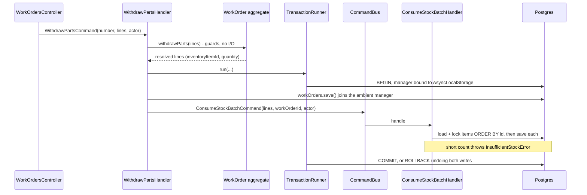

# Work Order Part Withdrawal Design

**Spec**: `.specs/features/work-order-part-withdrawal/spec.md`
**Status**: Approved

---

## Architecture Overview

A withdrawal is one HTTP call that must move two aggregates in two modules or move neither. The mechanism for that already exists and has one production caller: `TransactionRunner.run` opens a Postgres transaction and binds its `EntityManager` to an `AsyncLocalStorage`, and any repository that asks `currentEntityManager()` joins it, across a `CommandBus` dispatch, without either module learning anything about the other's persistence. `RegisterUserHandler` has used it since `identity-foundation` to keep a user insert and its role assignment together.

What this feature adds is participation. `TypeOrmWorkOrderRepository.save` and `TypeOrmInventoryItemRepository.save` both call `this.dataSource.transaction(...)` unconditionally today, which opens a second transaction on a second connection and would leave the two writes independent. Each grows a small `inTransaction` helper that prefers the ambient manager and falls back to opening its own, so their behaviour outside a runner stays exactly what it is now.

The work-orders module owns the decision and the ordering: `WithdrawPartsHandler` loads the work order, lets the aggregate validate the whole batch and compute what each line takes, then opens the transaction, saves the work order, and dispatches one `ConsumeStockBatchCommand` carrying every line. Inventory loads the addressed items **sorted by internal id**, locks them in that order, applies each decrement through the aggregate, and saves. A short count throws from `StockQuantity.minus` inside the domain, the exception unwinds the ambient transaction, and neither module's write survives.



---

## Code Reuse Analysis

### Existing Components to Leverage

| Component | Location | How to Use |
| --- | --- | --- |
| `TransactionRunner` / `currentEntityManager()` | `src/shared/application/ports/transaction-runner.port.ts`, `src/shared/infrastructure/database/typeorm-transaction-runner.ts` | Used as-is, no change. The handlers wrap their two writes in `run`. |
| The ambient-manager `repo()` helper | `typeorm-user.repository.ts:78` | Copied in shape into both repositories this feature touches. |
| `RegisterUserHandler` | `src/modules/users/application/commands/register-user/register-user.handler.ts:65` | The structural template for a handler that saves its own aggregate and dispatches a cross-module command inside one transaction. |
| `StockQuantity.minus` | `src/modules/inventory/domain/value-objects/stock-quantity.ts` | Already holds the never-negative invariant and throws `InsufficientStockError`. The consumption path adds no new guard. |
| `chk_inventory_items_quantity_on_hand` + `isViolation` mapping | `1787702400005-create-inventory-schema.ts`, `typeorm-inventory-item.repository.ts:89` | Stays the backstop for the concurrent case, already mapped to `InsufficientStockError`. |
| `StockMovementProps` | `src/modules/inventory/domain/entities/stock-movement.ts` | Already carries `status`, `workOrderId` and `undoesMovementId`, all null-only until now. Two new factories fill them; `restore` needs no change. |
| `stock_movements` / `stock_movement_transitions` schema | `1787702400005-create-inventory-schema.ts` | `CONSUMPTION`, `RETURN`, `PENDING` and `undoes_movement_id` all exist and are dormant. **This feature adds no migration.** |
| `WorkOrderPartItem.withdrawnQuantity` | `src/modules/work-orders/domain/entities/work-order-part-item.ts` | Created by feature 5, written by nothing until now. |
| `WorkOrderTrailEvent` + `appendTrail` | `.../domain/events/work-order-trail.event.ts`, `typeorm-work-order.repository.ts` | Two new subclasses; the trail keeps being written inside the aggregate's own transaction (AD-007). |
| Raw cross-module SQL join | `typeorm-work-order-query.adapter.ts:56` | The precedent and the comment justifying it: AD-003 forbids importing another module's entities, not joining its tables. The shortages query follows it in the other direction. |
| `Budget` and `budgetRound` on items | feature 6 | The approved-round guard reads the round's status through the aggregate, needing no new query. |

### Integration Points

| System | Integration Method |
| --- | --- |
| `inventory` module | `CommandBus`, `ConsumeStockBatchCommand` and `RestoreStockBatchCommand`, both able to refuse (AD-003). |
| PostgreSQL | No schema change. One shared transaction per call, with row locks taken in a deterministic order. |
| `work_order_events` | Two new `eventType` values in the existing append-only table. |

---

## Components

### `WorkOrderPartItem` (extended)

- **Purpose**: Hold the withdrawn quantity as the net of withdrawals and returns.
- **Location**: `src/modules/work-orders/domain/entities/work-order-part-item.ts`
- **Interfaces**:
  - `withdraw(quantity: number): void` - raises `withdrawnQuantity`; refuses to pass `plannedQuantity` with `WithdrawalExceedsPlannedError`.
  - `returnUnits(quantity: number): void` - lowers it; refuses to go below zero with `ReturnExceedsWithdrawnError`.
  - `get outstandingQuantity(): number` - `plannedQuantity - withdrawnQuantity`, the figure the shortage read model mirrors in SQL.
- **Reuses**: The `attachToBudget` mutator shape feature 6 introduced on this same entity.

### `WorkOrder` (extended)

- **Purpose**: Own the batch's validation and produce the lines inventory will consume.
- **Location**: `src/modules/work-orders/domain/entities/work-order.ts`
- **Interfaces**:
  - `withdrawParts(input: { lines: BatchLine[]; actorUserId: string; now: Date }): ResolvedLine[]`
  - `returnParts(input: { lines: BatchLine[]; actorUserId: string; now: Date }): ResolvedReturnLine[]`
  - where `BatchLine` is `{ itemId: WorkOrderItemId; quantity: number }` and a resolved line carries `{ inventoryItemId: string; quantity: number }`.
- **Guards, in this order**: `IN_EXECUTION`; batch not empty; no duplicate `itemId`; every `itemId` belongs to this work order (`WorkOrderItemNotFoundError`); every addressed item is attached to a round whose status is `APPROVED` (`PartNotWithdrawableError`); each quantity positive; then the per-item arithmetic.
- **Records**: one `PartWithdrawn` / `PartReturned` per call, not per line - one call is one act on the trail.
- **Returns** the resolved lines because the handler needs the inventory item ids to dispatch, and the aggregate is the only thing that knows which work order item maps to which inventory item.

### `StockMovement` (extended) and `InventoryItem` (extended)

- **Location**: `src/modules/inventory/domain/entities/`
- **Interfaces**:
  - `StockMovement.consume(input): StockMovement` - `CONSUMPTION`, status `PENDING`, carrying `workOrderId`.
  - `StockMovement.undo(input): StockMovement` - `RETURN`, status `null`, carrying `workOrderId` and `undoesMovementId`.
  - `InventoryItem.consume(input: { quantity; workOrderId; actorUserId; movementId; now }): void` - lowers the count through `StockQuantity.minus`, appends the movement.
  - `InventoryItem.restoreUnits(input: { quantity; workOrderId; actorUserId; movementId; undoesMovementId; now }): void` - raises the count, appends the `RETURN`.
- **Reuses**: `replenish` and `adjustDown` as the shape; the same compute-before-mutate ordering so a throw leaves `props` untouched.

### `ConsumeStockBatchHandler` / `RestoreStockBatchHandler`

- **Purpose**: The inventory side of the cross-module write, and the only place that locks more than one item at a time.
- **Location**: `src/modules/inventory/application/commands/consume-stock-batch/`, `.../restore-stock-batch/`
- **Interfaces**: `execute(command: { lines: { inventoryItemId: string; quantity: number }[]; workOrderId: string; actorUserId: string }): Promise<ConsumedLineDto[]>`
- **Behaviour**: loads every addressed item through `findAllByIdsForUpdate`, which returns them **ordered by internal id and locked in that order**, then applies each line through the aggregate and saves. Returns, for the consumption case, the movement id minted per line, so the return path can point at it later.
- **Dependencies**: `InventoryItemRepository`, `IdGenerator`, `Clock`, `EventBus`.

### `InventoryItemRepository.findAllByIdsForUpdate` (new port method)

- **Purpose**: The deadlock fix, expressed as a repository guarantee rather than a caller convention.
- **Location**: `src/modules/inventory/domain/repositories/inventory-item.repository.ts`, implemented in `typeorm-inventory-item.repository.ts`
- **Interfaces**: `findAllByIdsForUpdate(ids: InventoryItemId[]): Promise<InventoryItem[]>`
- **Behaviour**: one `SELECT ... WHERE external_id = ANY($1) ORDER BY id FOR UPDATE`, so every caller takes the same locks in the same order whatever order the client sent the batch in. Throws nothing for a missing id; the handler compares counts and refuses.

### The two repositories become transaction-aware

- **Location**: `typeorm-inventory-item.repository.ts`, `typeorm-work-order.repository.ts`
- **Change**: `save()` stops calling `this.dataSource.transaction(...)` directly and calls a private helper instead:
  ```ts
  private inTransaction<T>(work: (manager: EntityManager) => Promise<T>): Promise<T> {
    const ambient = currentEntityManager();
    return ambient ? work(ambient) : this.dataSource.transaction(work);
  }
  ```
- **Why it is safe**: with no ambient transaction the behaviour is identical to today, which is what every existing test exercises.

### `ListStockShortagesHandler` and the query

- **Purpose**: Show the administration every item whose outstanding demand exceeds the shelf.
- **Location**: `src/modules/inventory/application/queries/list-stock-shortages/`, SQL in `typeorm-inventory-query.adapter.ts`
- **Shape**: `StockShortageDto { inventoryItemId, sku, name, quantityOnHand, outstandingQuantity, workOrderNumbers: string[] }`
- **The query**, joining across module-owned tables the way `TypeOrmWorkOrderQueryAdapter` already does:
  ```sql
  SELECT ii.external_id, ii.sku, ii.name, ii.quantity_on_hand,
         SUM(wop.planned_quantity - wop.withdrawn_quantity) AS outstanding,
         array_agg(DISTINCT wo.number) AS work_order_numbers
    FROM work_order_parts wop
    JOIN work_orders wo ON wo.id = wop.work_order_id AND wo.status = 'IN_EXECUTION'
    JOIN work_order_budgets wob ON wob.id = wop.budget_id AND wob.status = 'APPROVED'
    JOIN inventory_items ii ON ii.id = wop.inventory_item_id
   WHERE wop.planned_quantity > wop.withdrawn_quantity
   GROUP BY ii.id
  HAVING SUM(wop.planned_quantity - wop.withdrawn_quantity) > ii.quantity_on_hand
  ```
  The `JOIN ... wob.status = 'APPROVED'` is what keeps a rejected round's parts out, and the inner join on `budget_id` is what keeps draft items out.

### Presentation

| Route | Permission | Body |
| --- | --- | --- |
| `POST /api/v1/work-orders/:number/withdrawals` | `work-orders:execute` | `{ lines: [{ itemId, quantity }] }` |
| `POST /api/v1/work-orders/:number/returns` | `work-orders:execute` | same shape |
| `GET /api/v1/inventory-items/shortages` | `inventory:read` | none |

The shortages route **must be declared before** `GET /api/v1/inventory-items/:externalId`, or Nest parses `shortages` as an id and `ParseUUIDPipe` answers 400. Phase 7's plan says so explicitly and this is the first chance to get it wrong.

---

## Error Handling Strategy

| Error Scenario | Handling | User Impact |
| --- | --- | --- |
| Count on hand does not cover a line | `InsufficientStockError` (`RuleViolation`) from `StockQuantity.minus` | 422, whole batch refused, nothing written |
| Concurrent withdrawal wins the race first | The `CHECK` constraint fires, mapped to `InsufficientStockError` | 422, identical to the above from the caller's side |
| Withdrawal past the planned quantity | `WithdrawalExceedsPlannedError` (`RuleViolation`) | 422 |
| Item on no round, or on a round that is not `APPROVED` | `PartNotWithdrawableError` (`RuleViolation`) | 422 |
| Return past the withdrawn quantity | `ReturnExceedsWithdrawnError` (`RuleViolation`) | 422 |
| Same item id twice in one batch | `DuplicateBatchLineError` (`RuleViolation`) | 422 |
| Empty batch, or a non-positive quantity | Request DTO validation (`@ArrayNotEmpty`, `@IsInt`, `@Min(1)`) | 400 |
| Item id not on this work order | `WorkOrderItemNotFoundError` | 404 |
| Work order outside `IN_EXECUTION` | `WorkOrderStateError` | 422 |
| Unknown work order number | `WorkOrderNotFoundError` | 404 |
| Actor lacks `work-orders:execute` / `inventory:read` | `PermissionsGuard` | 403 |

---

## Risks & Concerns

| Concern | Location (file:line) | Impact | Mitigation |
| --- | --- | --- | --- |
| **`save()`'s delta treats every non-`INBOUND` movement as a subtraction.** A `RETURN` puts units back and would be subtracted, doubling the loss instead of undoing it. | `typeorm-inventory-item.repository.ts:56-61` | Silent, permanent stock corruption on every return | The delta must key on the movement kind explicitly: `INBOUND` and `RETURN` add, `CONSUMPTION` and `ADJUSTMENT` subtract. A task asserts the count after a withdraw-then-return round trip equals the starting count. |
| Making two repositories transaction-aware touches the write path of every feature already shipped. | `typeorm-inventory-item.repository.ts`, `typeorm-work-order.repository.ts` | A regression here breaks features 1 to 6 | The fallback branch is the untouched original call. The whole existing suite (471 unit, 172 integration, 128 e2e) runs with no ambient transaction and must stay green, which is the regression test. |
| Two concurrent batches locking the same items in different orders deadlock, and Postgres kills one with `40P01`, surfacing as a 500. | `consume-stock-batch.handler.ts` | An unexplained 500 under concurrency | `findAllByIdsForUpdate` sorts by internal id inside the repository, so the order cannot depend on the caller. A task runs two overlapping batches with reversed line order against the real database. |
| The lock is now held for the whole outer transaction rather than the inventory write alone. | `typeorm-inventory-item.repository.ts` | Longer lock hold under load | Correct and necessary: releasing it before the work order row commits is exactly the window a second withdrawal could slip through. The transaction stays short because it contains no I/O beyond these writes. |
| The shortage query reads "pending withdrawals" as outstanding demand, not as `PENDING` movements. Those mean opposite things: a `PENDING` movement is stock already gone. | `typeorm-inventory-query.adapter.ts` | The list would show precisely the wrong items | The SQL never touches `stock_movements`. A task asserts an item with a large `PENDING` consumption and nothing outstanding is absent from the list. |
| `GET /inventory-items/shortages` parsed as an id. | `inventory-items.controller.ts` | 400 on a valid call | Declared above the `:externalId` route, with a comment. An e2e test calls it as an administrator. |
| `InventoryItem.restore` deliberately attaches no movements, so nothing in the aggregate can see prior consumptions. | `inventory-item.ts:96` | The return path cannot find the consumption to point at from the aggregate | **Superseded during Execute (tasks.md's T12 correction)**: the original plan below assumed work-orders could remember a movement id across requests; `WorkOrder.restore` rebuilds every item from `work_order_parts` columns alone, with no column for one, so it cannot. `RestoreStockBatchHandler` resolves the consumption itself via `findPendingConsumptions`, reading `stock_movements` newest first and netting prior returns - still without changing `InventoryItem.restore`'s own loading rule. |

---

## Tech Decisions

| Decision | Choice | Rationale |
| --- | --- | --- |
| How the two modules share a transaction | The existing `TransactionRunner` plus `currentEntityManager()`, with both repositories taught to join an ambient manager | The mechanism and its one precedent already exist; passing an `EntityManager` through a command payload would leak persistence into the application contract AD-003 keeps clean. |
| Batch consumption shape | One `ConsumeStockBatchCommand`, with locks taken in internal-id order inside the repository | Confirmed with the user. A per-part dispatch loop would take locks in client-supplied order, which deadlocks between two overlapping batches. |
| Where the shortage query lives | The inventory query adapter, joining work-order tables in raw SQL | Confirmed with the user. Matches the precedent and its stated reading of AD-003; keeps the demand-against-shelf comparison in one query. |
| Trail granularity | One `PartWithdrawn` per call, not per line | A batch is one act by one mechanic at one moment. Per-line entries would make a five-part withdrawal read as five events on the trail. |
| Where the movement id for a return comes from | **Superseded during Execute (tasks.md's T12 correction)**: `RestoreStockBatchHandler` resolves it itself, via a new `findPendingConsumptions` repository method, rather than a caller-supplied value | The original plan (`ConsumeStockBatchHandler` returns it, the return call passes it back) cannot survive a reload: `WorkOrder.restore` has no column to carry a movement id across requests. `ConsumeStockBatchHandler` still returns `ConsumedLineDto[]` for now (unused, harmless); nothing in `src/` reads it. |
| Whether the return's `RETURN` movement carries a status | No, `null` | Only a consumption carries a lifecycle status (rule 22 and the existing enum comment). A return is a fact, not something later settled or written off. |

> **Project-level decision:** this feature's transaction rule generalises past itself and is proposed as **AD-008**: *a repository whose aggregate can take part in a cross-module write must honour an ambient transaction, preferring `currentEntityManager()` and falling back to opening its own.* Any future repository that forgets it becomes a silent atomicity hole that no test in its own module would catch. To be appended to `.specs/STATE.md` `## Decisions` when this design is approved.
