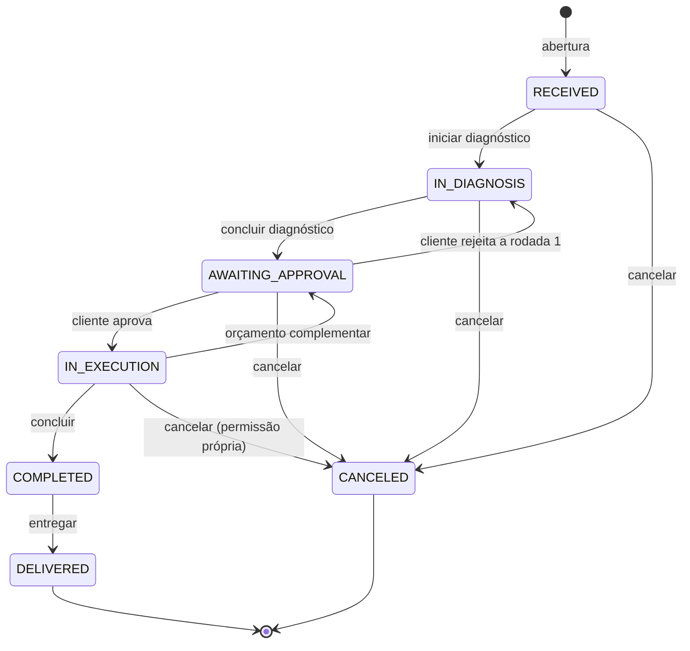
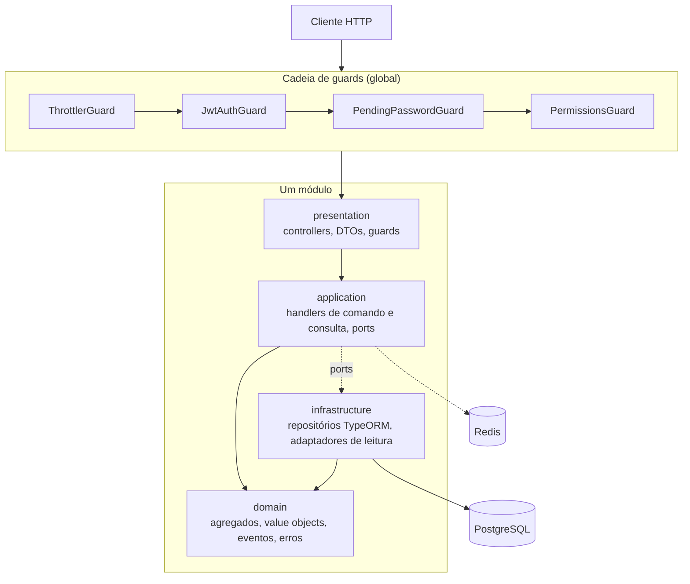

# Workshop Management API

API REST para a operação de uma oficina mecânica, da chegada do veículo até a entrega.

[](LICENSE)
[](https://nodejs.org)
[](https://nestjs.com)
[](https://www.postgresql.org)

> **Status:** MVP em desenvolvimento ativo. As funcionalidades descritas abaixo estão
> implementadas e cobertas por testes, mas o projeto nunca rodou em produção e não há pipeline de
> CI neste repositório.

## Sumário

- [Visão geral](#visão-geral)
- [Convenção de linguagem](#convenção-de-linguagem)
- [Funcionalidades](#funcionalidades)
- [Arquitetura](#arquitetura)
- [Stack](#stack)
- [Pré-requisitos](#pré-requisitos)
- [Começando](#começando)
- [Variáveis de ambiente](#variáveis-de-ambiente)
- [Banco de dados](#banco-de-dados)
- [Executando a aplicação](#executando-a-aplicação)
- [API](#api)
- [Collection do Postman](#collection-do-postman)
- [Testes](#testes)
- [Qualidade de código](#qualidade-de-código)
- [Estrutura de pastas](#estrutura-de-pastas)
- [Convenções](#convenções)
- [Decisões de arquitetura](#decisões-de-arquitetura)
- [Segurança](#segurança)
- [Deploy](#deploy)
- [Contribuindo](#contribuindo)
- [Licença](#licença)

## Visão geral

Uma oficina de pequeno porte administra o mesmo problema todos os dias: um veículo chega, alguém
diagnostica, alguém precisa aprovar o custo antes que o trabalho comece, peças saem do estoque
enquanto o serviço acontece, e no fim é preciso saber o que foi cobrado e por quê. Sem sistema,
esse controle vive em papel e planilha, o cliente liga para saber do carro e ninguém sabe
responder, e o estoque só é conferido quando falta.

Esta API centraliza essa operação em torno de um conceito: a **ordem de serviço**. Ela guarda quem
é o cliente, qual é o veículo, o que foi diagnosticado, quanto custa, quem aprovou, quais peças
saíram da prateleira e quando o carro foi entregue. Cada mudança de status acontece como
consequência de uma ação, nunca por escrita direta, e cada passo fica registrado numa trilha que
não pode ser reescrita.

**Para quem é:** desenvolvedores construindo ou avaliando um back-end de gestão de oficina, e
quem quiser um exemplo concreto de monolito modular com DDD e CQRS em NestJS. É uma API HTTP: não
há interface de usuário neste repositório.

**Por que existe:** nasceu como Tech Challenge da pós-graduação em Arquitetura de Software da
FIAP (SOAT). O escopo é o de uma oficina única, com um estoque e um endereço. Não cobre
faturamento, gestão de fornecedores nem agendamento.

## Convenção de linguagem

Este README e a documentação de entrada estão em **português**. O código, os commits, os nomes de
rota, os identificadores, as mensagens de erro e os documentos em `docs/` estão em **inglês**.

A separação é deliberada. A documentação de entrada existe para quem chega ao projeto, e o público
deste projeto é brasileiro: forçar inglês aqui só adiciona uma barreira sem contrapartida. O
código, por outro lado, convive com o vocabulário do ecossistema em que roda. NestJS, TypeORM,
class-validator e o próprio SQL são em inglês, e misturar os dois idiomas dentro de um mesmo
arquivo produz nomes como `RegistrarCustomerHandler`. Manter o código inteiro em inglês mantém o
vocabulário do domínio consistente do agregado até o nome da coluna.

Os dados de exemplo (nomes de serviço, endereços, os dados que `npm run seed` cria) estão em
português, porque são conteúdo brasileiro, não código.

## Funcionalidades

### Identidade e acesso

- Cadastro de conta em rota pública, com validação de CPF e CNPJ por dígito verificador
- Autenticação JWT com token de acesso e refresh token rotativo de uso único
- Sessões listáveis e revogáveis, individualmente ou todas de uma vez
- Contas de equipe criadas com senha temporária, bloqueadas até a primeira troca
- Controle de acesso por permissão, agrupadas em papéis: `SUPER_ADMIN`, `ADMIN`,
  `SERVICE_ADVISOR`, `MECHANIC`, `CUSTOMER`
- Limite de requisições por Redis, com uma faixa mais estreita nas rotas de autenticação

### Clientes e veículos

- CRUD de clientes, com endereço validado contra a lista real de UFs e telefone normalizado
- Busca de cliente por nome ou por documento, que é o caminho do balcão
- CRUD de veículos com placa nos formatos antigo (AAA0000) e Mercosul (AAA0A00)
- Transferência de veículo entre clientes
- Rotas `me` para o cliente ler e atualizar o próprio cadastro

### Catálogo de serviços

- CRUD de serviços com preço e duração estimada
- Exclusão lógica: o registro permanece e o nome volta a ficar disponível

### Estoque

- CRUD de peças e insumos, com SKU único entre os itens ativos
- Reposição e ajuste para baixo, cada um gravando um movimento
- Contagem que nunca fica negativa, alterada apenas por movimento
- Histórico de movimentos somente-adição, com o ator de cada um
- Relatório de faltas: itens cuja demanda das OS em execução passa do que há na prateleira
- Desativação recusada enquanto uma OS aberta ainda planeja o item

### Ordens de serviço

- Abertura a partir do cliente e do veículo, com um veículo por OS aberta
- Inclusão de serviços do catálogo e de peças do estoque
- Orçamento somado dentro do agregado, a partir dos serviços e das peças planejadas
- Rodadas de orçamento numeradas, para o trabalho extra descoberto durante a execução
- Aprovação ou rejeição pelo cliente, ou por quem tem a permissão para decidir
- Retirada de peças do estoque, com baixa e movimento na mesma transação da OS
- Devolução do que sobrou, cancelamento com baixa definitiva, desconto com justificativa
- Sete estados, alterados apenas como consequência de uma ação:



### Acompanhamento e métricas

- O cliente consulta as próprias ordens por API, sem acesso às de terceiros
- Trilha completa da OS, gravada na mesma transação que muda o agregado
- Tempo médio de execução, com filtro por serviço e por período

## Arquitetura

Monolito modular com CQRS, num único processo e um único banco. Oito módulos, cada um com quatro
camadas, e uma regra dura entre eles: módulos só conversam pelos barramentos de comando e consulta,
nunca importando o repositório ou a entidade do vizinho.



A dependência aponta sempre para dentro. `application` conhece `domain` e conversa com
`infrastructure` só através de interfaces (`ports`) que ela mesma declara. As regras de negócio
vivem nos agregados, não nos handlers: quem decide se uma OS pode sair do diagnóstico é a própria
`WorkOrder`, e quem garante que o estoque nunca fica negativo é o value object `StockQuantity`.

Isso não é convenção de nome de pasta. O ESLint recusa import de framework dentro de `domain` e
import de infraestrutura dentro de `application`, então uma violação de camada quebra
`npm run lint` em vez de passar pela revisão.

**Padrões táticos em uso**, com exemplos reais:

| Padrão               | Onde vive                                                                       |
| -------------------- | ------------------------------------------------------------------------------- |
| Agregado             | `WorkOrder`, `InventoryItem`, `Customer`, `Vehicle`, `Service`, `User`          |
| Entidade filha       | `Budget`, `WorkOrderPartItem`, `StockMovement` (dentro do agregado que as cria) |
| Value object         | `PersonDocument`, `LicensePlate`, `Money`, `StockQuantity`, `WorkOrderNumber`   |
| Evento de domínio    | `BudgetGenerated`, `StockReplenished`, `VehicleDelivered`                       |
| Repositório          | Interface em `domain/repositories`, implementação TypeORM em `infrastructure`   |
| Serviço de aplicação | `BudgetDecisionAuthorizer`, `WorkOrderCompletionAuthorizer`                     |
| Port e adaptador     | `InventoryQueryPort`, `Clock`, `IdGenerator`, `TransactionRunner`               |

Os cinco contextos delimitados são Identity & Access, Customer Management, Workshop Catalog,
Inventory e Workshop Operations. Contextos e módulos não são um para um: Identity & Access ocupa
três módulos e Customer Management dois.

Detalhes em [`docs/architecture/`](docs/architecture/):
[visão geral](docs/architecture/architecture-overview.md),
[projeto de alto nível](docs/architecture/high-level-design.md),
[projeto de baixo nível por módulo](docs/architecture/low-level-design/README.md).

## Stack

| Camada              | Tecnologia                               |
| ------------------- | ---------------------------------------- |
| Linguagem           | TypeScript 5.9                           |
| Runtime             | Node.js >= 22                            |
| Framework           | NestJS 11                                |
| CQRS                | `@nestjs/cqrs` 11                        |
| ORM                 | TypeORM 0.3                              |
| Banco               | PostgreSQL 16                            |
| Cache e limites     | Redis 7 (`ioredis`)                      |
| Documentação da API | `@nestjs/swagger` 11 (OpenAPI 3)         |
| Validação           | `class-validator` e `zod` (env)          |
| Hash de senha       | `argon2` (Argon2id)                      |
| Cabeçalhos HTTP     | `helmet`                                 |
| Log                 | `nestjs-pino`                            |
| Testes              | Vitest 3, `supertest`, `@faker-js/faker` |
| Cobertura           | `@vitest/coverage-v8`                    |
| Lint e formatação   | ESLint 9, Prettier 3                     |
| Containers          | Docker e Docker Compose                  |

## Pré-requisitos

- **Node.js 22 ou superior** (campo `engines` do `package.json`; a imagem Docker usa Node 24)
- **npm** (o repositório versiona `package-lock.json`)
- **Docker** e **Docker Compose**, para Postgres e Redis

Não é preciso instalar Postgres nem Redis na máquina: o `docker-compose.yml` sobe os dois.

## Começando

```bash
git clone <url-do-repositorio>
cd tech_challenger_1

npm install
cp .env.example .env

docker compose up -d
npm run migration:run
npm run seed
```

Ao final disso a API responde em `http://localhost:13000`, o Swagger em
`http://localhost:13000/api/docs`, e o banco tem um usuário por papel mais catálogo, estoque,
cliente e veículos de demonstração.

O `.env.example` já vem com valores que casam com o `docker-compose.yml`. Em ambiente local não é
preciso mudar nada além de `JWT_SECRET`, se quiser.

> O serviço `app` do compose roda a imagem construída no momento do `up`. Depois de mudar código,
> use `docker compose up -d --build`, senão o container continua servindo a versão anterior.

## Variáveis de ambiente

Carregadas de `.env` e validadas na subida por `zod`
([`src/config/env.validation.ts`](src/config/env.validation.ts)). Uma variável obrigatória ausente
derruba a aplicação com a mensagem do campo, em vez de falhar mais tarde.

| Variável                       | Obrigatória | Padrão           | Descrição                                                             |
| ------------------------------ | ----------- | ---------------- | --------------------------------------------------------------------- |
| `NODE_ENV`                     | Não         | `development`    | `development`, `test` ou `production`                                 |
| `PORT`                         | Não         | `3000`           | Porta que a aplicação escuta dentro do container                      |
| `APP_HOST_PORT`                | Não         | `13000`          | Porta publicada da API na máquina                                     |
| `POSTGRES_HOST_PORT`           | Não         | `15432`          | Porta publicada do Postgres na máquina                                |
| `REDIS_HOST_PORT`              | Não         | `16379`          | Porta publicada do Redis na máquina                                   |
| `DATABASE_HOST`                | Sim         | -                | Host do Postgres                                                      |
| `DATABASE_PORT`                | Não         | `5432`           | Porta do Postgres                                                     |
| `DATABASE_USER`                | Sim         | -                | Usuário do Postgres                                                   |
| `DATABASE_PASSWORD`            | Sim         | -                | Senha do Postgres                                                     |
| `DATABASE_NAME`                | Sim         | -                | Nome do banco                                                         |
| `REDIS_HOST`                   | Sim         | -                | Host do Redis                                                         |
| `REDIS_PORT`                   | Não         | `6379`           | Porta do Redis                                                        |
| `REDIS_DB`                     | Não         | `0`              | Índice do banco Redis, de 0 a 15                                      |
| `JWT_SECRET`                   | Sim         | -                | Segredo de assinatura do token, mínimo de 32 caracteres               |
| `ACCESS_TOKEN_TTL_SECONDS`     | Não         | `900`            | Validade do token de acesso                                           |
| `REFRESH_TOKEN_TTL_SECONDS`    | Não         | `604800`         | Validade do refresh token                                             |
| `SESSION_ABSOLUTE_TTL_SECONDS` | Não         | `2592000`        | Teto absoluto da sessão, independente das renovações                  |
| `RATE_LIMIT_TTL_SECONDS`       | Não         | `60`             | Janela do limite de requisições                                       |
| `RATE_LIMIT_MAX_REQUESTS`      | Não         | `100`            | Requisições por janela, limite global                                 |
| `RATE_LIMIT_AUTH_MAX_REQUESTS` | Não         | `10`             | Requisições por janela nas rotas de autenticação                      |
| `ADMIN_EMAIL`                  | Não         | -                | E-mail do `SUPER_ADMIN` criado pelos seeds                            |
| `ADMIN_PASSWORD`               | Não         | -                | Senha do `SUPER_ADMIN`, mínimo de 8 caracteres, lida por `seed:admin` |
| `ADMIN_DOCUMENT`               | Não         | -                | CPF ou CNPJ do `SUPER_ADMIN`, lido por `seed:admin`                   |
| `SEED_PASSWORD`                | Não         | `Str0ngPassword` | Senha dada a todas as contas que `npm run seed` cria                  |

`.env` está no `.gitignore` e nunca é versionado. `.env.test` está versionado de propósito: aponta
para o banco `workshop_test` e só contém credenciais locais de teste.

## Banco de dados

PostgreSQL, acessado por TypeORM com migrations escritas à mão. O schema tem 18 tabelas de
domínio, mais a tabela de controle do próprio TypeORM, criadas por nove migrations em
[`src/shared/infrastructure/database/migrations/`](src/shared/infrastructure/database/migrations/).
`synchronize` está desligado: nada altera o schema fora de uma migration.

```bash
npm run migration:run       # aplica as migrations pendentes
npm run migration:revert    # desfaz a última
npm run migration:generate  # gera uma nova a partir das diferenças de entidade
```

### Seeds

```bash
npm run seed        # atores, catálogo, estoque, cliente e veículos
npm run seed:admin  # apenas o SUPER_ADMIN, a partir das variáveis ADMIN_*
```

`npm run seed` é idempotente: rodar duas vezes deixa o mesmo banco. Ele cria uma conta por papel,
todas com a senha de `SEED_PASSWORD`:

| Papel             | E-mail                    |
| ----------------- | ------------------------- |
| `SUPER_ADMIN`     | valor de `ADMIN_EMAIL`    |
| `ADMIN`           | `admin@oficina.local`     |
| `SERVICE_ADVISOR` | `consultor@oficina.local` |
| `MECHANIC`        | `mecanico@oficina.local`  |
| `CUSTOMER`        | `cliente@oficina.local`   |

Mais quatro serviços de catálogo, cinco itens de estoque com saldo inicial, e um cliente com
endereço e dois veículos. É o suficiente para a [collection do Postman](#collection-do-postman)
rodar de ponta a ponta sem nenhum passo manual.

O catálogo de papéis e permissões não vem do seed: é criado pela migration
`1787702400001-seed-rbac-catalog`, porque o modelo de acesso é parte do schema.

### Banco de teste

O script de inicialização do Postgres
([`docker/postgres/init/`](docker/postgres/init/)) cria também o banco `workshop_test`, usado pelas
suítes de integração e e2e. Não há passo adicional para preparar os testes.

## Executando a aplicação

```bash
npm run start:dev    # desenvolvimento, com recarga automática
npm run start:debug  # desenvolvimento, com o inspetor do Node aberto
npm run build        # compila para dist/
npm run start:prod   # roda o build compilado
```

Pelo Docker, o compose sobe os três serviços de uma vez:

```bash
docker compose up -d          # postgres, redis e a aplicação
docker compose up -d --build  # reconstrói a imagem antes de subir
docker compose logs -f app
docker compose down           # para tudo, preservando o volume do Postgres
```

A aplicação espera os healthchecks do Postgres e do Redis antes de subir.

## API

Todas as rotas ficam sob o prefixo `/api/v1`. São 49 caminhos e 72 operações, em 10 controllers.

**Swagger UI:** `http://localhost:13000/api/docs`
**Especificação OpenAPI:** `http://localhost:13000/api/docs-json`

A autenticação é por Bearer token. Só três rotas dispensam o token: criar conta (`POST /users`),
login (`POST /auth/sessions`) e renovar (`POST /auth/tokens`).

Exemplo de login e de uma chamada autenticada:

```bash
TOKEN=$(curl -s -X POST http://localhost:13000/api/v1/auth/sessions \
  -H 'Content-Type: application/json' \
  -d '{"email":"admin@oficina.local","password":"Str0ngPassword"}' \
  | jq -r .accessToken)

curl -s http://localhost:13000/api/v1/work-orders \
  -H "Authorization: Bearer $TOKEN" | jq
```

Abrindo uma ordem de serviço a partir do CPF do cliente:

```bash
CLIENTE=$(curl -s "http://localhost:13000/api/v1/customers?document=11144477735" \
  -H "Authorization: Bearer $TOKEN" | jq -r '.[0].id')

VEICULO=$(curl -s "http://localhost:13000/api/v1/vehicles?customerId=$CLIENTE" \
  -H "Authorization: Bearer $TOKEN" | jq -r '.[0].id')

curl -s -X POST http://localhost:13000/api/v1/work-orders \
  -H "Authorization: Bearer $TOKEN" -H 'Content-Type: application/json' \
  -d "{\"customerId\":\"$CLIENTE\",\"vehicleId\":\"$VEICULO\"}" | jq
```

Todo valor monetário trafega como inteiro em centavos de real, na entrada e na saída.

Os erros seguem um formato único, e o tipo do erro de domínio define o status:

| Tipo do erro    | Status |
| --------------- | ------ |
| `Validation`    | 400    |
| `Unauthorized`  | 401    |
| `Forbidden`     | 403    |
| `NotFound`      | 404    |
| `Conflict`      | 409    |
| `RuleViolation` | 422    |

## Collection do Postman

[`postman/`](postman/) traz a collection e o environment local:

```
postman/
├── workshop-api.postman_collection.json
└── workshop-api.local.postman_environment.json
```

Importe os dois no Postman e rode as pastas de cima para baixo pelo Collection Runner. Cada
requisição guarda em variável o que a próxima precisa, então a sequência inteira funciona sem
edição manual. Requer `npm run seed` aplicado.

| Pasta                           | O que cobre                                                          |
| ------------------------------- | -------------------------------------------------------------------- |
| 00. Autenticação                | Login de cada ator, renovação do par de tokens, sessões ativas       |
| 01. Cadastro do cliente         | Conta, papel, cadastro de cliente, veículo, rotas `me`               |
| 02. Gestão de usuários          | Permissões, papéis, conta de staff com senha temporária, desativação |
| 03. Gestão de estoque           | CRUD de itens, reposição, ajuste, movimentos, faltas, desativação    |
| 04. Gestão de ordem de serviço  | Do CPF do cliente à entrega, mais um cancelamento                    |
| 05. Acompanhamento pelo cliente | O cliente lendo as próprias ordens, e o 404 para a ordem de terceiro |
| 06. Métricas e auditoria        | Tempo médio de execução e a trilha da OS                             |
| 07. Encerramento                | Logout, que derruba todas as sessões do usuário                      |

Pela linha de comando:

```bash
npx newman run postman/workshop-api.postman_collection.json \
  -e postman/workshop-api.local.postman_environment.json
```

Uma execução completa consome quase toda a cota de `RATE_LIMIT_AUTH_MAX_REQUESTS`, então duas
rodadas seguidas recebem 429. Espere a janela fechar, ou aumente o limite no `.env`.

## Testes

Três suítes, cada uma com seu arquivo de configuração:

| Comando                    | Suíte                         | O que exercita                                                            |
| -------------------------- | ----------------------------- | ------------------------------------------------------------------------- |
| `npm run test:unit`        | `src/**/*.spec.ts`            | Agregados, value objects e handlers, com dublês de teste                  |
| `npm run test:integration` | `test/integration/`           | Repositórios, adaptadores de leitura e migrations, contra o Postgres real |
| `npm run test:e2e`         | `test/e2e/`                   | Fluxos completos por HTTP, com a aplicação de pé                          |
| `npm run test:coverage`    | unitários, com cobertura      | Aplica os limites por caminho crítico                                     |
| `npm run test:unit:watch`  | unitários, em modo observador | -                                                                         |

`npm test` é atalho para `npm run test:unit`.

As suítes de integração e e2e leem `.env.test`, rodam as próprias migrations em `workshop_test`
antes de começar ([`test/support/global-setup.ts`](test/support/global-setup.ts)) e não precisam de
nenhum passo além de `docker compose up -d`. O banco de teste nunca é truncado entre execuções, e
por isso cada teste gera seus próprios dados únicos em vez de contar com um banco limpo.

### Cobertura

O limite de 80% é aplicado por caminho crítico, não como um número global
([`vitest.config.ts`](vitest.config.ts)). Cada faixa quebra o build sozinha, o que impede que uma
camada bem coberta compense outra descoberta. As faixas cobrem a camada de domínio de work-orders,
inventory, customers, os value objects de users e vehicles, o `Money` do núcleo compartilhado, e a
camada de aplicação dos seis módulos de negócio.

O número global fica bem abaixo disso, e de propósito: controllers, DTOs, mappers e repositórios
não são exercitados pelos testes unitários, e sim pelas suítes de integração e e2e, que não entram
no relatório de cobertura.

## Qualidade de código

```bash
npm run lint          # ESLint com regras de tipo
npm run lint:fix      # corrige o que for automatizável
npm run format        # Prettier em todo o repositório
npm run format:check  # confere sem escrever
```

O ESLint faz mais do que estilo aqui: as regras `no-restricted-imports` dos blocos por pasta em
[`eslint.config.mjs`](eslint.config.mjs) proíbem framework dentro de `domain` e infraestrutura
dentro de `application`. É o que torna as camadas obrigatórias em vez de sugeridas.

`lint-staged` está configurado no `package.json` e o `husky` está instalado, mas **não há hook de
pre-commit ativo** no repositório: o diretório `.husky/` só contém os arquivos internos do husky.
Rode `npm run lint` manualmente antes de commitar.

O `tsconfig.json` roda em modo estrito. `npm run build` compila com `tsconfig.build.json`, que
exclui os arquivos de teste.

## Estrutura de pastas

```
.
├── src/
│   ├── config/                    # configuração tipada e validação do ambiente
│   ├── modules/                   # um diretório por módulo, quatro camadas em cada
│   │   ├── authentication/        # sessões, tokens, revogação
│   │   ├── authorization/         # papéis, permissões, acesso efetivo
│   │   ├── customers/             # cadastro de clientes
│   │   ├── inventory/             # peças, insumos e movimentos de estoque
│   │   ├── services/              # catálogo de serviços
│   │   ├── users/                 # contas e credenciais
│   │   ├── vehicles/              # veículos dos clientes
│   │   └── work-orders/           # ordens de serviço, orçamentos, trilha
│   ├── shared/                    # núcleo compartilhado e infraestrutura comum
│   │   ├── domain/                # AggregateRoot, DomainEvent, Money, erros base
│   │   ├── application/           # ports de Clock, IdGenerator, TransactionRunner
│   │   ├── infrastructure/        # datasource, migrations, Redis, relógio, ids
│   │   └── presentation/          # filtro global de erro, pipe de validação
│   ├── app.module.ts              # composição da aplicação e guards globais
│   └── main.ts                    # bootstrap e Swagger
├── test/
│   ├── e2e/                       # fluxos completos por HTTP
│   ├── integration/               # persistência contra o Postgres real
│   └── support/                   # fábricas, dublês e setup das suítes
├── docs/
│   ├── adr/                       # 25 registros de decisão de arquitetura
│   └── architecture/              # visão geral, alto nível, baixo nível por módulo
├── postman/                       # collection e environment
├── scripts/                       # seeds
├── docker/                        # script de inicialização do Postgres
├── Dockerfile
└── docker-compose.yml
```

Dentro de cada módulo, as quatro camadas seguem sempre a mesma forma:

```
modules/work-orders/
├── domain/          # agregados, entidades, value objects, eventos, erros, interfaces de repositório
├── application/     # handlers de comando e consulta, ports, autorizadores
├── infrastructure/  # repositórios TypeORM, adaptadores de leitura, mappers
└── presentation/    # controllers, DTOs de requisição e resposta
```

Os testes unitários ficam ao lado do arquivo que cobrem (`inventory-item.spec.ts` ao lado de
`inventory-item.ts`), e não numa árvore paralela.

## Convenções

**Commits** seguem [Conventional Commits](https://www.conventionalcommits.org/), com escopo de
módulo: `feat(inventory): deactivate a catalog item`, `docs(architecture): ...`. Não há commitlint
configurado, então a convenção é mantida à mão.

**Identificadores.** Toda tabela endereçável tem `id bigserial` para uso interno e chaves
estrangeiras, mais `external_id uuid` para o que sai do processo. Nenhuma chave sequencial aparece
em URL ou payload ([ADR 0006](docs/adr/0006-internal-key-plus-external-uuid.md)).

**Dinheiro** é sempre inteiro em centavos de real, em coluna `bigint`
([ADR 0007](docs/adr/0007-money-in-integer-brl-cents.md)). Formatação e conversão de moeda são
responsabilidade do cliente.

**Exclusão é lógica.** Clientes, veículos, serviços, itens de estoque e usuários são desativados,
não apagados. Os índices únicos são parciais, filtrados por `deleted_at IS NULL` ou pelo status,
então o e-mail, a placa ou o SKU voltam a ficar livres.

**Histórico é somente-adição.** `stock_movements`, `stock_movement_transitions` e
`work_order_events` nunca são apagados nem reescritos
([ADR 0015](docs/adr/0015-stock-movements-append-only.md)).

**Módulos conversam por barramento.** Nenhum módulo importa o repositório ou a entidade de outro;
a comunicação é por `CommandBus` e `QueryBus`, trocando identificadores e DTOs
([ADR 0008](docs/adr/0008-cross-context-calls-through-the-buses.md)).

**Erros** são classes de domínio com código próprio e um tipo, e o tipo define o status HTTP. Um
handler nunca escolhe um código de status.

## Decisões de arquitetura

Vinte e cinco registros numerados em [`docs/adr/`](docs/adr/README.md), um por decisão, cada um com
contexto, decisão e consequências.

### Por que PostgreSQL

Registrado por inteiro na
[ADR 0002](docs/adr/0002-postgresql-as-the-relational-database.md). Em resumo, os dados aqui são
relacionais no sentido estrito: uma ordem de serviço aponta para um cliente, um veículo, um
conjunto de itens de serviço, um conjunto de itens de peça e uma série de rodadas de orçamento; um
movimento de estoque aponta para o item e para a OS que o consumiu.

Quatro propriedades sustentam a escolha:

1. **Integridade referencial declarada no schema.** As chaves estrangeiras são verificadas pelo
   banco, então um item não pode apontar para uma OS inexistente. A garantia é do schema, não do
   código que por acaso escreve.
2. **Transação atravessando dois agregados em dois módulos.** A retirada de peça baixa o estoque,
   grava um movimento e atualiza a OS. Se qualquer metade falhar, as duas precisam falhar. O
   Postgres entrega isso como um `COMMIT`.
3. **Bloqueio de linha para a concorrência real do caso.** Duas retiradas simultâneas sobre o
   mesmo item são resolvidas com `SELECT ... FOR UPDATE` ordenado por id, o que também evita
   deadlock entre lotes que citam os mesmos itens em ordens diferentes.
4. **Índices únicos parciais.** A regra de exclusão lógica depende de `UNIQUE ... WHERE deleted_at
IS NULL`, que o Postgres suporta nativamente.

Um banco de documentos resolveria a leitura da OS com menos junções, e pagaria por isso com a
consistência entre estoque e ordem, que é exatamente o ponto onde este domínio não pode ceder.

## Segurança

O que está implementado:

- Senhas com Argon2id ([ADR 0005](docs/adr/0005-argon2id-for-password-hashing.md))
- JWT de vida curta com refresh token rotativo de uso único, reuso detectado
  ([ADR 0004](docs/adr/0004-jwt-with-refresh-token-rotation.md))
- Revogação de sessão consultada a cada requisição, com a lista em Redis
- Controle de acesso por permissão, com o acesso efetivo em cache e invalidado por evento
- `SUPER_ADMIN` criado fora da API, o único que pode conceder `ADMIN`
  ([ADR 0012](docs/adr/0012-super-administrator-created-outside-the-api.md))
- Limite de requisições por Redis, mais estreito nas rotas de autenticação
- `helmet` nos cabeçalhos de resposta
- Validação de entrada em toda rota, com CPF, CNPJ e placa verificados de verdade
- Log com redação de `authorization`, `password` e `refreshToken`
- O container roda como usuário `node`, não como root

O que este projeto **não** afirma: não passou por auditoria de segurança, não roda em produção e
não deve ser tratado como pronto para isso. Não há `SECURITY.md` neste repositório; para relatar
uma vulnerabilidade, abra uma issue sem detalhar o vetor e peça um canal privado.

## Deploy

O que existe no repositório é o suficiente para rodar em qualquer host com Docker:

- [`Dockerfile`](Dockerfile) multi-estágio, com `npm ci` e `npm prune --omit=dev`, gerando uma
  imagem de produção que roda como usuário `node` e expõe a porta 3000
- [`docker-compose.yml`](docker-compose.yml) orquestrando aplicação, Postgres e Redis, com
  healthcheck nos dois últimos e volume nomeado para os dados

Não há configuração de nuvem, Kubernetes, Terraform nem pipeline de CI neste repositório, e o
compose foi escrito para ambiente local. Subir isso em produção pediria pelo menos segredos fora
do `.env`, TLS na borda, backup do volume do Postgres e um passo que rode as migrations antes da
aplicação começar a servir.

## Contribuindo

Não há `CONTRIBUTING.md`. As convenções que o repositório segue hoje:

1. Trabalhe em um branch a partir de `main`
2. Um commit por unidade de trabalho, em Conventional Commits, com escopo de módulo
3. Teste junto com o código: agregado e handler em teste unitário, persistência em integração,
   fluxo em e2e
4. Antes de abrir o PR, rode:

```bash
npm run lint
npm run build
npm run test:unit
npm run test:integration
npm run test:e2e
```

5. Decisão que muda a forma do sistema vira um ADR novo em `docs/adr/`, numerado em sequência

## Licença

Distribuído sob a licença MIT. Veja [LICENSE](LICENSE).
