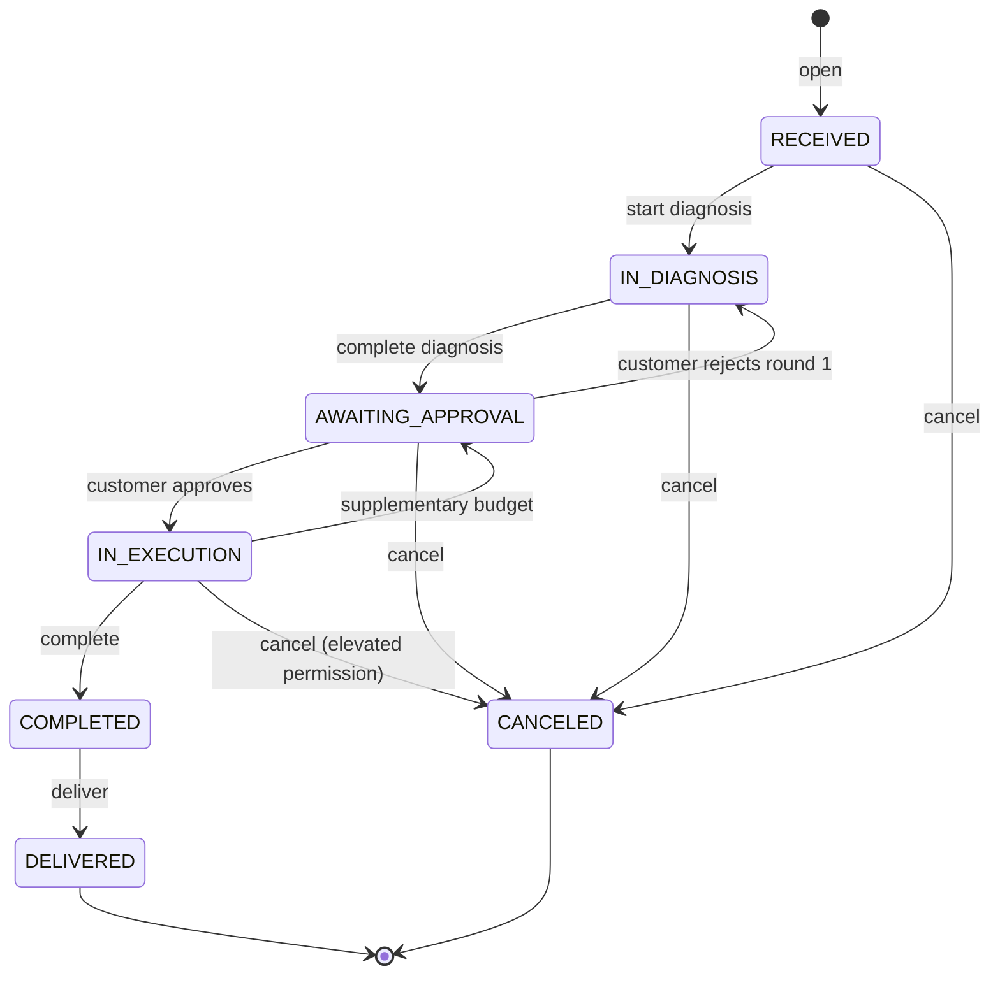

# Workshop Management API

A REST API for running an auto repair shop, from the moment the vehicle arrives to the moment it
is handed back.

[](LICENSE)
[](https://nodejs.org)
[](https://nestjs.com)
[](https://www.postgresql.org)

> **Status:** MVP under active development. The features described below are implemented, covered
> by tests and verified by git hooks on every commit and push. The project has never run in
> production.

## Contents

- [Overview](#overview)
- [Features](#features)
- [Architecture](#architecture)
- [Tech stack](#tech-stack)
- [Requirements](#requirements)
- [Getting started](#getting-started)
- [Environment variables](#environment-variables)
- [Database](#database)
- [Running the application](#running-the-application)
- [API](#api)
- [Postman collection](#postman-collection)
- [Testing](#testing)
- [Code quality](#code-quality)
- [Project structure](#project-structure)
- [Conventions](#conventions)
- [Ubiquitous language](#ubiquitous-language)
- [Technical decisions](#technical-decisions)
- [Challenge requirements](#challenge-requirements)
- [Security](#security)
- [Security assessment](#security-assessment)
- [Deployment](#deployment)
- [Contributing](#contributing)
- [License](#license)

## Overview

A small repair shop runs the same cycle every day: a car arrives, someone diagnoses it, the
customer has to approve the cost before the work starts, parts leave the shelf while the service
happens, and at the end somebody needs to know what was charged and why. Without a system this
lives in paper and spreadsheets, the customer calls to ask about the car and nobody can answer,
and the stock is only checked when something runs out.

This API centres that operation on one concept: the **work order**. It holds who the customer is,
which vehicle it is, what was diagnosed, what it costs, who approved it, which parts left the
shelf and when the car was delivered. Every status change happens as the consequence of an action,
never through a direct write, and every step is recorded in a trail that cannot be rewritten.

**Who it is for:** developers building or evaluating a repair shop backend, and anyone who wants a
concrete example of a modular monolith with DDD and CQRS in NestJS. It is an HTTP API: there is no
user interface in this repository.

**Why it exists:** it started as the Tech Challenge of the postgraduate program in Software
Architecture at FIAP (SOAT). The scope is a single shop, with one stock and one address. It does
not cover invoicing, supplier management or scheduling.

## Features

### Identity and access

- Account registration on a public route, with CPF and CNPJ validated by check digit
- JWT authentication with an access token and a single-use rotating refresh token
- Sessions that can be listed and revoked, one at a time or all at once
- Staff accounts created with a temporary password, locked until the first change
- Permission-based access control, grouped into roles: `SUPER_ADMIN`, `ADMIN`, `SERVICE_ADVISOR`,
  `MECHANIC`, `CUSTOMER`
- Rate limiting through Redis, with a tighter band on the authentication routes

### Customers and vehicles

- Customer CRUD, with the address checked against the real list of Brazilian states and the phone
  number normalised
- Customer lookup by name or by document, which is how the counter works
- Vehicle CRUD with plates in the old (AAA0000) and Mercosul (AAA0A00) formats
- Vehicle transfer between customers
- `me` routes for the customer to read and update their own record

### Service catalog

- Service CRUD with a price and an estimated duration
- Logical deletion: the record stays and the name becomes available again

### Inventory

- Part and supply CRUD, with the SKU unique among active items
- Replenishment and downward adjustment, each writing a movement
- A count that never goes negative, changed only by a movement
- Append-only movement history, with the actor of each one
- Shortage report: items whose demand from orders in execution exceeds what is on the shelf
- Deactivation refused while an open work order still plans the item

### Work orders

- Opened from the customer and the vehicle, with one vehicle per open order
- Catalog services and inventory parts added to the order
- Budget summed inside the aggregate, from the services and the planned parts
- Numbered budget rounds, for extra work found during execution
- Approval or rejection by the customer, or by whoever holds the permission to decide
- Part withdrawal from stock, with the decrease and the movement in the same transaction as the order
- Return of what was left over, cancellation with a definitive write-off, discount with a reason
- Seven states, changed only as the consequence of an action:



### Tracking and metrics

- The customer reads their own orders through the API, with no access to anyone else's
- Full work order trail, written in the same transaction that changes the aggregate
- Average execution time, filterable by service and by period

## Architecture

A modular monolith with CQRS, in a single process against a single database. Eight modules, each
with four layers, and one hard rule between them: modules talk only through the command and query
buses, never by importing a neighbour's repository or entity.


Dependencies always point inward. `application` knows `domain` and talks to `infrastructure` only
through interfaces (`ports`) that it declares itself. The business rules live in the aggregates,
not in the handlers: what decides whether a work order can leave the diagnosis is `WorkOrder`
itself, and what guarantees the stock never goes negative is the `StockQuantity` value object.

This is not a folder naming convention. ESLint refuses framework imports inside `domain` and
infrastructure imports inside `application`, so a layering violation breaks `npm run lint` rather
than passing review.

**Tactical patterns in use**, with real examples:

| Pattern             | Where it lives                                                                          |
| ------------------- | --------------------------------------------------------------------------------------- |
| Aggregate           | `WorkOrder`, `InventoryItem`, `Customer`, `Vehicle`, `Service`, `User`                  |
| Child entity        | `Budget`, `WorkOrderPartItem`, `StockMovement` (inside the aggregate that creates them) |
| Value object        | `PersonDocument`, `LicensePlate`, `Money`, `StockQuantity`, `WorkOrderNumber`           |
| Domain event        | `BudgetGenerated`, `StockReplenished`, `VehicleDelivered`                               |
| Repository          | Interface in `domain/repositories`, TypeORM implementation in `infrastructure`          |
| Application service | `BudgetDecisionAuthorizer`, `WorkOrderCompletionAuthorizer`                             |
| Port and adapter    | `InventoryQueryPort`, `Clock`, `IdGenerator`, `TransactionRunner`                       |

The five bounded contexts are Identity & Access, Customer Management, Workshop Catalog, Inventory
and Workshop Operations. Contexts and modules are not one for one: Identity & Access occupies
three modules and Customer Management two.

Details in [`docs/architecture/`](docs/architecture/):
[overview](docs/architecture/architecture-overview.md),
[high level design](docs/architecture/high-level-design.md),
[low level design per module](docs/architecture/low-level-design/README.md).

The vocabulary of each context, with the translation between the business term and the code term,
is in [`docs/ubiquitous-language/`](docs/ubiquitous-language/README.md).

## Tech stack

| Layer             | Technology                               |
| ----------------- | ---------------------------------------- |
| Language          | TypeScript 5.9                           |
| Runtime           | Node.js >= 22                            |
| Framework         | NestJS 11                                |
| CQRS              | `@nestjs/cqrs` 11                        |
| ORM               | TypeORM 0.3                              |
| Database          | PostgreSQL 16                            |
| Cache and limits  | Redis 7 (`ioredis`)                      |
| API documentation | `@nestjs/swagger` 11 (OpenAPI 3)         |
| Validation        | `class-validator` and `zod` (env)        |
| Password hashing  | `argon2` (Argon2id)                      |
| HTTP headers      | `helmet`                                 |
| Logging           | `nestjs-pino`                            |
| Testing           | Vitest 3, `supertest`, `@faker-js/faker` |
| Coverage          | `@vitest/coverage-v8`                    |
| Lint and format   | ESLint 9, Prettier 3                     |
| Containers        | Docker and Docker Compose                |

## Requirements

- **Node.js 22 or newer** (the `engines` field in `package.json`; the Docker image uses Node 24)
- **npm** (the repository versions `package-lock.json`)
- **Docker** and **Docker Compose**, for PostgreSQL and Redis

There is no need to install PostgreSQL or Redis on the machine: `docker-compose.yml` starts both.

## Getting started

```bash
git clone <repository-url>
cd tech_challenger_1

npm run setup
```

[`scripts/setup.sh`](scripts/setup.sh) does the whole local bring-up: it checks Node, Docker and
the Docker daemon, creates `.env` from `.env.example`, installs the dependencies, starts the
containers, waits for PostgreSQL and Redis to answer, guarantees the `workshop_test` database used
by the tests exists, runs the migrations and seeds the users and the demo data. Every step checks
what it is about to do and skips it when the work is already there, so running it over an
environment that is already up changes nothing. Pass `--rebuild` to rebuild the app image on the
way through.

To walk the same steps by hand:

```bash
npm install
cp .env.example .env

docker compose up -d
npm run migration:run
npm run seed
```

After that the API answers at `http://localhost:13000`, Swagger at
`http://localhost:13000/api/docs`, and the database holds one user per role plus a catalog, stock,
a customer and demo vehicles.

`.env.example` already carries values that match `docker-compose.yml`. In a local environment
nothing needs changing beyond `JWT_SECRET`, if you want to.

> The compose `app` service runs the image built at the time of the `up`. After changing code, use
> `docker compose up -d --build`, otherwise the container keeps serving the previous version.

## Environment variables

Loaded from `.env` and validated at startup by `zod`
([`src/config/env.validation.ts`](src/config/env.validation.ts)). A missing required variable
brings the application down with the field's message, rather than failing later.

| Variable                       | Required | Default          | Description                                                                |
| ------------------------------ | -------- | ---------------- | -------------------------------------------------------------------------- |
| `NODE_ENV`                     | No       | `development`    | `development`, `test` or `production`                                      |
| `PORT`                         | No       | `3000`           | The port the application listens on inside the container                   |
| `APP_HOST_PORT`                | No       | `13000`          | The API port published on the host                                         |
| `POSTGRES_HOST_PORT`           | No       | `15432`          | The PostgreSQL port published on the host                                  |
| `REDIS_HOST_PORT`              | No       | `16379`          | The Redis port published on the host                                       |
| `DATABASE_HOST`                | Yes      | -                | PostgreSQL host                                                            |
| `DATABASE_PORT`                | No       | `5432`           | PostgreSQL port                                                            |
| `DATABASE_USER`                | Yes      | -                | PostgreSQL user                                                            |
| `DATABASE_PASSWORD`            | Yes      | -                | PostgreSQL password                                                        |
| `DATABASE_NAME`                | Yes      | -                | Database name                                                              |
| `REDIS_HOST`                   | Yes      | -                | Redis host                                                                 |
| `REDIS_PORT`                   | No       | `6379`           | Redis port                                                                 |
| `REDIS_DB`                     | No       | `0`              | Redis database index, 0 to 15                                              |
| `JWT_SECRET`                   | Yes      | -                | Token signing secret, at least 32 characters                               |
| `ACCESS_TOKEN_TTL_SECONDS`     | No       | `900`            | Access token lifetime                                                      |
| `REFRESH_TOKEN_TTL_SECONDS`    | No       | `604800`         | Refresh token lifetime                                                     |
| `SESSION_ABSOLUTE_TTL_SECONDS` | No       | `2592000`        | Absolute session ceiling, regardless of renewals                           |
| `RATE_LIMIT_TTL_SECONDS`       | No       | `60`             | Rate limit window                                                          |
| `RATE_LIMIT_MAX_REQUESTS`      | No       | `100`            | Requests per window, global limit                                          |
| `RATE_LIMIT_AUTH_MAX_REQUESTS` | No       | `10`             | Requests per window on the authentication routes                           |
| `ADMIN_EMAIL`                  | No       | -                | Email of the `SUPER_ADMIN` the seeds create                                |
| `ADMIN_PASSWORD`               | No       | -                | Password of the `SUPER_ADMIN`, at least 8 characters, read by `seed:admin` |
| `ADMIN_DOCUMENT`               | No       | -                | CPF or CNPJ of the `SUPER_ADMIN`, read by `seed:admin`                     |
| `SEED_PASSWORD`                | No       | `Str0ngPassword` | Password given to every account `npm run seed` creates                     |

`.env` is in `.gitignore` and never versioned. `.env.test` is versioned on purpose: it points at
the `workshop_test` database and holds only local test credentials.

## Database

PostgreSQL, reached through TypeORM with hand-written migrations. The schema has 18 domain tables,
plus TypeORM's own bookkeeping table, created by nine migrations in
[`src/shared/infrastructure/database/migrations/`](src/shared/infrastructure/database/migrations/).
`synchronize` is off: nothing changes the schema outside a migration.

```bash
npm run migration:run       # applies the pending migrations
npm run migration:revert    # undoes the last one
npm run migration:generate  # generates a new one from the entity differences
```

### Seeds

```bash
npm run seed        # actors, catalog, stock, customer and vehicles
npm run seed:admin  # only the SUPER_ADMIN, from the ADMIN_* variables
```

`npm run seed` is idempotent: running it twice leaves the same database. It creates one account
per role, all with the password from `SEED_PASSWORD`:

| Role              | Email                     |
| ----------------- | ------------------------- |
| `SUPER_ADMIN`     | value of `ADMIN_EMAIL`    |
| `ADMIN`           | `admin@oficina.local`     |
| `SERVICE_ADVISOR` | `consultor@oficina.local` |
| `MECHANIC`        | `mecanico@oficina.local`  |
| `CUSTOMER`        | `cliente@oficina.local`   |

Plus four catalog services, five stock items with an opening balance, and one customer with an
address and two vehicles. That is enough for the [Postman collection](#postman-collection) to run
end to end with no manual step.

The role and permission catalog does not come from the seed: it is created by the
`1787702400001-seed-rbac-catalog` migration, because the access model is part of the schema.

### Test database

The PostgreSQL init script ([`docker/postgres/init/`](docker/postgres/init/)) also creates the
`workshop_test` database, used by the integration and e2e suites.

That script runs only on the first initialisation of the PostgreSQL data directory. A volume
created before it existed has no test database, which is why `npm run setup` checks for
`workshop_test` and creates it when it is missing.

## Running the application

```bash
npm run start:dev    # development, with automatic reload
npm run start:debug  # development, with the Node inspector open
npm run build        # compiles to dist/
npm run start:prod   # runs the compiled build
```

Through Docker, compose starts all three services at once:

```bash
docker compose up -d          # postgres, redis and the application
docker compose up -d --build  # rebuilds the image before starting
docker compose logs -f app
docker compose down           # stops everything, keeping the PostgreSQL volume
```

The application waits for the PostgreSQL and Redis healthchecks before starting.

## API

Every route sits under the `/api/v1` prefix. There are 49 paths and 73 operations, across 10
controllers.

**Swagger UI:** `http://localhost:13000/api/docs`
**OpenAPI specification:** `http://localhost:13000/api/docs-json`

Authentication is by bearer token. Only three routes need no token: create an account
(`POST /users`), sign in (`POST /auth/sessions`) and renew (`POST /auth/tokens`).

Signing in and making an authenticated call:

```bash
TOKEN=$(curl -s -X POST http://localhost:13000/api/v1/auth/sessions \
  -H 'Content-Type: application/json' \
  -d '{"email":"admin@oficina.local","password":"Str0ngPassword"}' \
  | jq -r .accessToken)

curl -s http://localhost:13000/api/v1/work-orders \
  -H "Authorization: Bearer $TOKEN" | jq
```

Opening a work order starting from the customer's CPF:

```bash
CUSTOMER=$(curl -s "http://localhost:13000/api/v1/customers?document=11144477735" \
  -H "Authorization: Bearer $TOKEN" | jq -r '.[0].id')

VEHICLE=$(curl -s "http://localhost:13000/api/v1/vehicles?customerId=$CUSTOMER" \
  -H "Authorization: Bearer $TOKEN" | jq -r '.[0].id')

curl -s -X POST http://localhost:13000/api/v1/work-orders \
  -H "Authorization: Bearer $TOKEN" -H 'Content-Type: application/json' \
  -d "{\"customerId\":\"$CUSTOMER\",\"vehicleId\":\"$VEHICLE\"}" | jq
```

Every monetary value travels as an integer number of cents, on the way in and on the way out.

Errors follow one shape, and the kind of the domain error decides the status:

| Error kind      | Status |
| --------------- | ------ |
| `Validation`    | 400    |
| `Unauthorized`  | 401    |
| `Forbidden`     | 403    |
| `NotFound`      | 404    |
| `Conflict`      | 409    |
| `RuleViolation` | 422    |

## Postman collection

[`postman/`](postman/) carries the collection and the local environment:

```
postman/
├── workshop-api.postman_collection.json
└── workshop-api.local.postman_environment.json
```

Import both into Postman and run the folders top to bottom with the Collection Runner. Each
request stores what the next one needs in a variable, so the whole sequence works without manual
editing. It requires `npm run seed` to have been applied.

| Folder                    | What it covers                                                            |
| ------------------------- | ------------------------------------------------------------------------- |
| 00. Authentication        | Signing in as each actor, renewing the token pair, active sessions        |
| 01. Customer onboarding   | Account, role, customer record, vehicle, `me` routes                      |
| 02. User management       | Permissions, roles, staff account with a temporary password, deactivation |
| 03. Inventory management  | Item CRUD, replenishment, adjustment, movements, shortages, deactivation  |
| 04. Work order management | From the customer's CPF to delivery, plus a cancellation                  |
| 05. Customer tracking     | The customer reading their own orders, and the 404 for someone else's     |
| 06. Metrics and audit     | Average execution time and the work order trail                           |
| 07. Wrap-up               | Logout, which drops every session of the user                             |

From the command line:

```bash
npx newman run postman/workshop-api.postman_collection.json \
  -e postman/workshop-api.local.postman_environment.json
```

A full run consumes almost the whole `RATE_LIMIT_AUTH_MAX_REQUESTS` quota, so two runs back to
back get a 429. Wait for the window to close, or raise the limit in `.env`.

## Testing

Three suites, each with its own configuration file:

| Command                    | Suite                     | What it exercises                                                       |
| -------------------------- | ------------------------- | ----------------------------------------------------------------------- |
| `npm run test:unit`        | `src/**/*.spec.ts`        | Aggregates, value objects and handlers, with test doubles               |
| `npm run test:integration` | `test/integration/`       | Repositories, read adapters and migrations, against the real PostgreSQL |
| `npm run test:e2e`         | `test/e2e/`               | Full flows over HTTP, with the application running                      |
| `npm run test:coverage`    | unit tests, with coverage | Enforces the thresholds on each critical path                           |
| `npm run test:unit:watch`  | unit tests, in watch mode | -                                                                       |

`npm test` is a shortcut for `npm run test:unit`.

The unit suite needs nothing beyond `npm install`. The integration and e2e suites need PostgreSQL
and Redis answering, which `npm run setup` leaves ready; on an environment already set up,
`docker compose up -d` is enough. They do not need the `app` container, because each one boots its
own instance of the application in process.

Those two suites read `.env.test`, which is versioned on purpose because it carries no secret, and
run their own migrations on `workshop_test` before starting
([`test/support/global-setup.ts`](test/support/global-setup.ts)). Neither `npm run migration:run`
nor `npm run seed` is a prerequisite for them. The test database is never truncated between runs,
which is why each test generates its own unique data rather than relying on a clean slate.

### Coverage

The 80% floor is enforced per critical path, not as a single global number
([`vitest.config.ts`](vitest.config.ts)). Each band breaks the build on its own, which stops a
well-covered layer from compensating for an uncovered one. The bands cover the domain layer of
work-orders, inventory and customers, the value objects of users and vehicles, `Money` from the
shared kernel, and the application layer of the six business modules.

The global number sits well below that, deliberately: controllers, DTOs, mappers and repositories
are not exercised by the unit tests but by the integration and e2e suites, which do not feed the
coverage report.

## Code quality

```bash
npm run lint          # ESLint with type-aware rules
npm run lint:fix      # fixes what can be fixed automatically
npm run format        # Prettier across the repository
npm run format:check  # checks without writing
```

ESLint does more than style here: the `no-restricted-imports` rules in the per-folder blocks of
[`eslint.config.mjs`](eslint.config.mjs) forbid the framework inside `domain` and infrastructure
inside `application`. That is what makes the layers mandatory rather than suggested.

Two `husky` hooks run on their own, installed by `npm install`:

| Hook         | What it runs                                                                  |
| ------------ | ----------------------------------------------------------------------------- |
| `pre-commit` | `lint-staged`: ESLint with `--fix` and Prettier over the staged files         |
| `pre-push`   | `lint`, `build`, unit tests, plus integration and e2e when PostgreSQL answers |

`pre-push` checks the PostgreSQL port before deciding. On a machine without Docker running it
executes lint, build and the unit tests, and says which suites were left out rather than failing
for infrastructure it does not have.

`tsconfig.json` runs in strict mode. `npm run build` compiles with `tsconfig.build.json`, which
excludes the test files.

## Project structure

```
.
├── src/
│   ├── config/                    typed configuration and environment validation
│   ├── modules/                   one directory per module, four layers in each
│   │   ├── authentication/        sessions, tokens, revocation
│   │   ├── authorization/         roles, permissions, effective access
│   │   ├── customers/             customer records
│   │   ├── inventory/             parts, supplies and stock movements
│   │   ├── services/              service catalog
│   │   ├── users/                 accounts and credentials
│   │   ├── vehicles/              customer vehicles
│   │   └── work-orders/           work orders, budgets, trail
│   ├── shared/                    shared kernel and common infrastructure
│   │   ├── domain/                AggregateRoot, DomainEvent, Money, base errors
│   │   ├── application/           Clock, IdGenerator and TransactionRunner ports
│   │   ├── infrastructure/        datasource, migrations, Redis, clock, ids
│   │   └── presentation/          global error filter, validation pipes, middleware
│   ├── app.module.ts              application composition and global guards
│   └── main.ts                    bootstrap and Swagger
├── test/
│   ├── e2e/                       full flows over HTTP
│   ├── integration/               persistence against the real PostgreSQL
│   └── support/                   factories, test doubles and suite setup
├── docs/
│   ├── adr/                       25 architecture decision records
│   ├── architecture/              overview, high level, low level per module
│   └── ubiquitous-language/       the shared vocabulary, one page per context
├── postman/                       collection and environment
├── security/                      the vulnerability assessment tool
├── scripts/                       setup and seeds
├── docker/                        PostgreSQL init script
├── Dockerfile
└── docker-compose.yml
```

Inside each module, the four layers always take the same shape:

```
modules/work-orders/
├── domain/          aggregates, entities, value objects, events, errors, repository interfaces
├── application/     command and query handlers, ports, authorizers
├── infrastructure/  TypeORM repositories, read adapters, mappers
└── presentation/    controllers, request and response DTOs
```

Unit tests sit next to the file they cover (`inventory-item.spec.ts` beside
`inventory-item.ts`), rather than in a parallel tree.

## Conventions

**Commits** follow [Conventional Commits](https://www.conventionalcommits.org/), scoped by module:
`feat(inventory): deactivate a catalog item`, `docs(architecture): ...`. There is no commitlint
configured, so the convention is kept by hand.

**Identifiers.** Every addressable table carries `id bigserial` for internal use and foreign keys,
plus `external_id uuid` for anything that leaves the process. No sequential key ever appears in a
URL or a payload ([ADR 0006](docs/adr/0006-internal-key-plus-external-uuid.md)).

**Money** is always an integer number of cents in a `bigint` column
([ADR 0007](docs/adr/0007-money-in-integer-brl-cents.md)). Formatting and currency conversion are
the client's responsibility.

**Deletion is logical.** Customers, vehicles, services, inventory items and users are deactivated,
not erased. The unique indexes are partial, filtered by `deleted_at IS NULL` or by the status, so
the email, the plate or the SKU becomes available again.

**History is append-only.** `stock_movements`, `stock_movement_transitions` and
`work_order_events` are never deleted nor rewritten
([ADR 0015](docs/adr/0015-stock-movements-append-only.md)).

**Modules talk through buses.** No module imports another's repository or entity; communication
goes through the `CommandBus` and the `QueryBus`, exchanging identifiers and DTOs
([ADR 0008](docs/adr/0008-cross-context-calls-through-the-buses.md)).

**Errors** are domain classes with a code of their own and a kind, and the kind decides the HTTP
status. A handler never picks a status code.

## Ubiquitous language

The vocabulary shared between the business, product, development and QA lives in
[`docs/ubiquitous-language/`](docs/ubiquitous-language/README.md), one document per bounded
context. Each one carries the concepts, actors, commands, events, rules, states and aggregates of
that context, plus two sections the rest of the documentation does not cover: the **rejected
terms**, with what to use instead, and the **domain vocabulary against technical vocabulary**
table, which ties each business term to the name it has in the code.

| Document                                                               | Context                                     |
| ---------------------------------------------------------------------- | ------------------------------------------- |
| [Identity and Access](docs/ubiquitous-language/identity-and-access.md) | Accounts, sessions, roles and permissions   |
| [Customer Registry](docs/ubiquitous-language/customer-registry.md)     | Customers and vehicles                      |
| [Service Catalog](docs/ubiquitous-language/service-catalog.md)         | What the workshop sells as labour           |
| [Inventory](docs/ubiquitous-language/inventory.md)                     | Parts, supplies and movements               |
| [Work Order](docs/ubiquitous-language/work-order.md)                   | The life of an order, reception to delivery |

The index carries what crosses contexts: the terms whose meaning shifts between them, the terms
rejected across the project, the record of the language decisions and the consistency checklist.

## Technical decisions

Twenty-five numbered records in [`docs/adr/`](docs/adr/README.md), one per decision, each with its
context, the decision and the consequences. The seven below shape the system the most.

### Why PostgreSQL

The challenge leaves the database open and asks for the justification. It is written in full in
[ADR 0002](docs/adr/0002-postgresql-as-the-relational-database.md).

The data here is relational in the strict sense. A work order points at a customer, a vehicle, a
set of service items, a set of part items and a series of budget rounds. A stock movement points
at the item and at the work order that consumed it. The system's most frequent read crosses five
of those tables at once.

Four properties carry the choice:

1. **Referential integrity declared in the schema.** The foreign keys are enforced by the
   database, so a work order item cannot point at a non-existent order and a movement cannot
   reference an item that does not exist. The guarantee belongs to the schema, not to whichever
   code happens to write.
2. **A transaction crossing two aggregates in two modules.** Withdrawing a part decreases the
   stock, writes a movement in the ledger and updates the work order. If any part fails, all three
   have to fail together, otherwise the shop ends up with a part written down and an order that
   does not know about it. PostgreSQL delivers that as a single `COMMIT`
   ([ADR 0023](docs/adr/0023-repositories-honour-an-ambient-transaction.md)).
3. **Row locking for the concurrency this case actually has.** Two simultaneous withdrawals of the
   same item are resolved with `SELECT ... FOR UPDATE` ordered by id, which also prevents a
   deadlock between batches naming the same items in a different order.
4. **Partial unique indexes.** Logical deletion depends on `UNIQUE ... WHERE deleted_at IS NULL`
   so an email, a plate or a SKU becomes free again after a deactivation. PostgreSQL supports that
   natively; without it, the rule would become application code and would stop being guaranteed.

**What was considered and set aside.** A document database would resolve the work order read with
fewer joins, writing the whole order into a single document, and would pay for that in the
consistency between stock and order, which is exactly where this domain cannot give: the two live
in different aggregates and have to change together. MySQL covers points 1 to 3, but has no
partial unique index, which is the basis of logical deletion across the whole project. SQLite
would serve development and not the concurrency of point 3.

### Why a modular monolith with CQRS

The challenge asks for a monolithic backend, and for an MVP of a single workshop that is also what
makes sense: one process, one database, one deployment, without the latency and the operational
complexity of a network between services. What separates this monolith from a single block is
that the boundary between modules is real: no module imports another's repository or entity, and
communication goes through the `CommandBus` and the `QueryBus` exchanging identifiers and DTOs
([ADR 0001](docs/adr/0001-modular-monolith-with-cqrs.md),
[ADR 0008](docs/adr/0008-cross-context-calls-through-the-buses.md)).

The cost is a trip through the bus where a join would fit. The gain is that the boundary that
would one day become a service is already drawn, and an accidental coupling breaks the lint rather
than passing review.

The split between command and query follows the same reasoning: writes go through the aggregate,
which protects the invariant, while reads go straight to the database through an adapter that
returns the DTO ready. Building the work order board through the aggregate would mean loading each
order in full, with items and budgets, to display six fields.

### Why Redis alongside PostgreSQL

Three uses, all with the same property: nothing Redis holds is irreplaceable
([ADR 0003](docs/adr/0003-redis-for-cache-revocation-and-rate-limiting.md)).

- **Effective access cache.** Resolving a user's roles and permissions on every request is a
  four-table join on the critical path of every authenticated route. The cache is invalidated by
  event when an assignment changes, not by expiry.
- **Revoked session list.** A JWT is valid until it expires, so logout and password change need
  somewhere the revocation is checked on every request.
- **Rate limit counters**, which have to be shared between instances.

If Redis is lost, everything rebuilds: the cache is recomputed from PostgreSQL and the revoked
sessions remain recorded in the sessions table.

### Why JWT with a rotating refresh token

The challenge asks for JWT authentication on the administrative APIs. The access token is short
lived (15 minutes by default) and is not looked up in the database, which is the point of a JWT.
The refresh token is long lived, single use and rotating: each renewal invalidates the previous
one, and presenting an already spent token is treated as evidence of theft and brings down the
whole session ([ADR 0004](docs/adr/0004-jwt-with-refresh-token-rotation.md)).

Without the rotation, a leaked refresh token would be worth seven days with no trace. With it, the
parallel use by the attacker and by the legitimate owner announces itself at the first renewal.

### Why Argon2id for passwords

Argon2id won the Password Hashing Competition and is OWASP's current recommendation. Unlike
bcrypt, it is memory-hard as well as time-hard, which raises the cost of GPU and ASIC attacks,
which is exactly the vector against a leaked database
([ADR 0005](docs/adr/0005-argon2id-for-password-hashing.md)).

### Why money in integer cents

Floating point does not represent `0.1` exactly, and a budget is a sum of many items whose total
has to reconcile with what was charged. Every value is a `bigint` in cents, from the aggregate to
the column and the API payload. Formatting and currency conversion are the client's
responsibility ([ADR 0007](docs/adr/0007-money-in-integer-brl-cents.md)).

TypeORM returns `bigint` as a string, so the mappers convert explicitly. That is a cost accepted
in order to have no rounding error anywhere.

### Why an internal id and an external UUID

Every addressable table carries `id bigserial` for internal use and foreign keys, plus
`external_id uuid` for everything that leaves the process
([ADR 0006](docs/adr/0006-internal-key-plus-external-uuid.md)).

A sequential key in a URL is enumerable: whoever receives work order 41 knows 40 and 42 exist. A
UUID alone, on the other hand, inflates every index and every foreign key in the schema. The two
together give a compact index on the inside and an opaque identifier on the outside, at the cost
of the repositories translating one into the other at the boundary.

## Challenge requirements

Where each mandatory capability of the Tech Challenge is met.

| Requirement                                     | Where it lives                                                                                                            |
| ----------------------------------------------- | ------------------------------------------------------------------------------------------------------------------------- |
| Customer identification by CPF/CNPJ             | `GET /customers?document=`, validated by check digit in `PersonDocument`                                                  |
| Vehicle registration (plate, make, model, year) | `POST /vehicles`, with `LicensePlate` in the old and Mercosul formats                                                     |
| Adding the requested services                   | `POST /work-orders/:number/services`                                                                                      |
| Adding parts and supplies                       | `POST /work-orders/:number/parts`                                                                                         |
| Budget generated automatically                  | `POST /work-orders/:number/diagnosis/completion`, summed inside the aggregate                                             |
| Sending the budget to the customer for approval | The status moves to `AWAITING_APPROVAL` and the customer reads it at `GET /work-orders/me/:number` (see the caveat below) |
| The six work order statuses                     | [`work-order-status.ts`](src/modules/work-orders/domain/work-order-status.ts)                                             |
| Automatic status changes                        | Every transition follows from an aggregate method; no route writes a status                                               |
| Customer tracking through the API               | `GET /work-orders/me` and `GET /work-orders/me/:number`                                                                   |
| Customer CRUD                                   | `/customers`                                                                                                              |
| Vehicle CRUD                                    | `/vehicles`                                                                                                               |
| Service CRUD                                    | `/services`                                                                                                               |
| Part and supply CRUD with stock control         | `/inventory-items`, plus replenishment, adjustment, movements and shortages                                               |
| Work order listing and detail                   | `GET /work-orders` and `GET /work-orders/:number`                                                                         |
| Average execution time monitoring               | `GET /work-orders/metrics/average-execution-time`                                                                         |
| JWT authentication on the administrative APIs   | Global `JwtAuthGuard`; only three routes are public                                                                       |
| Sensitive data validation (CPF/CNPJ, plate)     | `PersonDocument` and `LicensePlate`, each with its own unit tests                                                         |
| Unit and integration tests                      | Three suites, see [Testing](#testing)                                                                                     |
| Layered monolithic backend                      | See [Architecture](#architecture)                                                                                         |
| Database justification                          | [Why PostgreSQL](#why-postgresql)                                                                                         |
| Documented RESTful API                          | Swagger at `/api/docs`                                                                                                    |
| Dockerfile                                      | [`Dockerfile`](Dockerfile), multi-stage                                                                                   |
| docker-compose.yml                              | [`docker-compose.yml`](docker-compose.yml), three services with healthchecks                                              |
| Minimum 80% coverage on the critical domains    | Per-path thresholds in [`vitest.config.ts`](vitest.config.ts), see [Coverage](#coverage)                                  |
| Simple local setup                              | [Getting started](#getting-started)                                                                                       |

**An honest caveat about sending the budget.** The system records the `BudgetSent` event in the
trail and moves the order to `AWAITING_APPROVAL`, and the customer reads it and decides through
the API. There is no active outbound channel: no email, push or webhook starts here. The model is
pull, not push. Adding a channel means consuming the event that is already recorded, without
touching the aggregate.

## Security

What is implemented:

- Passwords with Argon2id ([ADR 0005](docs/adr/0005-argon2id-for-password-hashing.md))
- Short-lived JWT with a single-use rotating refresh token, with reuse detection
  ([ADR 0004](docs/adr/0004-jwt-with-refresh-token-rotation.md))
- Session revocation checked on every request, with the list in Redis
- Permission-based access control, with the effective access cached and invalidated by event
- `SUPER_ADMIN` created outside the API, the only one that can grant `ADMIN`
  ([ADR 0012](docs/adr/0012-super-administrator-created-outside-the-api.md))
- Rate limiting through Redis, tighter on the authentication routes
- `helmet` on the response headers
- `Cache-Control: no-store` on the responses, which carry documents, addresses and phone numbers
- Input validation on every route, with CPF, CNPJ and plate genuinely verified
- NUL bytes refused before they reach a query, with a 400 instead of a 500
- Logging with `authorization`, `password` and `refreshToken` redacted
- The container runs as the `node` user, not as root

What this project does **not** claim: it has not been through a security audit, does not run in
production and should not be treated as ready for it. To report a vulnerability, open an issue
without detailing the vector and ask for a private channel.

## Security assessment

The project includes an internal vulnerability assessment tool, built on tools recognised by
OWASP. It covers the three complementary questions:

| Question                                         | Analysis | Tool                              |
| ------------------------------------------------ | -------- | --------------------------------- |
| Do my libraries have known vulnerabilities?      | SCA      | npm audit, OWASP Dependency-Check |
| Does my code match an insecure pattern?          | SAST     | Semgrep                           |
| Does the running application respond insecurely? | DAST     | OWASP ZAP                         |

```bash
npm run security:scan -- --prepare
```

`--prepare` starts the stack, applies the migrations, runs the seed and creates a scan account
with an administrative role. With it, OWASP ZAP authenticates and exercises the routes for real;
without it every protected route answers 401 and the dynamic analysis can only report that the API
refuses anonymous callers.

> The authenticated scan sends write requests with an administrative token. Run it against a
> disposable environment, such as the local `docker compose`, never against data that matters.

With the stack already up, `npm run security:scan` is enough. The result is a consolidated report
at `security/reports/security-report.html`, which opens offline and is ready to print to PDF.

To compare two runs, for instance before and after fixing the findings:

```bash
npm run security:snapshot before   # freezes the current result
# apply the fixes
npm run security:scan
npm run security:snapshot after
npm run security:summary           # writes security/reports/security-summary.html
```

The methodology, the prerequisites, the configuration, how to read the results and the limitations
are in [Security assessment documentation](security/README.md).

## Deployment

What exists in the repository is enough to run on any host with Docker:

- A multi-stage [`Dockerfile`](Dockerfile), with `npm ci` and `npm prune --omit=dev`, producing a
  production image that runs as the `node` user and exposes port 3000
- A [`docker-compose.yml`](docker-compose.yml) orchestrating the application, PostgreSQL and
  Redis, with healthchecks on the last two and a named volume for the data

There is no cloud, Kubernetes, Terraform or CI configuration in this repository, and the compose
file was written for a local environment. Taking this to production would need at least secrets
outside `.env`, TLS at the edge, a backup of the PostgreSQL volume and a step that runs the
migrations before the application starts serving.

## Contributing

The conventions the repository follows:

1. Work on a branch from `main`
2. One commit per unit of work, in Conventional Commits, scoped by module
3. Test alongside the code: aggregate and handler in unit tests, persistence in integration, flow
   in e2e
4. `pre-push` runs lint, build and tests for you. With Docker up it includes integration and e2e;
   without it, run those two suites by hand before opening the PR
5. A decision that changes the shape of the system becomes a new ADR in `docs/adr/`, numbered in
   sequence

## License

Distributed under the MIT license. See [LICENSE](LICENSE).
